# 卷一 · 美股硬科技与 AI 产业链实战手册

> **原著经验**：[@xiaomustock](https://x.com/xiaomustock) · 川沐｜Trumoo
> **整理收录**：[@SUOHA_AI](https://x.com/SUOHA_AI) · 梭哈.AI

汇聚川沐关于英伟达、博通、MRVL、海力士、美光、光模块 CPO 架构及美股高壁垒半导体标的的完整实盘投资方法论。

---

## 核心精选实盘推文汇编

### 1. 推文记录 (2026-09-13 03:03:53)

**互动数据**：👍 193 | 🔁 8 | 💬 58 | 👁️ 77491

```text
如果再过50年，可能那时候的人类会变成离开AI就成了纯白痴。
看不懂代码，没有任何计算能力，
没有各学科的基本常识，
他们不敢相信人能手搓电影。
人能设计芯片，飞行器，火箭，核弹。
可以自己写app，自己做海报，设计建筑。

50年后的AI可能看那时候的人类跟猴子没啥区别，就像我们看大猩猩和恒河猴，都是猴子，即使猩猩聪明点。
```

**实盘附图**：


[查看原推链接](https://x.com/xiaomustock/status/2098970898510626824)

---

### 2. 推文记录 (2026-09-08 03:47:22)

**互动数据**：👍 0 | 🔁 0 | 💬 0 | 👁️ 0

```text
美股仓位我主要是 $RAM 和 $INTW 
ram跟踪多dram价格的波动不会特别难受，
intw则是坚信国会山股神佩洛西的实力，她直达天庭的信息让她胜率80%， $INTC  是她最近猛干加仓的第二大仓位。
```

**实盘附图**：


[查看原推链接](https://x.com/xiaomustock/status/2097169902218231865)

---

### 3. 推文记录 (2026-09-03 07:22:30)

**互动数据**：👍 174 | 🔁 6 | 💬 13 | 👁️ 74732

```text
今天突然闪崩了一下，比较有意思的事情是
美国要求三星海力士在美国建厂生产才免关税。
实际情况是什么呢，
作为美国的存储老大美光，它绝大部分产能也不在美国本土，在中国台湾。
美国佬自己都不乐意自己在本土建厂😂 https://t.co/g0wOGZezBB
```

**实盘附图**：


[查看原推链接](https://x.com/xiaomustock/status/2095412099422064978)

---

### 4. 推文记录 (2026-08-31 06:33:42)

**互动数据**：👍 183 | 🔁 11 | 💬 13 | 👁️ 385367

```text
从年初3月份龙虾爆火，那么二季度才是做agent业务真正开始进入大众视野转化成收入的起点，通过半年报找出a股美股或港股中agent大幅转化收入的股票应该不是很困难。
二季度财报是agent新兴行业的第一份财报。
爆炸式增长的新机会，估计增长速度远超存储。
还没想好干啥，美股a股港股打算一起梭哈搞agent的股票。
如果是伟大的机会，不差这一俩天，随时能上车，所以也不是特别着急立马买。
```

[查看原推链接](https://x.com/xiaomustock/status/2094312656148877332)

---

### 5. 推文记录 (2026-08-14 11:09:08)

**互动数据**：👍 0 | 🔁 0 | 💬 0 | 👁️ 0

```text
有时候对比这些股票的市值，营收甚至远期的市值营收还是非常抽象。
虽然这人也做空了美光，但是做空这个 $NEBIUS 感觉没啥错虽然我不敢做空股票。
闪迪一个季度利润60亿美金，2000亿市值，
nebius一个季度亏2亿美金，市值600亿美金。
然后nebius暴涨居然是因为27年28年能有个俩三百亿美金的营收，累计拿着个400亿美金订单。
和闪迪一比这公司数据就是一坨屎，都能值600亿。营收，利润，毛利啥啥都不行都能值600亿，可见存储相对于绝大多数公司还是非常便宜，存储这几家公司俩三年赚的钱可能其他公司十来年都赚不到，即使可能他们市值更高。
```

**实盘附图**：


[查看原推链接](https://x.com/xiaomustock/status/2088221378944336033)

---

### 6. 推文记录 (2026-08-13 23:59:54)

**互动数据**：👍 86 | 🔁 18 | 💬 11 | 👁️ 231439

```text
睡醒看了很多人测评的deepseek的agent “DSH”，很多人聊的最多的就是token消耗量，kv键缓存命中率，同时DSH的同任务时间消耗是gpt或者clude的2倍。
这点透露的信息强化了我对英特尔陈立武老爷子说的CPU和dram存储堆叠封装的路线理解。
agent代理的普及很快会迎来cpu/gpu的1:1时刻，那时的cpu也非常需要像英伟达的gpu和hbm堆叠封装一样，需要把cpu和hbm堆叠封装在一起，极大的提高读取效率和降低计算时间。
```

**实盘附图**：


[查看原推链接](https://x.com/xiaomustock/status/2088052959741714846)

---

### 7. 推文记录 (2026-08-05 17:20:01)

**互动数据**：👍 259 | 🔁 19 | 💬 36 | 👁️ 191324

```text
刚把snxx，muu，skhynix都减了一半仓位，怕闪迪财报向下波动，等闪迪财报波动结束，准备再把减掉的仓位集中干到muu和snxx上。 https://t.co/vUjbFROyEL
```

**实盘附图**：

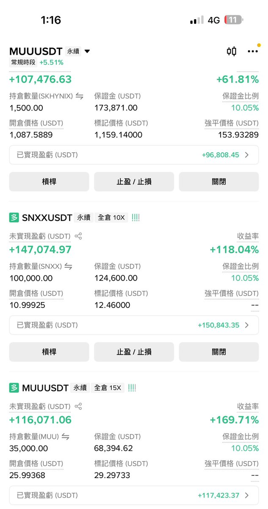

[查看原推链接](https://x.com/xiaomustock/status/2085053224386744756)

---

### 8. 推文记录 (2026-08-03 02:23:51)

**互动数据**：👍 0 | 🔁 0 | 💬 0 | 👁️ 0

```text
$META 相比于 $APPL 利润实际非常接近甚至如果meta像apple不搞巨额ai投入，meta利润大概率超过苹果。
市值meta只有1万亿，apple4万亿。
长期80%的毛利率，营收一直在增长。
算美股巨头里面最有性价比的了。
```

**实盘附图**：


[查看原推链接](https://x.com/xiaomustock/status/2084102919658565889)

---

### 9. 推文记录 (2026-08-01 09:27:32)

**互动数据**：👍 134 | 🔁 23 | 💬 12 | 👁️ 83422

```text
亚马逊2026 年 Q2 电话会中文翻译

今年早些时候，我们表示，计划在2026年投入约2000亿美元现金资本开支（Cash CapEx）。

其中绝大部分将用于支持 AI 和 AWS 的基础设施建设以及相关人员投入。

我们非常清楚，这些投资将带来十分可观的财务回报。下面我解释原因。

这项投资主要由两部分组成：

第一部分是数据中心（Data Centers）；

第二部分是部署在数据中心里的服务器（Servers）和网络设备（Networking Equipment）。

这两部分资产具有完全不同的资本投入周期。

数据中心通常需要提前约两年开始建设。

待数据中心建成后，我们再将服务器部署进去，即可开始产生收入。

一个数据中心一旦正式投入运营、服务器上线，我们几乎立刻便开始获得大量收入，并且这些数据中心未来30年以上都可以持续创造收益，而无需再次投入最初建设数据中心所需的大规模资本。

相比之下，服务器和网络设备属于更新周期较短的资产。

通常，我们会在正式投入使用前几个月才采购这些设备。

在决定采购之前，我们已经能够非常清楚地看到客户需求。

如果没有需求，我们就不会投入服务器和网络设备的资本。

平均而言，这类服务器投资不到三年即可收回成本（Break Even）。

目前服务器的使用寿命至少约为5～6年。

而如今，大多数 AI 算力合同的签约期限至少都是5年。

这意味着，在服务器和网络设备实现回本之后的未来2～3年，它们将持续产生大量自由现金流。

另外值得注意的是，AWS 一直拥有非常优秀的记录，能够不断缩短服务器投资的回本周期。

我们已经取得了实质性的进展，能够在不影响客户体验的前提下延长服务器设备的使用寿命。

对于寿命超过30年的数据中心而言，我们预计至少能够经历5～6代服务器升级。

正如前面所说，第二代、第三代以及之后的服务器，其整体经济效益都会优于第一代。

原因在于，我们无需再次投入最初建设数据中心的巨额资本。

因此，在短期内，由于市场需求迫使我们必须提前同步建设大量数据中心，而这些数据中心尚未开始产生收入，所以资本开支（CapEx）会维持在很高水平，自由现金流也会承受压力。

直到这些数据中心陆续上线并开始商业化运营之后，这种压力才会缓解。

随着服务器投入使用几年之后，收入增长最终将超过新增资本开支的增长速度——这一阶段迟早会到来。

届时，公司所产生的收入、自由现金流以及投入资本回报率（ROIC）都会非常具有吸引力。

我们其实在第一代云计算时代就已经经历过类似的发展过程。

只不过，当年的需求增长速度远没有今天 AI 时代这么快，而是更加循序渐进。

我们看到，如今 AI 业务的利润率和投资回报率，与当年 AWS 云计算业务发展到相同阶段时非常相似，甚至还要略好一些。

目前，我们预计2026年的现金资本开支将达到约2200亿美元。

相比此前约2000亿美元的预期有所提高。

主要原因是内存（Memory）成本上涨，推高了整体资本开支。

不过，即便投入达到2200亿美元，我们在2026年的算力仍然不足以满足全部客户需求。

我认为，这种供不应求的局面在2027年仍将持续。

事实上，我们目前已经收到的2028年需求规模都令人震惊。

请记住，目前企业客户在生产环境中大规模部署 AI 推理（Inference）仍处于非常早期阶段。

长期以来，我们一直认为 AWS 能够成长为一家数千亿美元年收入规模的业务。

而现在，我们认为它至少能够达到此前预期的两倍，并且非常有可能最终成为一家年收入达到1万亿美元的业务。

与此同时，它还将拥有极具吸引力的自由现金流和投入资本回报率（ROIC）。

上面那么多跟ai废话文学一样总结一下就是

亚马逊26q2ai核心观点：
开支：2200亿美元（原2000亿美元），主要因HBM/内存涨价。
需求：2026、2027算力仍供不应求，2028需求已非常强劲。
投资回本周期：服务器投资<3年回本，之后持续产生自由现金流。
数据中心寿命30+年，可支持5–6代服务器升级，后续ROI持续提升。
现金流状况：短期自由现金流承压，长期自由现金流和ROIC大幅增长。
AWS长期目标：年收入1万亿美元。
```

**实盘附图**：


[查看原推链接](https://x.com/xiaomustock/status/2083484767644004434)

---

### 10. 推文记录 (2026-08-01 08:48:09)

**互动数据**：👍 643 | 🔁 56 | 💬 47 | 👁️ 223363

```text
虽然过去一个月亏了35%，账户接近腰斩，但是今年存储带来的收益还能剩268%。
不再激进求获得多高的收益，
只求能稳定健康点，祝老板们以后财富长虹。回看真正稳妥的大机会都是黑天鹅式的，
去年关税战暴跌到170的台积电，80多的英伟达，
今年美伊战争暴跌下来的存储，美光，闪迪，铠侠，三星海力士，全都跌成了白菜价。
以及7月份的存储俩周时间闪崩腰斩，
市场是真不缺机会，更不缺黑天鹅。
以后打算长期保持个30%现金仓位学巴菲特蹲黑天鹅机会再下手，其他时间一点不动。像闪迪能一天拉40%，1000拉到1400。
这种时间直接梭哈带来的收益远超每年持有apy或者qqq平均带来的15%左右年化。
```

**实盘附图**：

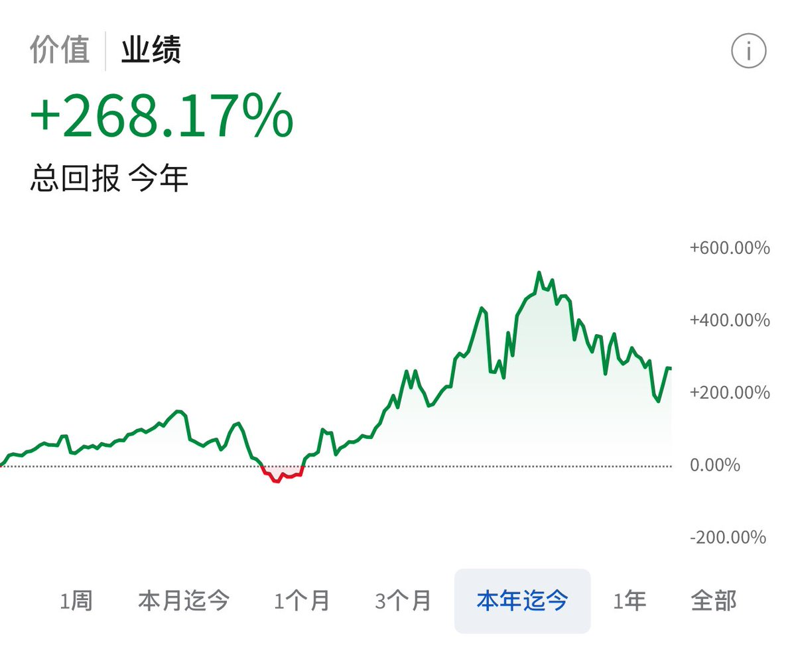

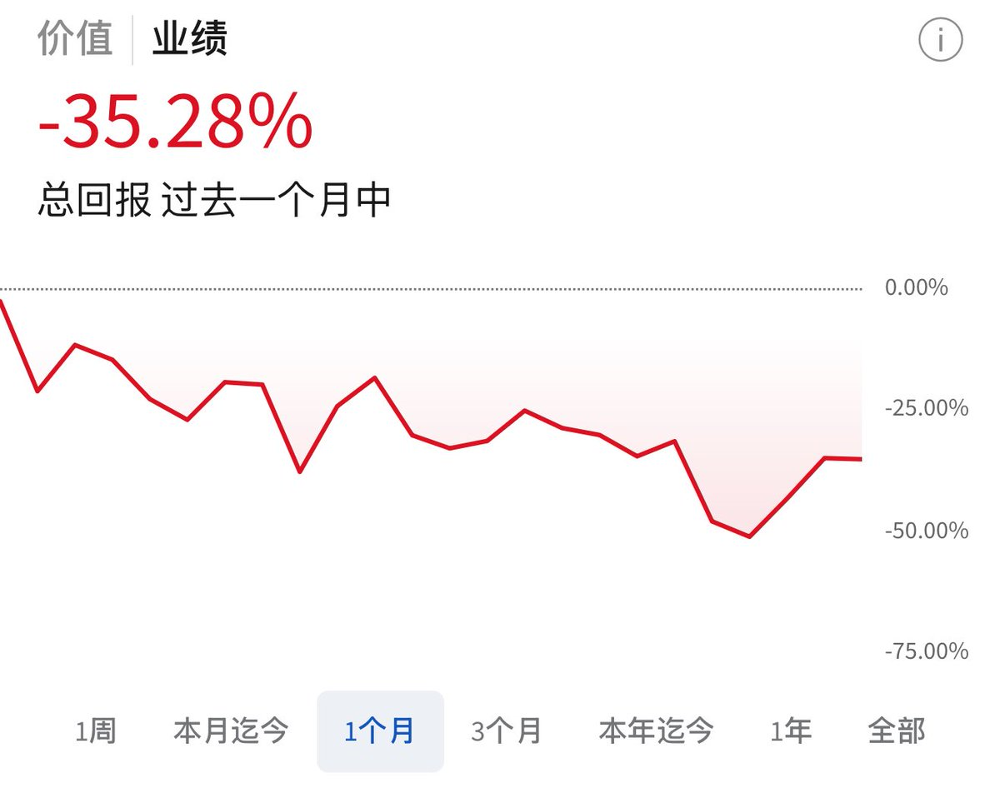

[查看原推链接](https://x.com/xiaomustock/status/2083474854507069903)

---

### 11. 推文记录 (2026-08-01 08:36:15)

**互动数据**：👍 0 | 🔁 0 | 💬 0 | 👁️ 0

```text
刚进8月来了个鬼故事，
长鑫存储的lpddr6研发几乎完成，下半年就开始量产。
长鑫可以侵蚀掉dram份额，
不过三巨头的核心是hbm4，以及未来存算一体三位堆叠光电融合的共封装，这部分是
涉及到英伟达算力的hbm不可能撼动。美国佬不可能把算力交给长鑫来打包，而这是真正存储市场的爆发式的增长点。
长鑫吃国内厂商合作的存算一体hbm的算力基建也足够了，国家层面刚发了4万亿算力基建。
```

**实盘附图**：


[查看原推链接](https://x.com/xiaomustock/status/2083471859576979783)

---

### 12. 推文记录 (2026-07-31 19:44:41)

**互动数据**：👍 0 | 🔁 0 | 💬 0 | 👁️ 0

```text
不想发大财也不想赚更多的钱或者以往冒很大风险了。最近这一个月体感太差。
趁着meta财报暴跌了一波.把这俩天抄底解脱卖出来的钱刚553刀买了点 $META 占个1/5仓。
meta这个长期80%毛利，18%的年营收增速和类似腾讯社交的全球社交地位，这点一万亿市值还是令人着迷。
对比纠结了半天都处于财报暴跌的苹果和meta，一个4万亿一个1万亿，最终还是选了个meta数据上长期拿胜率更高点，营收增速下5年后4000亿美金，80%毛利就能冲到3000亿美金毛利，相比现在这个市值对我自己来说还挺心动。希望以后meta别瞎折腾了，搞搞新出的云业务可能比他之前一直瞎搞好，搞了一堆啥都参与了啥都没成。

后面不想像以前那么激进操作了，万一真遇到啥更大规模的黑天鹅人干没了没必要，把spy和qqq配置得提上日程，只用小于一半的资金撸最热的大市值概念，猥琐狗起来，降低预期，不贪就不返贫。
也降低发推欲望，时间花在打游戏和看资料看书洗脚按摩上肯定比一直盯着股票和推特更开心。
```

**实盘附图**：


[查看原推链接](https://x.com/xiaomustock/status/2083277688824095080)

---

### 13. 推文记录 (2026-07-31 19:44:06)

**互动数据**：👍 0 | 🔁 0 | 💬 0 | 👁️ 0

```text
不想发大财也不想赚更多的钱或者以往冒很大风险了。最近这一个月体感太差。
趁着meta财报暴跌了一波.把这俩天卖出来的钱刚553刀买了点 $META 占个1/5仓。
meta这个长期80%毛利，18%的年营收增速和类似腾讯社交的全球社交地位，这点一万亿市值还是令人着迷。
对比纠结了半天都处于财报暴跌的苹果和meta，一个4万亿一个1万亿，最终还是选了个meta数据上长期拿胜率更高点，营收增速下5年后4000亿美金，80%毛利就能冲到3000亿美金毛利，相比现在这个市值对我自己来说还挺心动。希望以后meta别瞎折腾了，搞搞新出的云业务可能比他之前一直瞎搞好，搞了一堆啥都参与了啥都没成。

后面不想像以前那么激进操作了，万一真遇到啥更大规模的黑天鹅人干没了没必要，把spy和qqq配置得提上日程，只用小于一半的资金撸最热的大市值概念，猥琐狗起来，降低预期，不贪就不返贫。
也降低发推欲望，时间花在打游戏和看资料看书洗脚按摩上肯定比一直盯着股票和推特更开心。
```

**实盘附图**：


[查看原推链接](https://x.com/xiaomustock/status/2083277541788529077)

---

### 14. 推文记录 (2026-07-26 02:21:15)

**互动数据**：👍 310 | 🔁 22 | 💬 27 | 👁️ 277413

```text
市场还有一个非常严重的误区，
大陆ai投1000亿人民币，美区投1万亿美金，看起来美国佬投这么多钱搞出来的大模型实力水平都差不多，
但是投出去的钱大都买的是算力卡存储卡cpu卡，这些大陆买不仅不会更便宜反而更贵，都是能转化成收入的印钞机。

马斯克已经因为买卡赚死了。
而我们大陆，只能买3倍价格的卡，

美国佬投1万亿美金就是拿到了可以转化成1万亿美金收入的ai基建印钞机。
其他成本占比如人力成本和电力成本占比都很低，
ai研究本身是人才密度极高的行业，员工数都极其少。
电力成本是平民化的东西也非常低，而且电力建设一直都是养老的印钞机也不可能亏损。
```

[查看原推链接](https://x.com/xiaomustock/status/2081203163928109207)

---

### 15. 推文记录 (2026-07-19 15:15:49)

**互动数据**：👍 182 | 🔁 12 | 💬 26 | 👁️ 228314

```text
明天又要搏命了，感觉soxl没skhynix稳，怕他娘的美股再跌个10%亏个大的我人没了直接换成了韩股sk。
这俩天kimi这个太热了，导致老外认识到大模型公司没有任何护城河，没几天就被别人干掉，今天gpt干gemini，明天claude干gpt。
市场可能会重新思考什么类型的公司是真正有稳固的护城河的。

能被kimi竞争登顶出现，很可能会被华尔街觉得长期利好谷歌，因为目前任何一家大模型公司谁能熬得过谷歌？稳固的现金流稳固的业务作为护城河，现在不管哪个模型领先，最终可能都是谷歌领先，它可以慢慢追，追到所有ai军备竞赛的大模型都耗尽家财，谷歌还有源源不断的血液继续干gemini。
```

**实盘附图**：


[查看原推链接](https://x.com/xiaomustock/status/2078861372805501074)

---

### 16. 推文记录 (2026-07-16 17:12:10)

**互动数据**：👍 603 | 🔁 23 | 💬 35 | 👁️ 401401

```text
全网看起来都清仓了，
抄了soxl，muu，snxx，
三个成本142/27.2/15 https://t.co/M3aK3g1VDD
```

**实盘附图**：

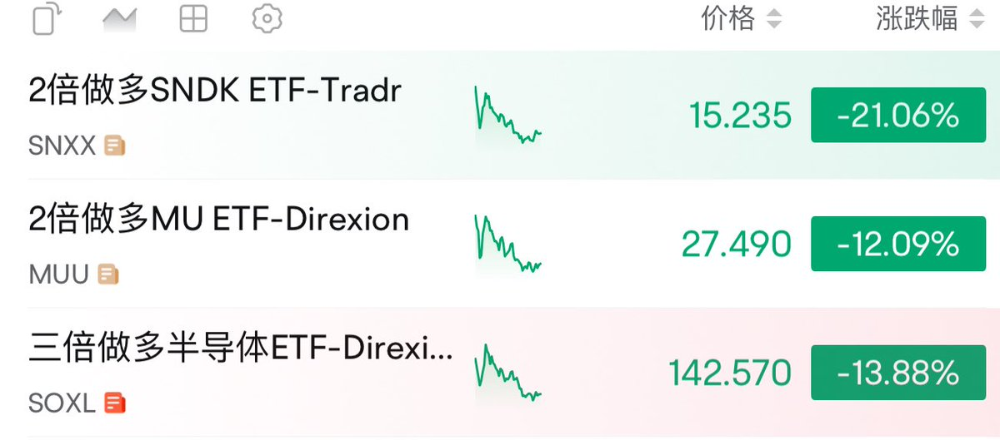

[查看原推链接](https://x.com/xiaomustock/status/2077803489942802814)

---

### 17. 推文记录 (2026-07-14 15:41:37)

**互动数据**：👍 297 | 🔁 43 | 💬 129 | 👁️ 235631

```text
请发给你的韩国朋友。
AI能干的事情过去2年，
慢慢从一维数据到二维数据再到未来的三维数据进化，也就是文字，图片，三维视频。
这经历的时间也才短短2年多，24年到现在26年。而存储扩产在2028年，也就是2年后，AI会发展成什么样，这些傻逼预测分析师硅谷投资客都没有考虑进去，他们只是基于现在的AI状态来分析存储未来尤其是存储2028年的未来做出当下的判断，他们都是傻逼。

如果物理AI能突破，处理的资料都是视频资料，不是文字，存储数据内容从一维到三维，存储的需求量是天量。人们现在对存储的假设是基于现有AI水平来测算。
但这些傻逼都没有考虑进去2年后AI会发展成什么样，
现在AI视频已经可以以假乱真，
俩年后更是不敢想象会进化到啥程度，
如果AI能进化到理解现实物理世界，那它处理的数据全是视频数据，
存储需求的数量级可能是百倍于现在，
要坚信你的存储。
试想一下AI俩年后会发展成什么样，回想过去俩年AI的进化速度和对存储需求的增长速度，不要再扔掉你们宝贵的 #海力士 $SKHYX 了。

AI用量会在俩年后暴增数倍，想象你2年后使用频率，从现在一天3-5次会不会暴增到30-50次？
AI使用群体数量俩年后会不会从1B暴增到几B？（使用群体不限于人，包括汽车，包括手机，包括机器人，甚至智能体本身…）

AI现在人70%的使用是文字token，俩年后会不会进化到视频影像物理三维视频token输入输出？（这里存储数据量差别千倍万倍。）

这里面的需求差别2年后会是现在的多少倍？十倍还是百倍？
那俩年后的存储产量增量是几倍？翻倍都撑死了吧？这些傻逼预测师永远不会这么给你算，只会基于现在AI状态误导你。

拿出你们290万韩元梭哈的勇气，
190万韩元都不敢买，真去死了算了。
```

**实盘附图**：

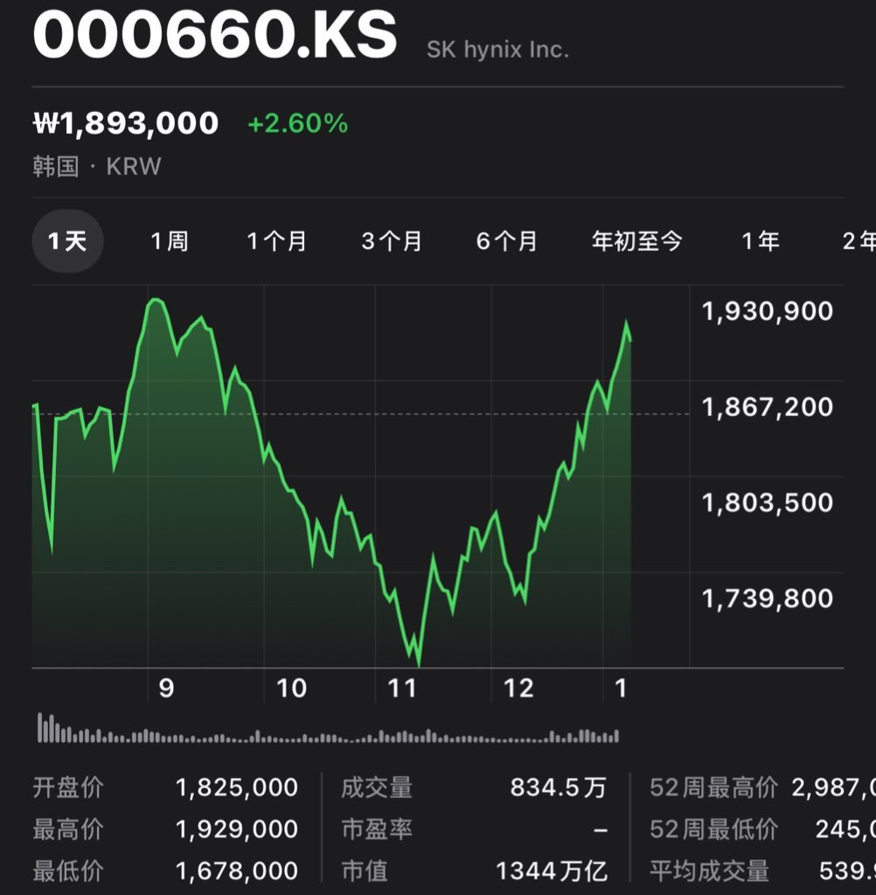

[查看原推链接](https://x.com/xiaomustock/status/2077055927786885527)

---

### 18. 推文记录 (2026-07-10 15:02:43)

**互动数据**：👍 397 | 🔁 12 | 💬 39 | 👁️ 239015

```text
去年真是满大街的好机会，
当时145梭哈的3万股amd现在已经高攀不起，回想起来真是脑残呐，
去年的股票能预期业绩涨十倍股价也能十倍，
现阶段大部分AI红利涨幅被吃完了，
预期不上不下，业绩翻倍都笑死，所以股价翻倍都笑死。
只能寻找业绩还能明确有十倍以上潜力的，才可能获得十倍左右的股价涨幅。
```

[查看原推链接](https://x.com/xiaomustock/status/2075596586986754131)

---

### 19. 推文记录 (2026-07-10 04:56:41)

**互动数据**：👍 1002 | 🔁 47 | 💬 144 | 👁️ 698383

```text
国内可回收火箭成功了，卧槽，牛逼炸了。
@elonmusk https://t.co/TS1YPsNvzn
```

**实盘附图**：

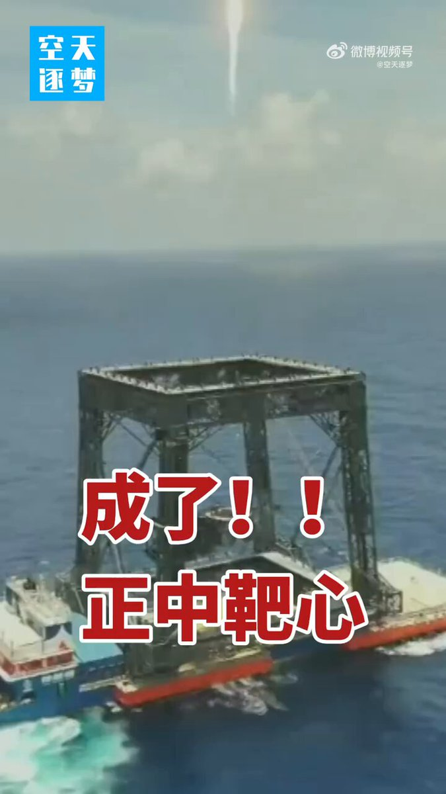

[查看原推链接](https://x.com/xiaomustock/status/2075444072588927151)

---

### 20. 推文记录 (2026-07-08 07:40:06)

**互动数据**：👍 389 | 🔁 18 | 💬 51 | 👁️ 163081

```text
韩国为了不让港股这个2x吸走资金，
疯狂发行了十几个2倍做多etf，
全部破发，
韩国人大多数都上杠杆买的杠杆etf😂
本来是韩国人的狂欢，
现在韩国股民集体亏麻了。 https://t.co/AyXqWehoOD
```

**实盘附图**：

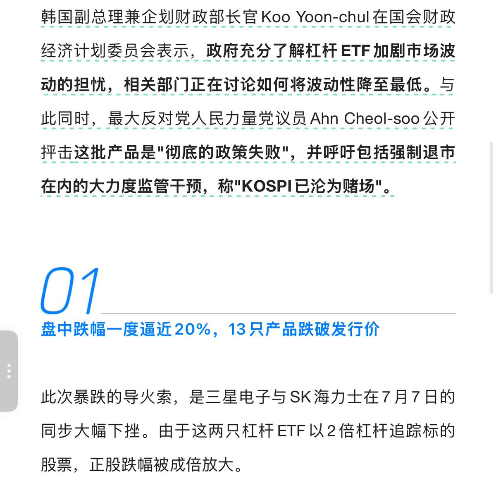

[查看原推链接](https://x.com/xiaomustock/status/2074760420427260054)

---

### 21. 推文记录 (2026-07-07 06:28:31)

**互动数据**：👍 544 | 🔁 28 | 💬 72 | 👁️ 242462

```text
今天应该是跌到位了，
美光跌到了918美金，
海力士跌到了1400美金左右。
跌的这些后上车跟风存储的人都折磨的
绝望离场就是新的开始。
美股韩股的特点股价涨幅得跟财报匹配 https://t.co/m5fApc3Tb7
```

**实盘附图**：

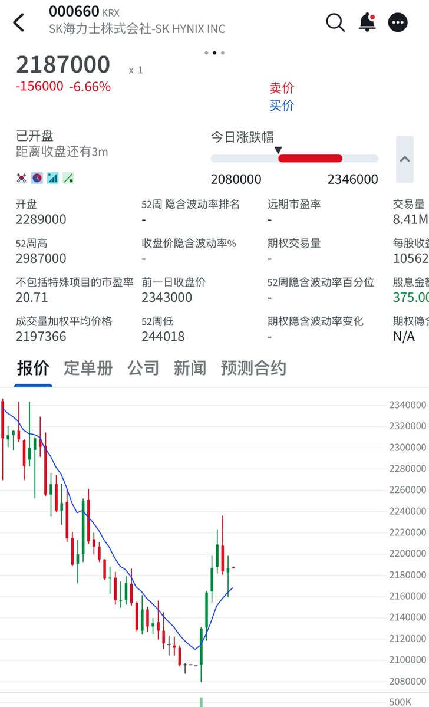

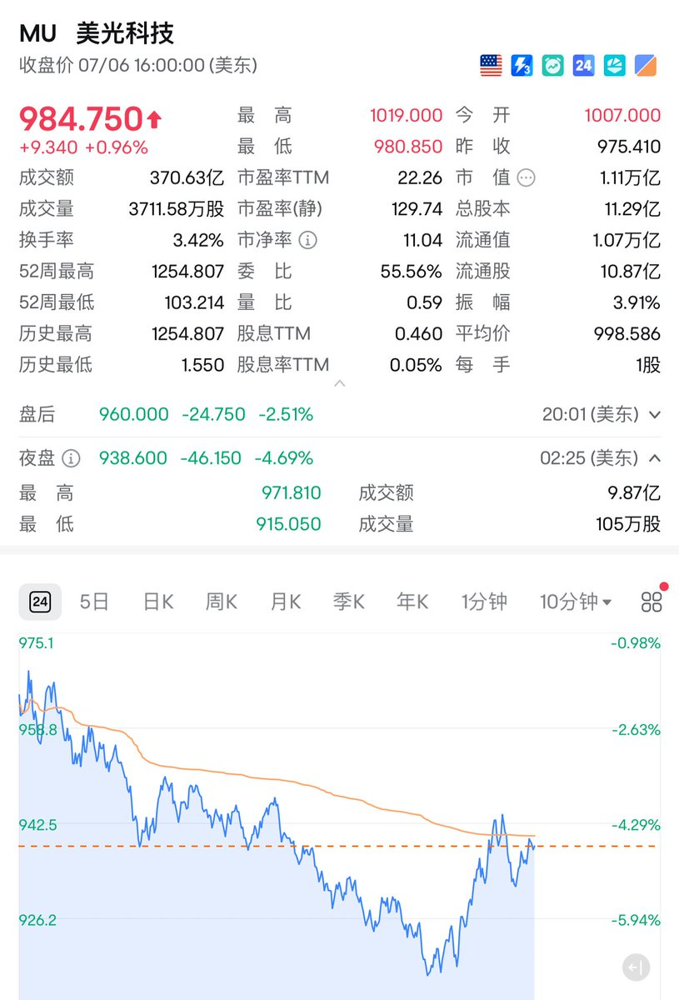

[查看原推链接](https://x.com/xiaomustock/status/2074380020429226196)

---

### 22. 推文记录 (2026-07-04 19:30:15)

**互动数据**：👍 1690 | 🔁 112 | 💬 86 | 👁️ 517143

```text
再整体记录一下上半年成功的操作。
$MRVL 爆拉前156刀推荐，35天最高329。
$MU 爆拉前118刀推荐，10个月最高1255
$LITE 爆拉前97刀推荐，10个月最高1085
$COHR 爆拉前164刀推荐，7个月最高440
#海力士 年初75万韩元推荐，6个月298万韩元
#中韩半导体 年初3.2推荐，6个月最高7.1
#五一世界 4月份47推荐，2月最高147
#2x海力士 年初23推荐，6个月最高193
$ewy 年初120推荐，6个月最高220
$DRAM 29美金推荐，3个月最高81
$GLW 康宁215推荐，7天最高271
除了上面所有，
今年买过最烂最失败的俩个就是港美互联网和nok，毕竟如果买的全暴涨那跟开挂有啥区别，有亏有赚才正常毕竟买的是股票不是玩的资金盘。

从半年前推特上没有几个中文推做股票，
到现在人人基本上做股票，
至少绝大多数人提前半年了解到存储应该我这个推特今年最大的意义。

这过程中有各种生物多样性的傻逼诋毁和嘲讽，2/3月份几乎拉黑屏蔽了所有我能刷到的看空存储的推，但这半年也有非常多朋友一直支持。努力让那些傻逼显的更傻逼。

人生得不断的承认错误，修正，
再对变化作出改变，
无尽重复，才能进步。
而不是顽固的固执己见，
汉语有关博大精深的词，
“观点”
并不是简简单单的看法，古人构词的时候真实想法应该是某一刻或者某一点的看法才叫观点。具有很强的时间点特征，不可能像物理定律一样，永远有效。
投资或者炒作都是基于“观点”这个词，
看到变化推出另外一种变化的方向来投资交易，非常具有时效性，而时效的长短跟变化本来的长短也直接挂钩。AI带来的变化则非常久远，但肯定也有对应的时效。
所以市场流传这样一段话
“要么早信要么坚决不信，
先信卖后信”
每次下撤暴跌亏惨的要么是信最晚的，
相当于49年入国军，溥仪下台入宫当太监。
要么是杠杆打满的，看得再对也承受不住市场的跳动。

做交易只能负责，所以非常厌恶别人问能不能买要不要卖，只想关心自己买没买啥时候卖。自己没有的也不想关心。
回归务实还是多关心关心家人和朋友。
希望老板们未来能看到一个更强的自己。
```

**实盘附图**：

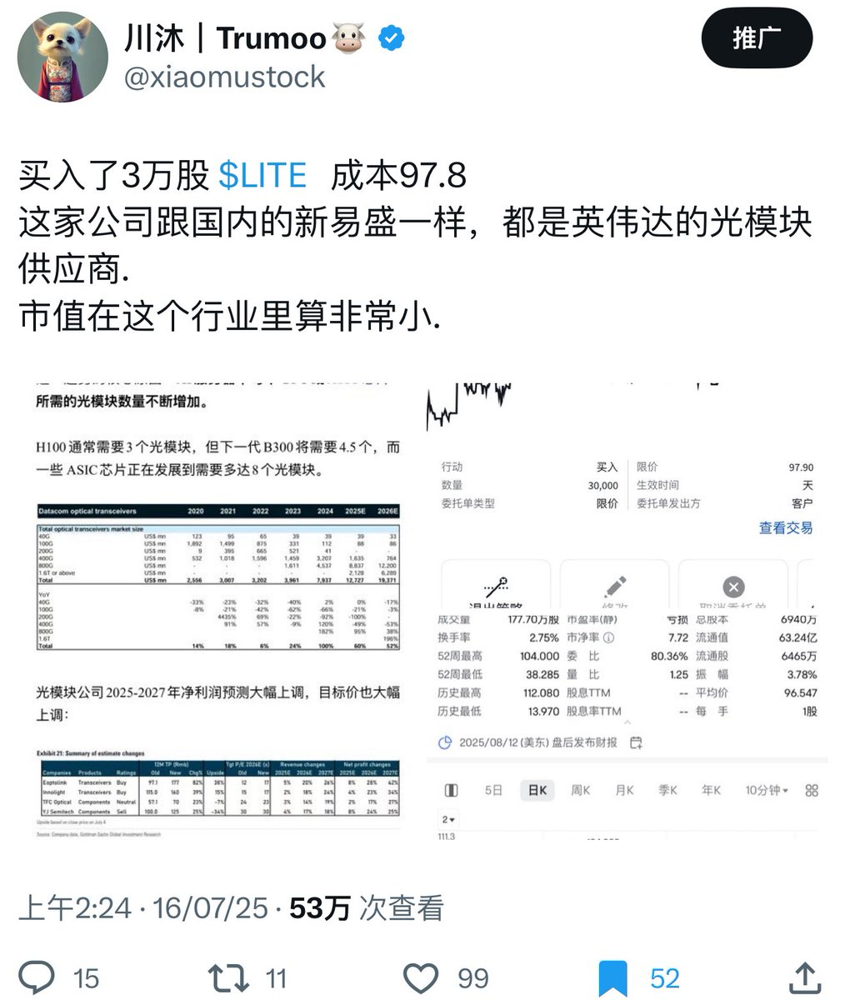

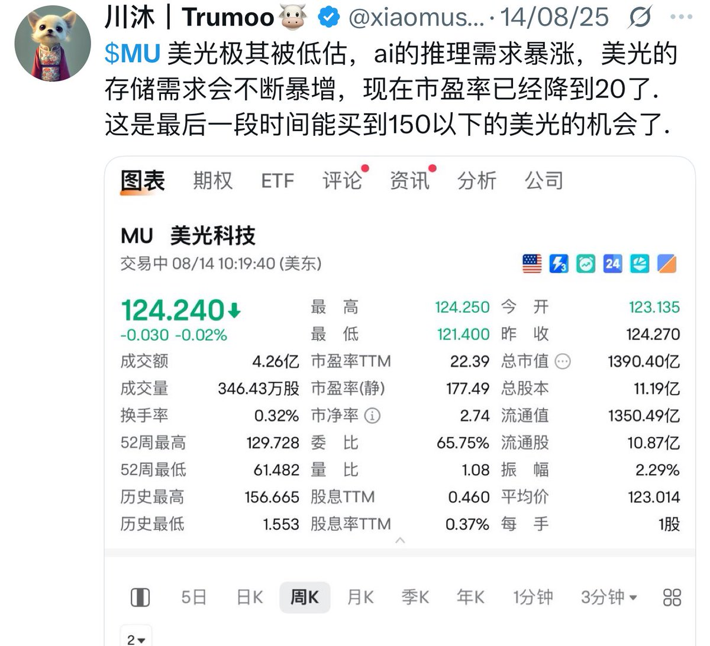

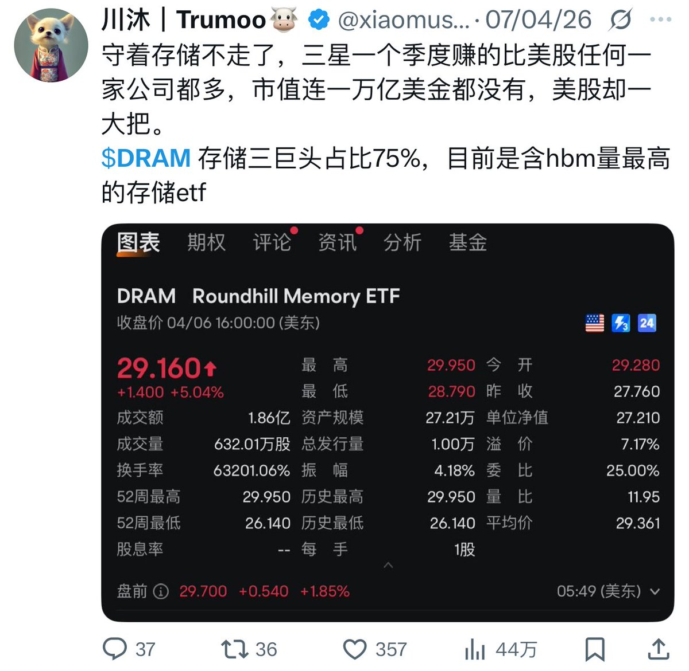

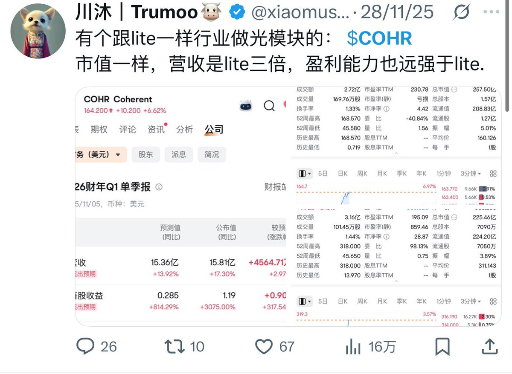

[查看原推链接](https://x.com/xiaomustock/status/2073489584298840564)

---

### 23. 推文记录 (2026-07-03 02:51:20)

**互动数据**：👍 474 | 🔁 45 | 💬 52 | 👁️ 320830

```text
能健康的管理自己仓位已经赢过绝大多数人

即使买对215刀的康宁 $GLW ，如果上杠杆在2x康宁或者正股也上杠杆，昨天一来一回可能人没了。
但是康宁玻璃基板目前是英伟达robin以后芯片的唯一解决方案。
目前因为发热严重导致基板翘曲，无奈把gpu4颗改为俩颗，hbm4e从16组改为8组。
但英伟达还是会不断迭代更强更先进的芯片，堆叠更高的芯片层数，那么按照现有的基板会导致更为严重的发热翘曲完全无法使用。
只能快速推进玻璃基板的方案才能解决。
这都需要时间，但是时间在被加快，最快可能明年年底就能见到规模应用。
高端芯片里玻璃基板的完全垄断，成本敏感度低，为了更强悍的性能，堆叠更高的层数，唯一解能卖出更高的溢价。

一旦大规模量产使用，康宁的价值会被完全挖掘。现在对于傻逼散户来说，涨了就是对，跌了就是错。只能对这些傻逼笑呵呵。
```

**实盘附图**：

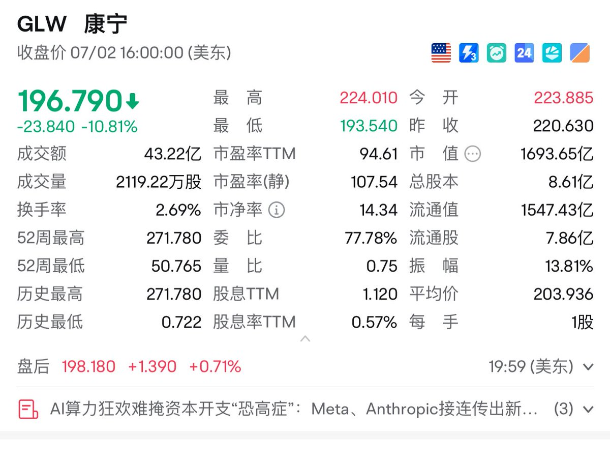

[查看原推链接](https://x.com/xiaomustock/status/2072875811997393037)

---

### 24. 推文记录 (2026-07-01 16:01:54)

**互动数据**：👍 519 | 🔁 14 | 💬 59 | 👁️ 146840

```text
画重点，韭菜交易员，
所以爆赚爆亏都别赖我，毕竟没收任何人钱，我也决定不了几千亿美金股票市值的走向。另外那些说看我买的亏的亏了喷我的，你爸妈说话都不听，我说话就听你了？
另外康宁 $GLW 我215发推特的，快速涨到270。
#海力士 年初推荐到现在拉了3倍

先信卖后信，要么早信要么别信，半路信亏钱活该你傻逼。
我又不是庄家特朗普决定不了行情走向，巴菲特要是赚了笑嘻嘻亏了mmp可能现在穷的上大街要饭了。
```

**实盘附图**：

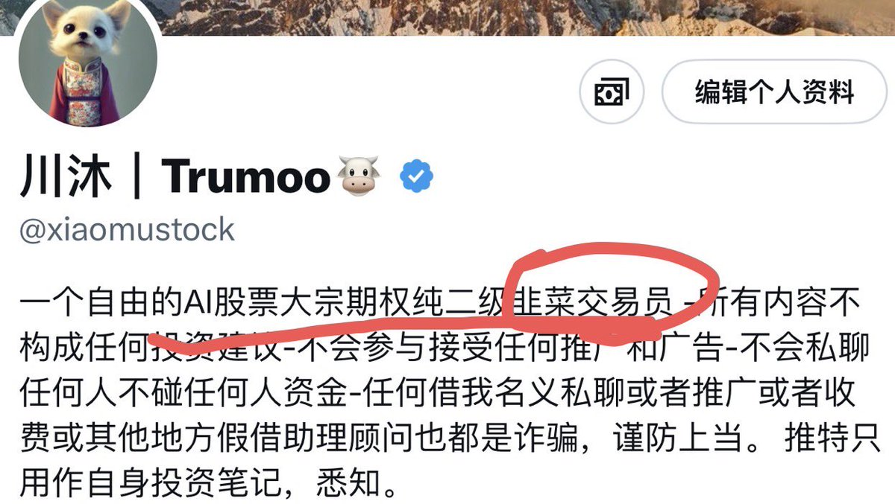

[查看原推链接](https://x.com/xiaomustock/status/2072349990467588346)

---

### 25. 推文记录 (2026-07-01 12:53:52)

**互动数据**：👍 155 | 🔁 4 | 💬 31 | 👁️ 329934

```text
Meta Platforms(META.O)盘前迅速拉升，现涨超5%，消息称其正在出售富余的人工智能算力资源。
(来自金十数据APP)
这新闻特么，算力不缺了？
英伟达老黄的没完成订单总不能假的吧mmp https://t.co/c5As0QP5DD
```

**实盘附图**：


[查看原推链接](https://x.com/xiaomustock/status/2072302668396331048)

---

### 26. 推文记录 (2026-07-01 12:36:11)

**互动数据**：👍 518 | 🔁 66 | 💬 27 | 👁️ 160412

```text
今天有个新etf上线， $KMEM ETF单仓 #SK海力士（41.53%） 为绝对第一大重仓；
美光 $MU （19.85%），
#三星（18.81%）次之。 https://t.co/znYcT5N44m
```

**实盘附图**：

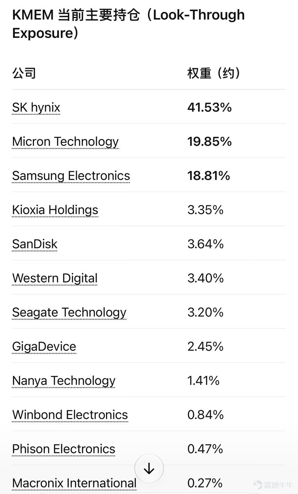

[查看原推链接](https://x.com/xiaomustock/status/2072298219854586201)

---

### 27. 推文记录 (2026-06-30 14:20:36)

**互动数据**：👍 355 | 🔁 18 | 💬 22 | 👁️ 154053

```text
这些千亿级别的大市值股票还有个好处，趋势确立会有源源不断的机构和指数加仓猛干，形成合力，而且他们几乎不会随意操作，会拿非常久。指数调整的周期特别长，
散户购买指数都会被动买入。
也不存在小票被大户或者kol或者公司管理层操纵涨跌的情况，没有散户互割踩踏。
也能上大仓位。
持仓体验大部分非常舒服。
```

[查看原推链接](https://x.com/xiaomustock/status/2071962108586344859)

---

### 28. 推文记录 (2026-06-30 11:38:27)

**互动数据**：👍 693 | 🔁 101 | 💬 28 | 👁️ 433987

```text
芯片的设备厂应该才刚刚开始，
存储三家公司赚的1/3可能都要流向这三家。
科磊 $KLAC 应用材料 $AMAT 泛林 $LRCX https://t.co/BvaczD4cXE
```

**实盘附图**：

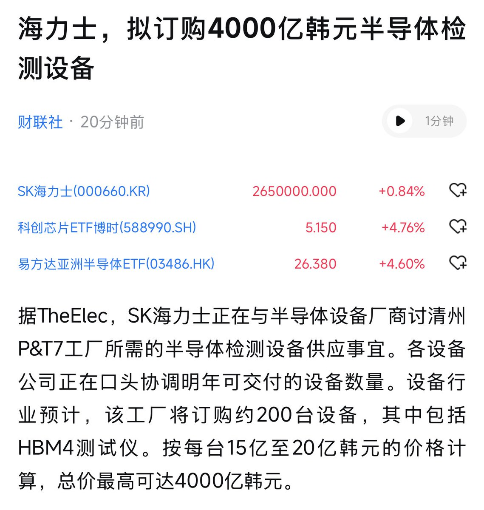

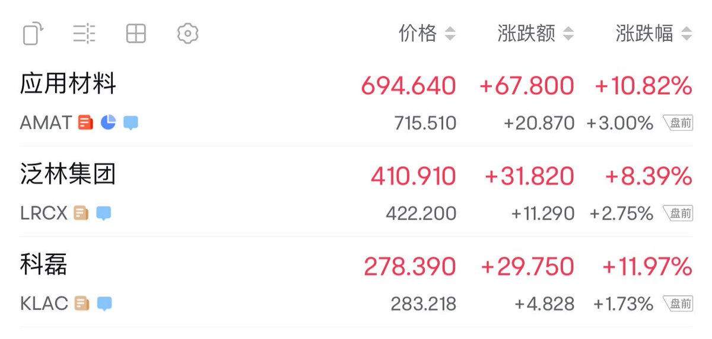

[查看原推链接](https://x.com/xiaomustock/status/2071921302861222147)

---

### 29. 推文记录 (2026-06-30 06:09:32)

**互动数据**：👍 85 | 🔁 2 | 💬 17 | 👁️ 131372

```text
物理AI被英伟达 $NVDA 反复提，但真正意义上的物理AI难找，文本AI都搞不赢的公司不可能搞赢物理AI。可能物理AI需要投入的资金体量要远大于文本AI。 https://t.co/XEuz9OhS4N
```

**实盘附图**：


[查看原推链接](https://x.com/xiaomustock/status/2071838526296227983)

---

### 30. 推文记录 (2026-06-30 05:25:47)

**互动数据**：👍 232 | 🔁 16 | 💬 22 | 👁️ 150574

```text
明年HBM存储会再次挤压消费级dram市场，
因为英伟达必须持续增长，英伟达对于所有AI公司来说它的业绩不能出点点点问题，包括美国政府也不允许。
但是美光几乎不可能进口长鑫存储的dram，只有三星海力士能绕开限制，因为国内扩产的速度快，dram产能提升快，明年很大概率发生的事情就是三星海力士高价买长鑫的dram回来在韩国造hbm4e，再供货给英伟达。
不过这中间肯定会发生很多额外的屁眼交易才可能成功。
只要英伟达的业绩能翻倍增长那么存储价格就很难下来，如果明天这些都发生，那么三星海力士的hbm4e份额会大幅扩大，远远甩开美光。
```

**实盘附图**：

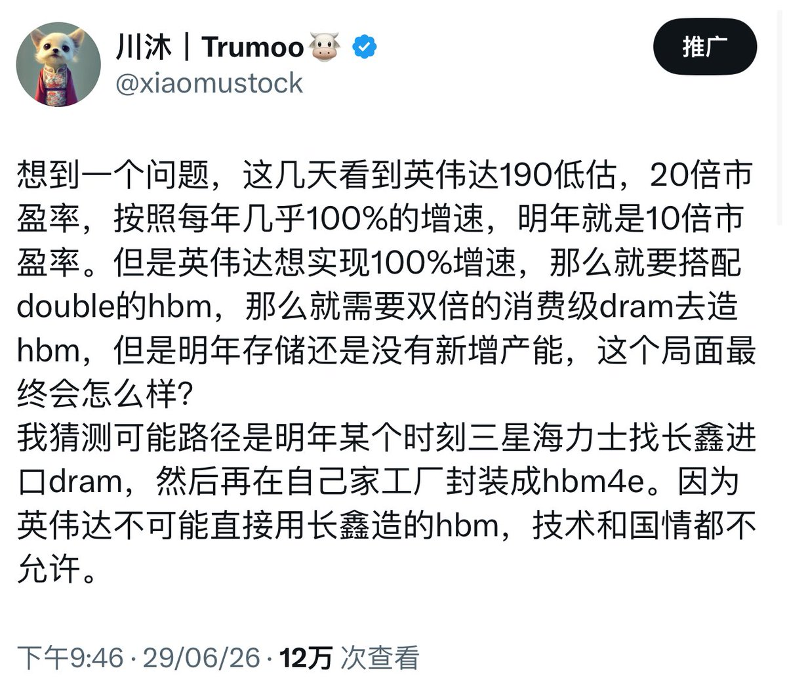

[查看原推链接](https://x.com/xiaomustock/status/2071827515392635333)

---

### 31. 推文记录 (2026-06-30 04:36:24)

**互动数据**：👍 245 | 🔁 12 | 💬 31 | 👁️ 150016

```text
康宁 $GLW 真是涨的无敌寂寞！262刀了.
5000亿市值也就600刀左右，对英伟达写明面上合作扩产10倍的康宁来说业绩翻10倍远远不止600刀这个价，期待市场不断的后知后觉涌入，尤其是大机构，他们早晚会根据此给更高的康宁评级。 https://t.co/1ljXlM62To
```

**实盘附图**：

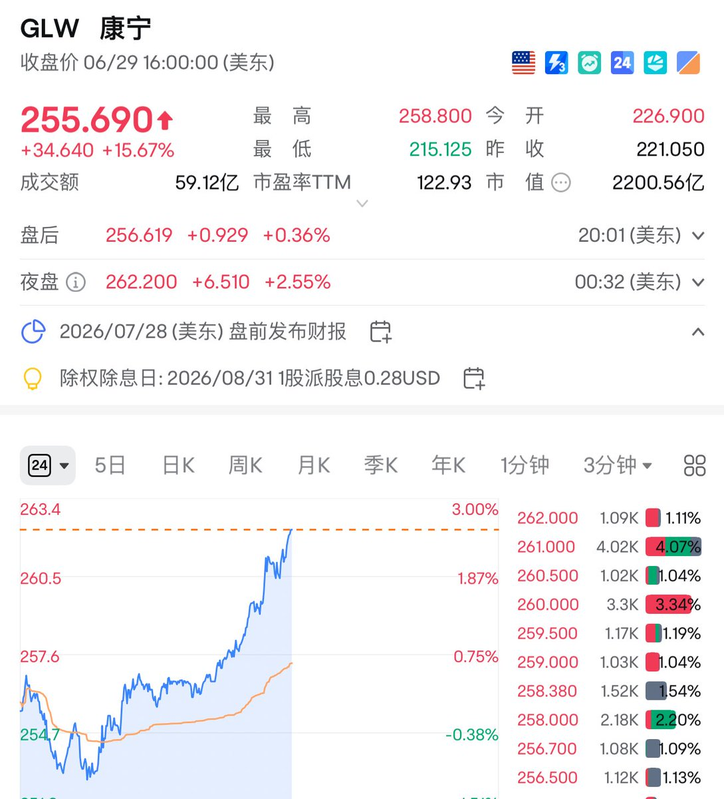

[查看原推链接](https://x.com/xiaomustock/status/2071815091692150895)

---

### 32. 推文记录 (2026-06-30 04:26:16)

**互动数据**：👍 569 | 🔁 49 | 💬 32 | 👁️ 410469

```text
想再加仓点海力士，奈何仓位已经都打满了，
现在想买啥都买不了，昨天想买点芯片半导体设备的2x，忍住了怕杠杆出啥事也没搞。
现在被动成了康宁 $GLW 和 #海力士 躺平了

美股的三个芯片设备刚开始涨，
应用材料 $AMAT 科磊  $KLAC 泛林 $LRCX https://t.co/obTrwAHwmW
```

**实盘附图**：


[查看原推链接](https://x.com/xiaomustock/status/2071812539953102902)

---

### 33. 推文记录 (2026-06-29 16:24:36)

**互动数据**：👍 330 | 🔁 23 | 💬 27 | 👁️ 354911

```text
看来 康宁 $GLW  取代年初海力士的置顶，能挂置顶挂说不定一年。10倍扩产就是10倍业绩暴增，大把的沙雕机构和散户被爆拉起来才能后知后觉这个康宁 $GLW 机会。 https://t.co/Yukb9MtEqM
```

**实盘附图**：

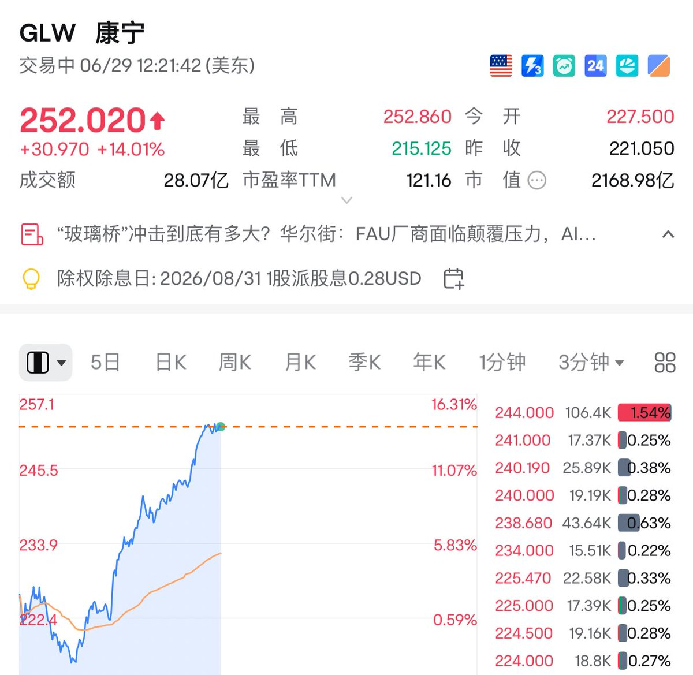

[查看原推链接](https://x.com/xiaomustock/status/2071630925017018671)

---

### 34. 推文记录 (2026-06-29 15:22:41)

**互动数据**：👍 343 | 🔁 32 | 💬 39 | 👁️ 266980

```text
眨眼功夫康宁 $GLW 又拉了10%，240刀，
康宁最大的魅力在于未来的确定性。
英伟达让康宁扩产10倍，那么在投产后说明康宁业绩也要10倍涨幅！
这是英伟达 $NVDA 给康宁的定心丸。
这还只是在玻璃基板没火之前的事情。
自玻璃基板和玻璃桥出来后，康宁的投产后估值可能远不止10倍，那就是远超2万亿美金

按照康宁官方的10倍扩产时间表，完成时间在2028年前后。也就是2年左右的时间赌一个10倍爆拉，非常划算。
```

**实盘附图**：

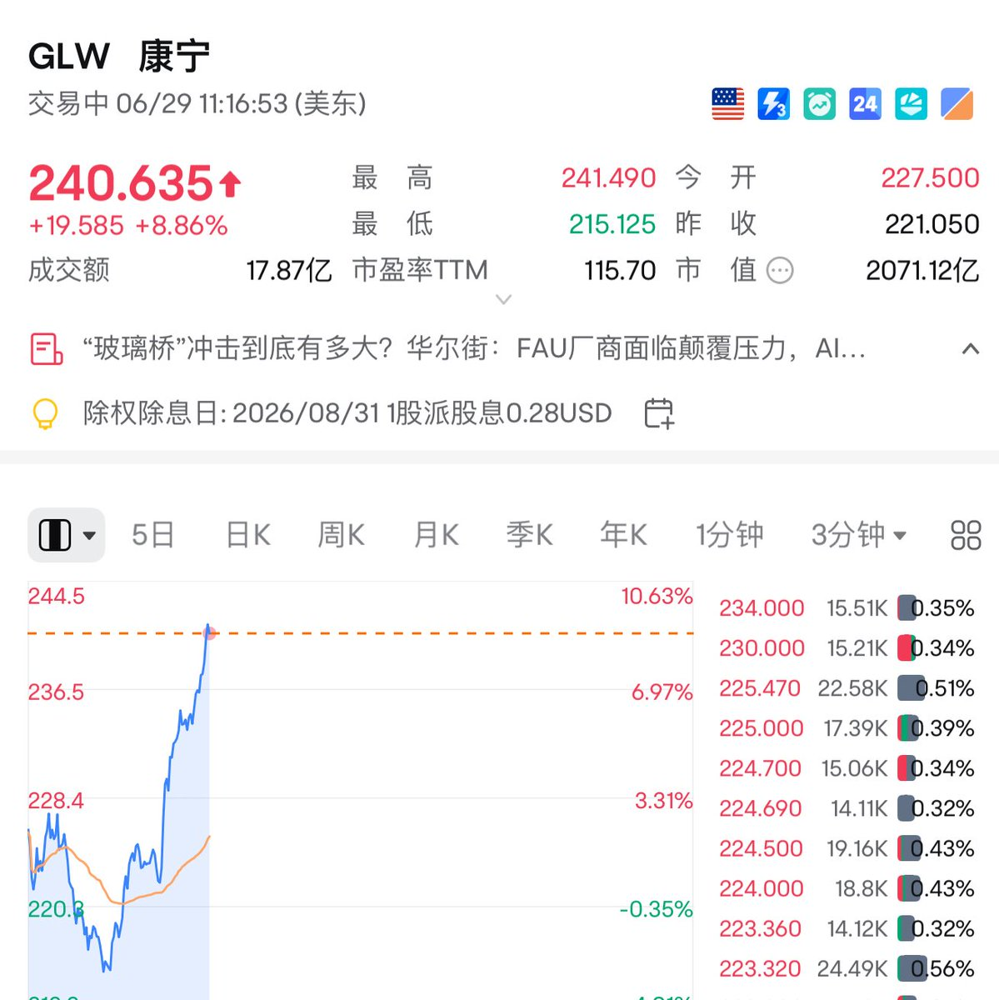

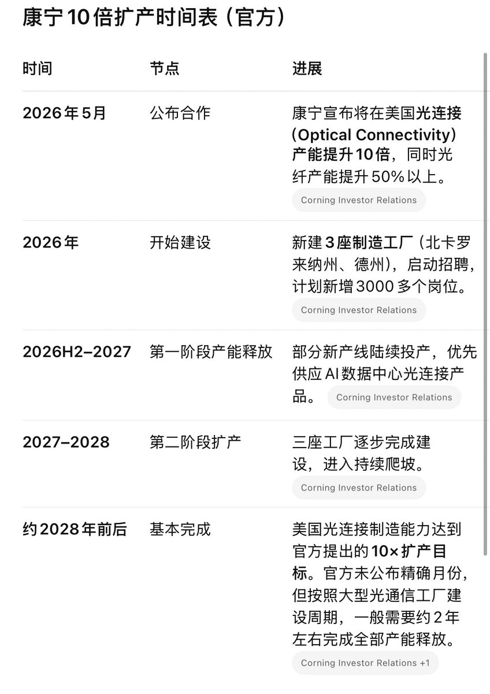

[查看原推链接](https://x.com/xiaomustock/status/2071615344435937283)

---

### 35. 推文记录 (2026-06-29 13:46:22)

**互动数据**：👍 436 | 🔁 22 | 💬 42 | 👁️ 152580

```text
想到一个问题，这几天看到英伟达190低估，20倍市盈率，按照每年几乎100%的增速，明年就是10倍市盈率。但是英伟达想实现100%增速，那么就要搭配double的hbm，那么就需要双倍的消费级dram去造hbm，但是明年存储还是没有新增产能，这个局面最终会怎么样？
我猜测可能路径是明年某个时刻三星海力士找长鑫进口dram，然后再在自己家工厂封装成hbm4e。因为英伟达不可能直接用长鑫造的hbm，技术和国情都不允许。
```

[查看原推链接](https://x.com/xiaomustock/status/2071591106803118442)

---

### 36. 推文记录 (2026-06-29 08:34:35)

**互动数据**：👍 623 | 🔁 32 | 💬 52 | 👁️ 199289

```text
a股最近一个月的半导体设备etf涨疯了，
买个锤子的个股，
这些etf都能涨停真是万万不可能想到。 https://t.co/U285nbKSSD
```

**实盘附图**：

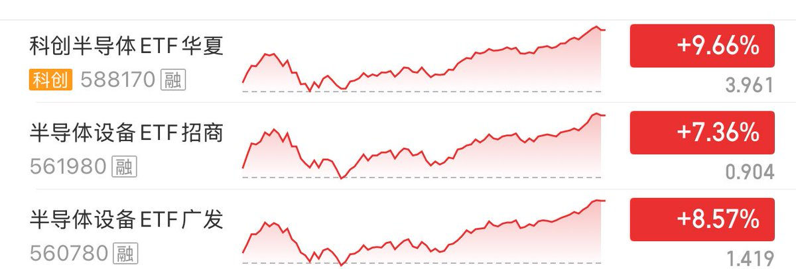

[查看原推链接](https://x.com/xiaomustock/status/2071512640715952494)

---

### 37. 推文记录 (2026-06-29 07:24:45)

**互动数据**：👍 560 | 🔁 116 | 💬 40 | 👁️ 218625

```text
问ai如果把日本韩国美国台湾欧盟的半导体设备龙头股组合成一个etf，取10个股票，如何组合，最好跟存储芯片的扩产路径相关的设备。
设备采购顺序一般是：

前道设备（刻蚀→薄膜沉积→清洗→检测→光刻）→ 后道封装（HBM）→ 测试

因此ETF应该偏重刻蚀、沉积、清洗，而不是EDA或晶圆代工。
1. $LRCX 20%
2. 8035.T 18%
3. AMAT 15%
4. 6525.T 10%
5. 7735.T 10%
6. https://t.co/LZn4FDgmel 8%
7. 6857.T 8%
8. 042700.KS 5%
9.ASML / https://t.co/lpVcCQ40Gf 4%
10. 8036.T  2%

核心逻辑：

重仓顺序：
刻蚀 > 沉积 > 清洗 > 测试 > HBM封装 > 光刻/检测

最核心三只：
LRCX、东京电子、AMAT

最贴近HBM后道：
Advantest、Hanmi

最贴近DRAM/NAND前道扩产：
LRCX、东京电子、AMAT、Kokusai、SCREEN
```

**实盘附图**：

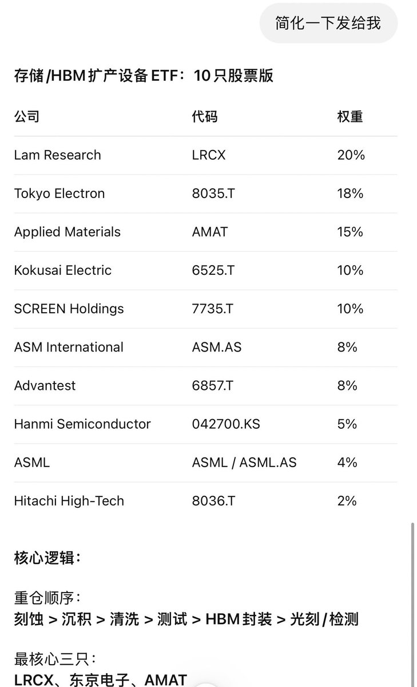

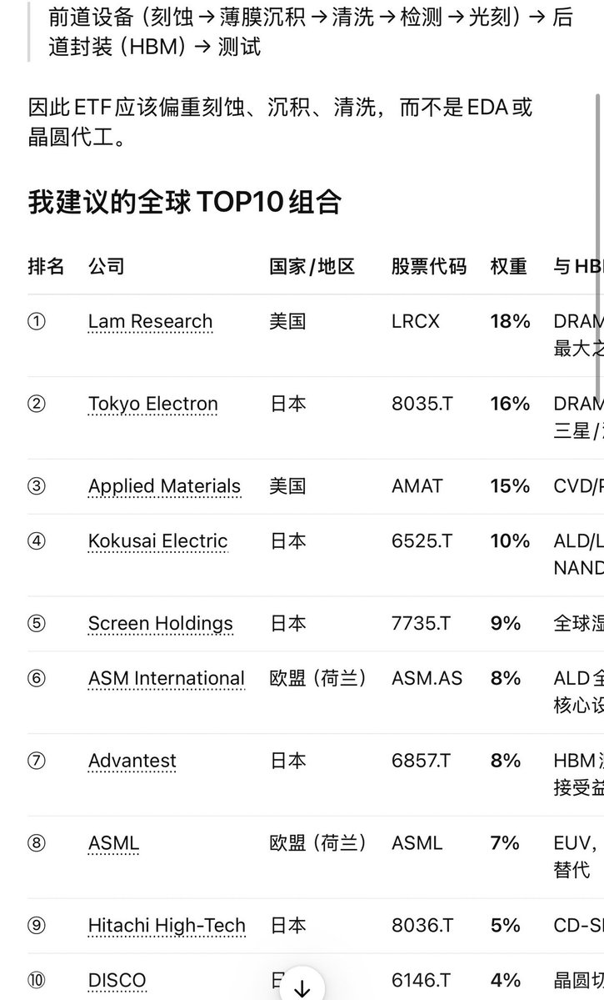

[查看原推链接](https://x.com/xiaomustock/status/2071495069815992433)

---

### 38. 推文记录 (2026-06-28 10:17:24)

**互动数据**：👍 287 | 🔁 30 | 💬 32 | 👁️ 189244

```text
谷歌限制了meta对gemini模型的使用需求。
这还不能证明AI基建还非常早期吗，
供不应求，AI的发展速度远超基建速度。
这些大公司是看到了产品狂暴的需求端可能才大举借债融资搞AI基建。
并非是没有转化成收入，
对谷歌来说都开始因为需求暴限制客户使用了，
咋可能没转化收入。
我们这些普通人都是小虾米，可能远远看不清未来的真相，
但自己看不见可以相信黄仁勋看得见，谷歌看得见，美光ceo看得见，三星海力士老板看得见，群联的那个ceo潘健成也非常非常有眼光和远见，我从去年到今年一直看他的存储相关的言论，他的思维和眼光特别超前。
```

**实盘附图**：

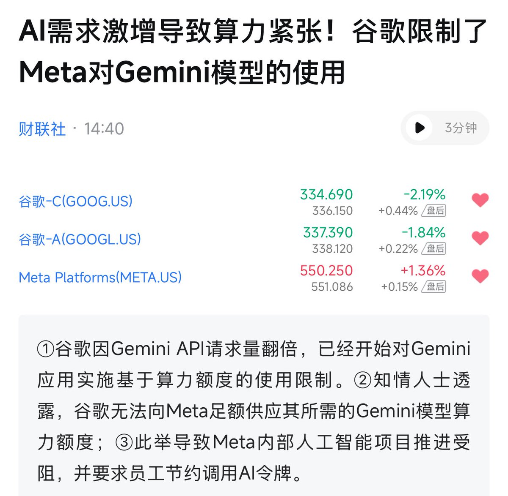

[查看原推链接](https://x.com/xiaomustock/status/2071176129298534424)

---

### 39. 推文记录 (2026-06-28 08:46:01)

**互动数据**：👍 321 | 🔁 24 | 💬 34 | 👁️ 173893

```text
存储的地位一年内都难以改变，
安心等海力士7月23号发的1300亿美金的季度利润财报。
美光难料，但 #海力士 绝对没问题。
这些大公司云厂的借债和融资都是为了给存储送钱。要么生要么死，没有存储产品和服务就没法提供，这俩年产能就这么多。
即使是国内长鑫长江一样是满产。
```

[查看原推链接](https://x.com/xiaomustock/status/2071153131166314689)

---

### 40. 推文记录 (2026-06-28 05:55:59)

**互动数据**：👍 1262 | 🔁 176 | 💬 76 | 👁️ 202916

```text
今天也算是半年过去，对自己上半年的惨痛交易也做个总结，
1.尽量买标品生意能流水线生产的或者互联网能直接复制产品的公司。
诺基亚这一俩个月俩回没啥起色，可能就跟它非标品的生意模式有关，基站啥的只能靠人力一点点干，搞土地搞关系搞人力搞供应链，苦力生意。
2.尽量买护城河极高，能参与公司极少的垄断公司垄断行业，湖南裕能这些就是对手多，无脑扩产的太疯狂，很难形成自己稳固的定价权。
3.自己没法掌控它实时仓过往业绩也不是特别好的etf或者lof少碰。当时5月初选港美互联网lof这个标是因为它持有美光和闪迪。如果基金经理完全按照一季度持仓加仓，则后续理论上表现会非常夸张，毕竟美光和闪迪在6月都涨了快50%，但真想不通这个傻逼经理在秀什么几把操作，后续价格走势完全跟美光和闪迪无关联。简直是盲盒交易。远不及中韩半导体这种etf持仓稳固，几个季度过去一直高比例持有三星海力士。
4.最重要最严重的错误，融资上杠杆。
差点在3月份爆仓死掉，2x海力士和ewy都暴跌差点没熬过去。以后再不去买超过自己本金的资产，顶多在自己本金范围内购买2x扩大上升周期的收益。
最沉痛的教训，当时3月的暴跌不仅吞噬了我1/2月份的收益，还直接巨亏打到了接近失去上桌的机会。
后续市场肯定还会有类似的波动，
比如真的加息来临，
比如市场承受不住大把的AI公司发债融资，
比如存储高价可能大幅抑制消费端需求，造成需求减弱，或者存储后期大幅度扩产引发降价等等。
总之市场会在我们意想不到的方式来一个黑天鹅来摧毁杠杆投资者，一俩个月风声过去，股市继续歌舞升平，全场新高，但与你无关。
```

**实盘附图**：

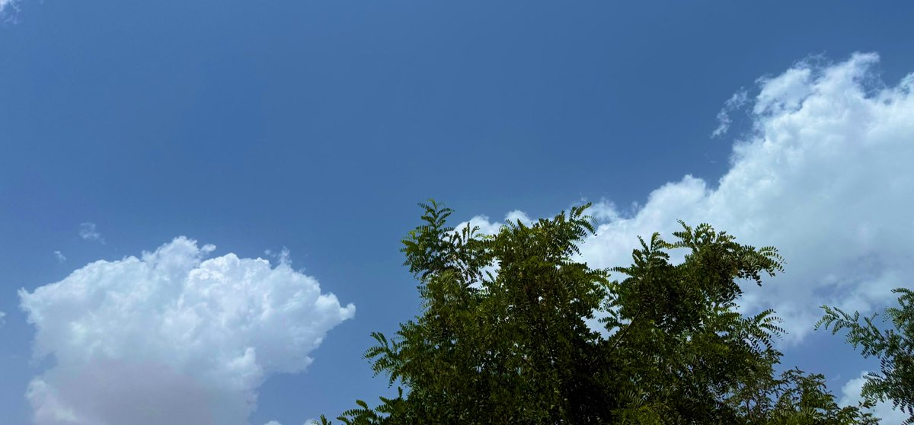

[查看原推链接](https://x.com/xiaomustock/status/2071110343636779062)

---

