# 卷二 · 加密大周期与核心资产配置手册

> **原著经验**：[@xiaomustock](https://x.com/xiaomustock) · 川沐｜Trumoo
> **整理收录**：[@SUOHA_AI](https://x.com/SUOHA_AI) · 梭哈.AI

深入拆解 BTC 宏观流动性周期、美联储降息剧本、公链生态价值重估及牛熊转换关键拐点信号。

---

## 核心精选实盘推文汇编

### 1. 推文记录 (2026-09-22 07:59:24)

**互动数据**：👍 400 | 🔁 38 | 💬 40 | 👁️ 107885

```text
币圈唯一良心项目方就是HYPE，
程序化链上执行手续费和回购销毁，不玩猫腻，
所以才有了现在不仅在1011后没有一蹶不振，而是不断刷新币价最高纪录，
其他的所有这些所谓回购的平台币都是爸散户当傻逼糊弄，所以他们的币价跟回购毫无关联，全部在造假玩数据玩文字游戏。
想到俩个公司可以解释这种现象，
一个美国的好市多costco，
一个大陆的胖东来。
坚持只赚自己该赚的一部分钱，坚守很低的利润比例红线给客户选优质好货，坚决不拿自己不该拿的钱，生意反而越做越大。

人们自身追逐于更多利益，但怕跟自己合作的或产生关联的人跟自己一样，那么很可能自己会变成自己这种用谎言换取更大利益的趋利性受害者，当人人都如此的时候，costco和胖东来居然看起来强的耀眼，
hype也一样，
我就喜欢每次btc回调或者暴跌的时候，
反而不买btc只抄hype，
言行一致的真诚真是太可贵。
```

**实盘附图**：

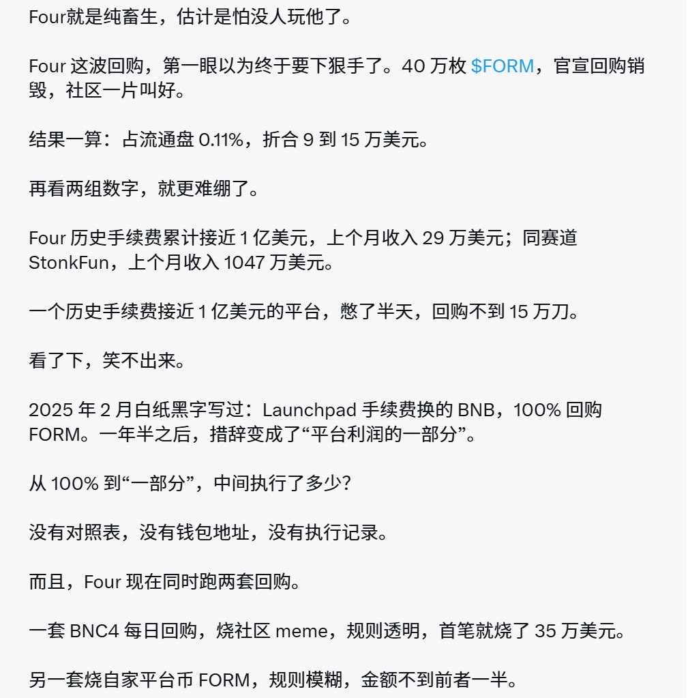

[查看原推链接](https://x.com/xiaomustock/status/2102306755137225205)

---

### 2. 推文记录 (2026-09-17 09:07:58)

**互动数据**：👍 135 | 🔁 4 | 💬 53 | 👁️ 50474

```text
持续加息不必然导致市场崩盘，
最直观的例子是上世纪90年代的互联网技术爆发期，那个年代利息长期高达10%以上。

相似之处是这个时代的AI技术对人类的影响不亚于互联网技术。
未来真的很难看懂会怎么变化，尤其是身处这种前所未有的变革面前。
```

**实盘附图**：


[查看原推链接](https://x.com/xiaomustock/status/2100512071603667433)

---

### 3. 推文记录 (2026-09-17 07:12:26)

**互动数据**：👍 166 | 🔁 7 | 💬 53 | 👁️ 133305

```text
加息对 $CRCL 来说是超级无敌大利好，
它的利润都来自短债利息，相当于收入增加了，而且美联储说了还要继续加，那未来收入增长也明确了，不应该被错杀，
它应该是最值得用来做加息降息交易的股票。
加息直接暴涨，降息直接暴跌。
市场麻瓜太多了，居然砸盘了昨天。
```

[查看原推链接](https://x.com/xiaomustock/status/2100482996193394771)

---

### 4. 推文记录 (2026-09-17 06:39:26)

**互动数据**：👍 149 | 🔁 3 | 💬 24 | 👁️ 451751

```text
网上一堆因为arc链直播视频出现多个印度人喷circle的，虽然印度人口碑确实差，
但是美联储昨天加息，并且预示下次继续加息，这对稳定币生意为主的 $CRCL 应该是大利好，能吃到的利息更多了。
昨天莫名其妙被错杀还跌了，理应加息大暴涨。
那个加密法案没通过本身就是好事情，有个议员喷特朗普说它家搞加密捞的钱比最大加密上市公司赚的都多。这个法案相当于给这些政客捞金合法化，有很大漏洞所以投了反对票并不是因为他们这些议员反对稳定币或者加密。
```

**实盘附图**：


[查看原推链接](https://x.com/xiaomustock/status/2100474692457103708)

---

### 5. 推文记录 (2026-09-09 13:29:31)

**互动数据**：👍 304 | 🔁 25 | 💬 236 | 👁️ 249439

```text
four是币安团队自己做的。
起点是2018年左右何一主导收购了期货交易所jex，是何一败笔，jex跟币安合并后也没能搞下去，jex币安团队在21年5月份转型尝试做了链游bnx，再后来bnx游戏上币安后也黄了，
币安就让bnx团队再做了four发币平台用来抄袭恶心sol链的pump。
很多人喷four却不敢喷币安这夫妻俩，但实际上喷four就是喷他们夫妻俩，four吃了数亿刀手续费做的事比狗还狗，怎么恶心怎么来。
```

**实盘附图**：

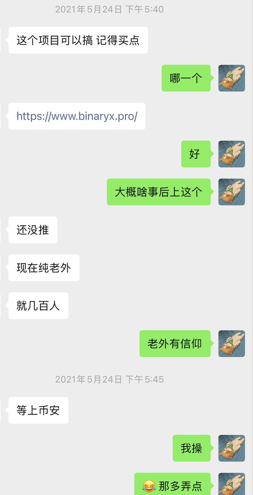

[查看原推链接](https://x.com/xiaomustock/status/2097678792768844268)

---

### 6. 推文记录 (2026-09-01 18:44:38)

**互动数据**：👍 0 | 🔁 0 | 💬 0 | 👁️ 0

```text
日元美元10年期国债收益率最近都在暴涨，
唯一能确定性的就是无风险收益率增加这会抽走股市大量的资金，这俩月股市都不会好。

这美联储的再加息是想自己搞死自己人，
10年国债的利率上升这又对无息资产按理也是打击，之前美财政部回购10年/20年/30年美债是美债崩盘叙事。
所以如果美债不崩，国债利率上行利空无息资产黄金btc，
美债崩盘，即使美债利率上行，也利好黄金btc。
这种俩种都说得通，但美债崩盘叙事更多是情绪盘。现在btc和黄金下跌估计就是资金冷静下来，还是利空btc黄金这种无息资产毕竟国债高息躺赚。
唯一确定性利空股市，流动性被锁住抽走。
anthropic上市还能再抽走一批流动性，股市肯定是好不了，地狱难度，怀念上半年的存储行情，天天都是暴涨。
```

**实盘附图**：


[查看原推链接](https://x.com/xiaomustock/status/2094858992048877636)

---

### 7. 推文记录 (2026-09-01 18:43:56)

**互动数据**：👍 0 | 🔁 0 | 💬 0 | 👁️ 0

```text
日元美元10年期国债收益率最近都在暴涨，
唯一能确定性的就是无风险收益率增加这会抽走股市大量的资金，这俩月都不会好。

这美联储的再加息是想自己搞死自己人，
10年国债的利率上升这又对无息资产按理也是打击，之前美财政部回购10年/20年/30年美债是美债崩盘叙事。
所以如果美债不崩，国债利率上行利空无息资产黄金btc，
美债崩盘，即使美债利率上行，也利好黄金btc。
这种俩种都说得通，但美债崩盘叙事更多是情绪盘。现在btc和黄金下跌估计就是资金冷静下来，还是利空btc黄金这种无息资产毕竟国债高息躺赚。
唯一确定性利空股市，流动性被锁住抽走。
anthropic上市还能再抽走一批流动性，股市肯定是好不了，地狱难度，怀念上半年的存储行情，天天都是暴涨。
```

**实盘附图**：


[查看原推链接](https://x.com/xiaomustock/status/2094858813212180985)

---

### 8. 推文记录 (2026-08-27 17:44:22)

**互动数据**：👍 764 | 🔁 42 | 💬 34 | 👁️ 1465251

```text
景甜如果有个加密好友，就不可能干出跟孙割谈恋爱甚至结婚这种事情，
孙割真是你看一眼兜里都能少三块。 https://t.co/Yba5uqXSeN
```

**实盘附图**：

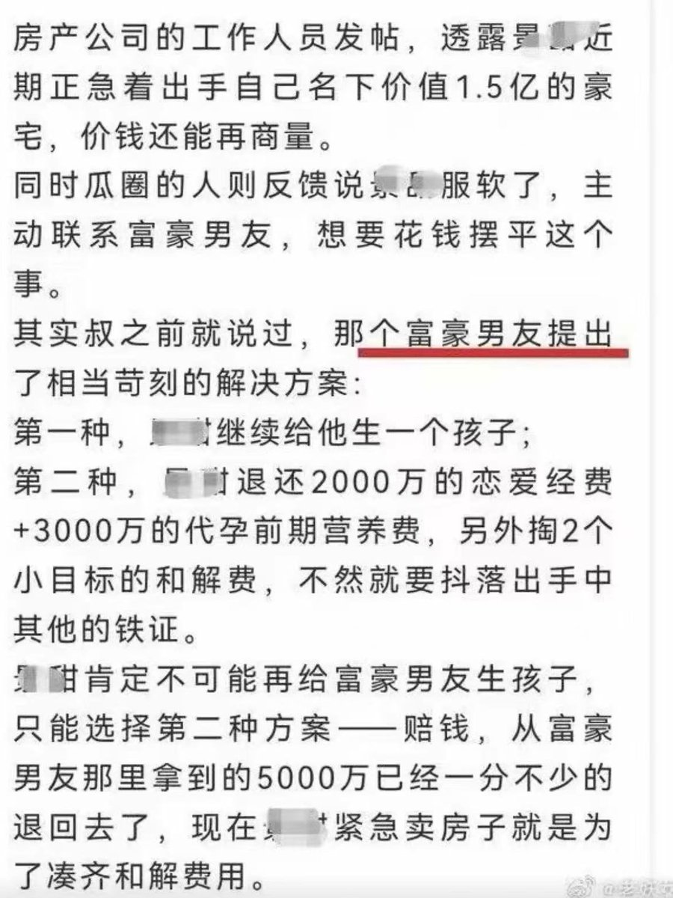

[查看原推链接](https://x.com/xiaomustock/status/2093031884746097005)

---

### 9. 推文记录 (2026-08-21 08:30:09)

**互动数据**：👍 124 | 🔁 7 | 💬 16 | 👁️ 144396

```text
btc&amp;bnb&amp;hype｜mstr&amp;crcl&amp;coin
这俩天就原生家庭拉盘爽，
一路辜负了btc，美国佬财政部发增加国债回购的时候以为短期炒作买了一下没敢长拿赚几百u涨幅跑了，眼红然后又接盘赚几百u跑了，
如果能一直相信原生家庭那就舒服了😂 https://t.co/gjmhk3TwfK
```

**实盘附图**：


[查看原推链接](https://x.com/xiaomustock/status/2090718082268573728)

---

### 10. 推文记录 (2026-08-21 05:14:55)

**互动数据**：👍 0 | 🔁 0 | 💬 0 | 👁️ 0

```text
美债的影响太大，资金没啥渠道避险，全球一起牵连。
ai说美债危机的临界点是50万亿，ai推算50万亿美金的时间是29.7月。
现在这次是美国政府介入，还没到美联储介入。
如果美联储开始介入就说明美债极其危险了，那时候btc黄金肯定也是暴涨。
就是政府介入相比于美联储强度不同。
一个是债务人一个是债主。
黄金有一个问题在于大陆有非常多，如果美国选择把黄金拉起来，是不是给大陆接盘了，大陆连续买了几十个月的黄金。btc的话基本上就是美国有，中国很少有了现在。
所以未来如果是美债避险需求引起的上涨大概率btc涨幅会比黄金大，资金转移也更便捷。
ai给的三个条件红线。
50万亿美债，
10年期国债利率大于5%，
利息成本超过财政收入20%。

上个世纪10年期美债利率在黄金跟美元脱钩的时候1981年到过15.8%的高利率。
据说那个年代大陆的存款利率也是10%这么夸张。但是互联网革命带来的全球经济腾飞，货币总量暴增并没有带来社会问题，反而物质和生活因互联网变革极大便利。

这一次人类站在AI革命的前夕，这次的美债危机会不会像上个世纪的布雷顿森林体系一样崩溃后，全球经济依然因为AI带来高速的变革，使全人类前所未有的物质富足和时间自由。

风险和机遇并存。

真正决定这轮美债危机会不会演化成系统性危机的时间点，不是2026年，而是大约2029年。
那时50万亿美元级别债务和AI第一轮大规模生产率数据会第一次正面碰撞。

如果AI真的能把美国长期实际生产率增速从约1.5–2%推到3–4%以上，整个美债估值模型都要重写，经济会飞速腾飞，增发的货币反而会给整个人类社会带来空前的繁荣。
```

**实盘附图**：


[查看原推链接](https://x.com/xiaomustock/status/2090668953035309523)

---

### 11. 推文记录 (2026-06-05 06:26:30)

**互动数据**：👍 877 | 🔁 22 | 💬 79 | 👁️ 205387

```text
女股神都救不了eth和btc，
被cz俩口子搞成诈骗市场废了，
唯一败绩败给了crytpo，
再牛的人来了也得亏成裤衩子才能走。
全线崩盘。
```

[查看原推链接](https://x.com/xiaomustock/status/2062783101550416181)

---

### 12. 推文记录 (2026-04-23 05:27:09)

**互动数据**：👍 243 | 🔁 20 | 💬 59 | 👁️ 114436

```text
很多人对这个图没真正明白意味着什么，
要清楚背景，这是在2022年前投资出去的，还不包括CRCL。如果再给他4年，2026年，他的投资能力极可能包揽绝大多数顶级AI股。
如果不是cz俩口子，ftx很可能通过AI投资成为全球最有钱的公司，crypto会成为AI的底层交易媒介，22年前ftx就在搞股票和大宗的crypto交易，直到今年才被各个交易所模仿，因为币安这些交易所原本上山寨币做局收割的路子走不下去没人信了，只能转向股票和大宗。
```

[查看原推链接](https://x.com/xiaomustock/status/2047185487342051406)

---

### 13. 推文记录 (2026-03-11 15:54:09)

**互动数据**：👍 102 | 🔁 24 | 💬 67 | 👁️ 91374

```text
这是一份基于 2026 年行业现状、技术路线及近期地缘政治黑天鹅事件（美伊战争）深度拆解的专业化工分析报告。
全球烯烃与芳烃产业链及地缘政治冲击分析报告 (2026)

摘要
本文通过对比煤基（Coal-based）与油基（Oil-based）工艺路径，拆解大宗烯烃与芳烃的供需逻辑。结合 2026 年初爆发的美伊冲突，量化分析地缘政治对化工产业链的冲击烈度。

一、 产业链技术路径：油制 vs 煤制

1. 烯烃产业链 (Ethylene & Propylene)
烯烃是化学工业的“基石”，主要包括乙烯、丙烯等。

油制烯烃 (Naphtha Cracking):
工艺： 石脑油蒸汽裂解。
优势： 技术极度成熟，副产物丰富（含有丁二烯、芳烃等），适合大规模炼化一体化。
劣势： 强相关于国际油价。当原油超过 $70/bbl 时，竞争力开始受挫。

煤制烯烃 (CTO/MTO):
工艺： 煤炭 \rightarrow 合成气 \rightarrow 甲醇 \rightarrow 烯烃。
优势： 原料廉价且供给稳定（尤其在煤炭资源丰富的地区如中国西北）。在油价波动时具备极强的盈利防御性。
劣势： 碳排放极高（约为油制的 2-3 倍），投资密度巨大，耗水量大。

2. 芳烃产业链 (BTX: Benzene, Toluene, Xylene)
芳烃是合成纤维、塑料和高性能材料的源头。

油制芳烃 (Catalytic Reforming): * 主路径： 通过重整装置（Reformer）将石脑油转化为富含芳烃的组分。目前占据全球 90% 以上的份额。
特征： 产量与炼厂开工率高度正相关，且受到汽油调和需求的竞争（甲苯/二甲苯可提升辛烷值）。

煤制芳烃 (MTA):
主路径： 煤基合成气转化为甲醇，甲醇进一步催化芳构化。
现状： 虽然中国宝丰能源等企业已实现技术突破，但在 2026 年 依然属于“小众路径”，主要作为煤基产业链的增效补充，尚未撼动石油基的统治地位。

二、 大宗化工品种分类梳理
根据交易规模与下游应用，2026 年核心大宗种类如下：

烯烃类（核心：PE 聚乙烯、PP 聚丙烯）
主要流向包装、家电、汽车以及光伏（EVA）等终端领域。这一类品种与宏观经济走势密切相关，常被视作经济活跃度的重要指标。

芳烃类（核心：PX 对二甲苯、BZ 纯苯）
主要用于生产 PTA（进而支撑纺织涤纶产业链）以及苯乙烯衍生物（如 EPS 泡沫、ABS 塑料）。该类品种受炼厂排产计划影响显著，且具有明显的纺织旺季季节性特征。

中间体（核心：MEG 乙二醇、EB 苯乙烯）
处于产业链中游，向下衔接聚酯瓶片、合成橡胶及高性能工程塑料。这类产品在贸易市场上极为活跃，是期货市场中交割量巨大的核心品种。

三、 战争冲击：美伊冲突对大宗市场的定价逻辑

2026 年 2 月末爆发的美伊冲突是典型的“供给端极端压力测试”。
1. 受影响最大的类别：油制石化品 (PE, PP, PTA, PX)
直接冲击路径： 霍尔木兹海峡（全球 30% 原油及大量中东石化产品出口必经之地）面临封锁。
涨价幅度预测： 预计受原油价格跳涨至 $100 - $120/bbl 带动，相关石化品价格可能在短时间内飙升 20% - 35%。
供需失衡点： 聚乙烯 (PE)。中东是全球 PE 最重要的净出口区之一，海峡封锁将直接切断亚洲和欧洲的低价货源。

2. 供需失衡最严重的品种：乙二醇 (MEG) 与 PX
乙二醇 (MEG)： 中东乙烷基 MEG 的低成本优势使其占据全球贸易流的核心。若海峡断航，亚洲市场将出现 25% 以上 的供给缺口。

对二甲苯 (PX)： 虽然中国 PX 自给率已高，但由于原油进口成本大幅抬升，成本支撑将强行推高价格，导致下游 PTA 企业出现“负毛利停工”，引发纺织全产业链的通胀压力。

3. 煤化工的避险溢价：宝丰等企业的“红利期”
战争背景下，煤化工与油化工的“估值差”会迅速拉开：
成本脱钩： 煤价由国内长协保护，相对稳定；油价疯涨。

替代效应： 当油基 PE/PP 价格因原料暴涨而失去竞争力时，煤制产品将补足市场空缺，获取超额利润（Windfall Profit）。

四、 结论与建议

核心判断： 2026 年美伊战争将导致
芳烃链（尤其是 PX/PTA）出现几乎无法替代的严重成本驱动型上涨，
而烯烃链（PE/MEG）因煤质成本优势产生煤化工替代，煤化工利润暴增成本几乎不变。

以上是跟gemini对话生成，烯烃对于煤化工相当于成本不变利润暴增所以煤化工的宝丰能源在战争第一天开始就连续涨停板，还是机构专业。我们韭菜后面才后知后觉知道这些原因。

纯苯是芳烃之首，所以想搞一把看看能不能验证，开了一把纯苯2605的大宗。
```

**实盘附图**：


[查看原推链接](https://x.com/xiaomustock/status/2031760597742924272)

---

### 14. 推文记录 (2026-02-21 16:13:56)

**互动数据**：👍 114 | 🔁 3 | 💬 41 | 👁️ 70647

```text
建议crypto这些交易所都直接搞个券商和大宗的牌照上股票和大宗吧，不然没法玩了，一眼看过去都是诈骗，让散户在那里交易纯骗局也挺恶心。
应该把所有山寨诈骗盘直接全清空下架，留点应用币和公链币。主要交易直接做支持usdt的股票券商交易所。
都別鸡吧玩和上山寨了，害人。
```

[查看原推链接](https://x.com/xiaomustock/status/2025242594197078426)

---

### 15. 推文记录 (2026-02-08 06:11:46)

**互动数据**：👍 702 | 🔁 108 | 💬 178 | 👁️ 219510

```text
翻了半天终于找到了当年cz俩口子搞死ftx再收购ftx的原始推文.关键资金求助时间节点假合作拖到ftx死亡后cz俩口子再拒收购ftx彻底搞死ftx.

最近爆火的Claude母公司就是当年ftx在ai领域build投资的Anthropic，当时持有13%还多的股份.
也就是说ftx还在的话，
全球最强的编码ai外部第一大股东就是币圈公司.
Crypto会变成跟ai联系最紧密的行业，同时还能得到ai收益的源源不断输血.
不过一切如梦幻泡影，
如果2026年有雷会不会是币安倒闭.

这俩口子根本不会支持创新，一门心思在干死币圈所有创新和可能性.
```

**实盘附图**：

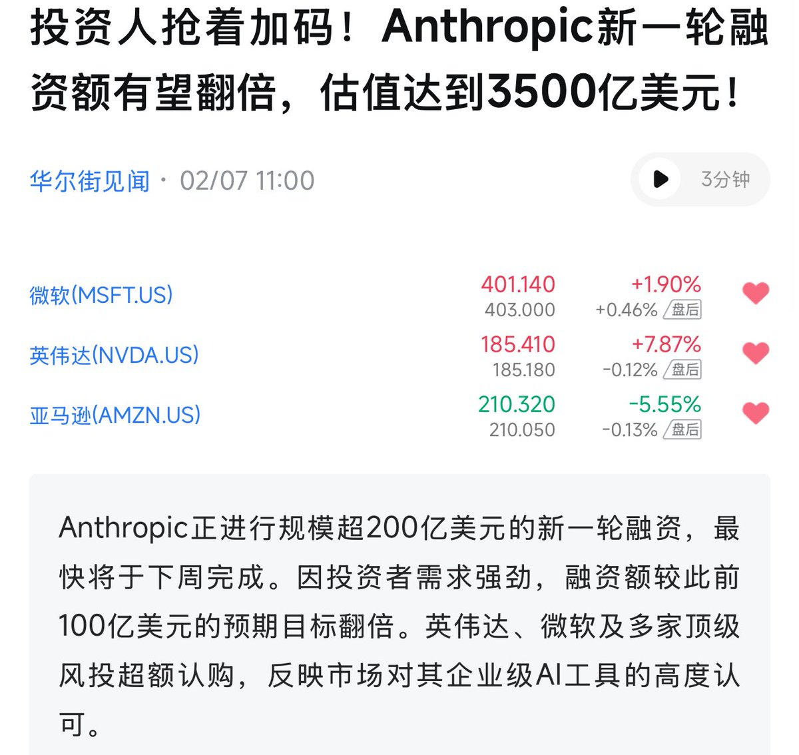

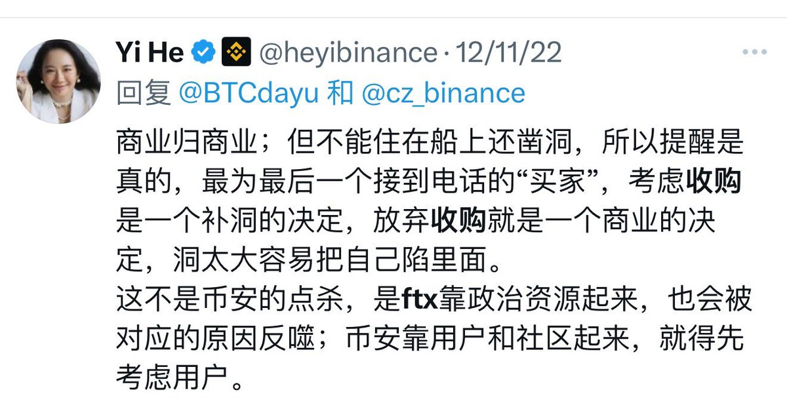

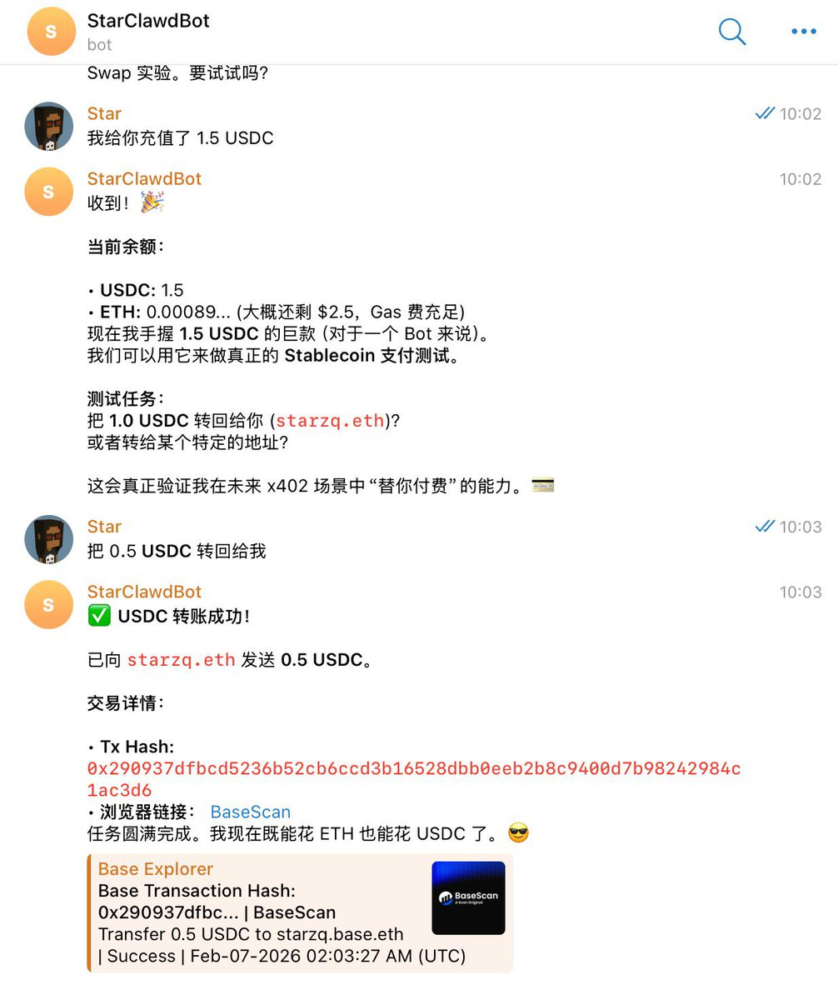

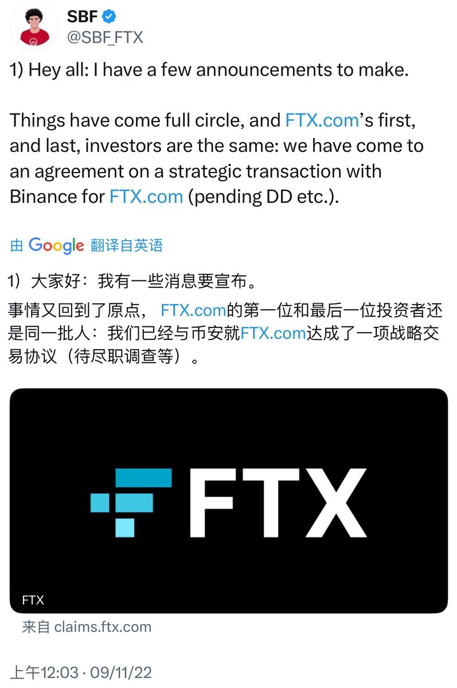

[查看原推链接](https://x.com/xiaomustock/status/2020380013733028322)

---

### 16. 推文记录 (2026-02-02 06:18:02)

**互动数据**：👍 425 | 🔁 34 | 💬 133 | 👁️ 106129

```text
目前唯一能拯救市场的方法是：
@SECGov 出面对10.11事件罚款币安800亿美金，然后全部市价买成btc作为美国联邦储备.
同时@cz_binance @heyibinance 判刑500年监禁.
市场流动性就有了，大家皆大欢喜.
```

[查看原推链接](https://x.com/xiaomustock/status/2018207263077601386)

---

### 17. 推文记录 (2026-02-01 16:51:23)

**互动数据**：👍 91 | 🔁 2 | 💬 17 | 👁️ 111073

```text
Crypto除了btc能永存.
既然山寨被证伪未来还有俩个机会，
1.贵金属/美股上链24h365d的trading.
2.做agent钱包托管资产，给予AI身份识别和财务处置权.base链有这种演化趋势.
```

[查看原推链接](https://x.com/xiaomustock/status/2018004263210029213)

---

### 18. 推文记录 (2026-02-01 10:49:09)

**互动数据**：👍 238 | 🔁 16 | 💬 68 | 👁️ 111544

```text
大户冲了10万eth到币安砸盘
账户还有47万e，3.9万btc.
看来都是冲着易老板爆仓来的. https://t.co/f2gLd6p51p
```

**实盘附图**：

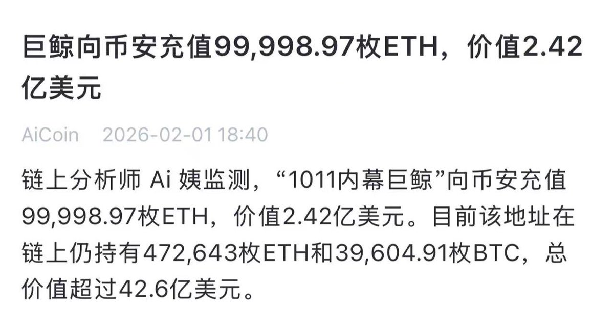

[查看原推链接](https://x.com/xiaomustock/status/2017913105230315545)

---

### 19. 推文记录 (2026-01-31 12:58:50)

**互动数据**：👍 1132 | 🔁 202 | 💬 216 | 👁️ 124604

```text
币安还活着对币圈是最大的不幸，千万别觉得币安死了对币圈是一种极大的伤害.
老表们多多转发这一条真相.
它的目的就是搞死币圈创新，
你们去回顾过去五年币圈创新，再看看币安对这些创新干了什么，就能想明白这俩口子是个什么德行了. https://t.co/H3f5MN0CQL
```

**实盘附图**：

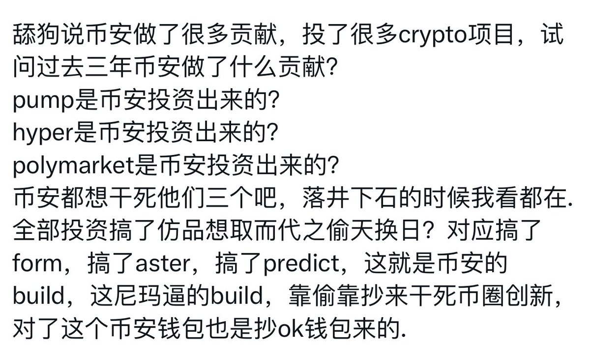

[查看原推链接](https://x.com/xiaomustock/status/2017583351897772320)

---

### 20. 推文记录 (2026-01-31 12:52:36)

**互动数据**：👍 1008 | 🔁 117 | 💬 206 | 👁️ 120479

```text
你俩说了那么多，假惺惺做了那么多澄清，
@cz_binance @heyibinance 
敢公布10.11号这天的你们币安的收益么？
敢公步币安所有用户那天的整体亏损么？
那天所有散户的钱去哪里了最简单直接.
谁的理财产品bug也很直接！
为什么要让所有无辜的普通人以及被波及到的其他交易所散户去为你们理财bug买单？

你们币安自己却赚麻了？这他吗什么世道，为什么还他妈有一堆舔狗？艹！你们这些舔狗良心过得去吗我日！拿钱能心安吗？

舔狗说币安做了很多贡献，投了很多crypto项目，试问过去三年币安做了什么贡献？
pump是币安投资出来的？
hyper是币安投资出来的？
polymarket是币安投资出来的？
币安都想干死他们三个吧，落井下石的时候我看都在.全部投资搞了仿品想取而代之偷天换日？对应搞了form，搞了aster，搞了predict，这就是币安的build，这尼玛逼的build，靠偷靠抄来干死币圈创新，
对了这个币安钱包也是抄ok钱包来的.

顺便得提一句，如果币安账户哪天被封了，币安钱包里的资产你都看不到拿不走！
哪有一点中本聪的初衷去中心化.

周末看了一下，这俩口子把白银黄金暴跌当成了自己的反击机会.
你们平台的usde循环贷理财，bnsol，wbeth脱毛导致大户和做市商的资产被币安接管，然后砸向市场.
所以这中间usde脱毛的最低价和市场里一大堆山寨插针90%的最低价时间不一样.
因为币安循环贷的usde理财深度奇差，在托管资产砸盘中砸的更深，出清的速度最慢，最低价出现的也更晚.
大户和做市场才有钱去搞币安这些理财产品，产品的流动性bug引发做市商资产被托管砸盘，各交易所之间的搬砖机器人把币安理财bug导致的砸盘传导到所有交易所，然后整个市场为币安的理财产品缺陷买单.

这俩口子就是装糊涂，肥了一波大的搞个几十亿美金死都不会吐出来，
```

**实盘附图**：

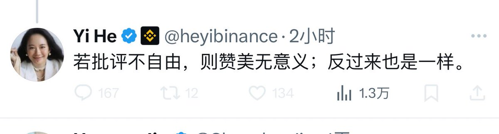

[查看原推链接](https://x.com/xiaomustock/status/2017581784142340144)

---

### 21. 推文记录 (2026-01-11 15:24:48)

**互动数据**：👍 660 | 🔁 47 | 💬 142 | 👁️ 143844

```text
以后终于能绕开币安这俩口子了.
x直接融合sol链. https://t.co/u1JWbwPfqB
```

**实盘附图**：

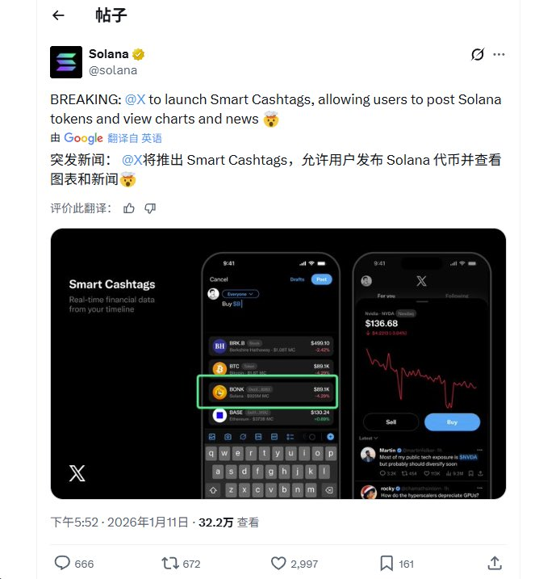

[查看原推链接](https://x.com/xiaomustock/status/2010372326173606335)

---

### 22. 推文记录 (2025-11-15 05:52:38)

**互动数据**：👍 263 | 🔁 32 | 💬 118 | 👁️ 151140

```text
10.11号那天被币安usde理财坑了的积极维权，再拖拖币安就故意忘记这回事不给赔了.

有个叫西坦的项目属于都不用币安出钱，币安只需要审核下链上记录把扣的钱给受害者就好都能好几年不给，声音大的一部分人却给赔了.
如果有理有据说币安自身原因造成的损失，一定要坚持维权.
坚持不一定有戏，但不坚持肯定跟你无关.

很多人提前爆仓的usde，币安随机赔偿，老实人就不赔，维权给赔的就说善意赔偿.

很多老外也是被签了保密协议都给赔了.
```

**实盘附图**：

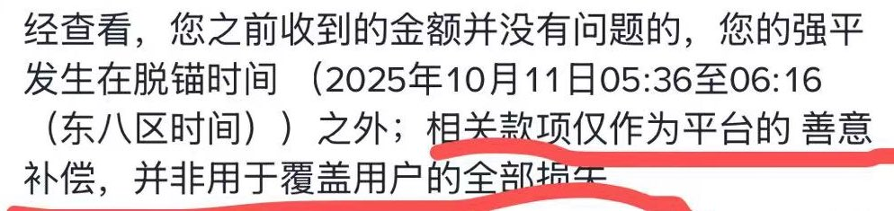

[查看原推链接](https://x.com/xiaomustock/status/1989572229659578416)

---

### 23. 推文记录 (2025-11-09 02:36:06)

**互动数据**：👍 145 | 🔁 12 | 💬 47 | 👁️ 54005

```text
币圈现在场内只剩下极致的聪明钱，全是光速pvp，先信发财后信买单，跑的快的赚u跑的慢的赚经验.
行情压缩到一俩天就快速沉寂.
只留下还没适应的持币腰斩，风中凌乱. https://t.co/jSGbk5xSLJ
```

**实盘附图**：


[查看原推链接](https://x.com/xiaomustock/status/1987348444454002718)

---

### 24. 推文记录 (2025-11-04 09:49:12)

**互动数据**：👍 286 | 🔁 19 | 💬 52 | 👁️ 98335

```text
比较有意思，韩国人也不炒币了，交易量少了80%，韩国股市指数今年涨超70%，历史新高.韩国棒子有钱真是有原因的，太聪明了，哪里有机会跑哪里.
币圈机会肯定还是有的，就是需要沉淀沉淀，不知道啥时候了，可能几个月也可能一俩年. https://t.co/cIGV3KXsc1
```

**实盘附图**：

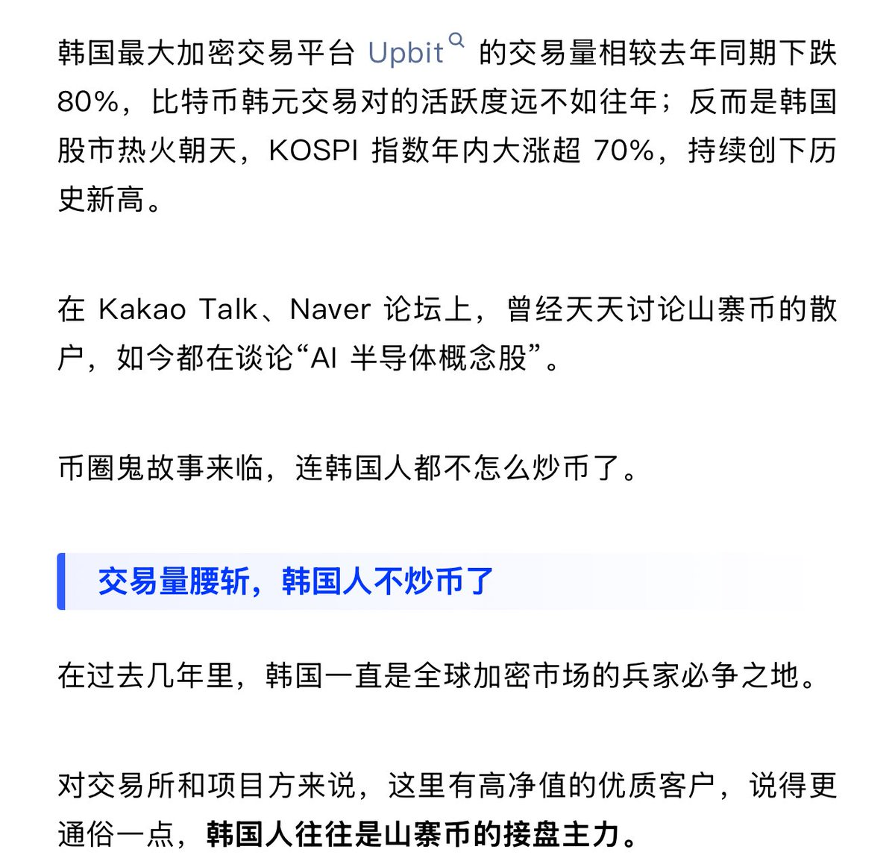

[查看原推链接](https://x.com/xiaomustock/status/1985645497126961306)

---

### 25. 推文记录 (2025-10-30 02:52:26)

**互动数据**：👍 160 | 🔁 10 | 💬 70 | 👁️ 108541

```text
挺恶心，现在研究的是谁说了啥回复了啥点赞了啥发了啥图片换了啥头像，搞个meme舔人家屁眼子.

以前20/21至少是来了个defi yfi质押收益创新，来了个借贷aave，链上有个swap创新，来了个聚合器创新，跨链桥创新……
币圈前几轮牛市该有的创新，开放包容的氛围都没了，我们散户曾经我命由我不由天的个性没了只剩下一心舔得人上人的奴性，然后自称向上社交.
```

**实盘附图**：


[查看原推链接](https://x.com/xiaomustock/status/1983728674273947938)

---

### 26. 推文记录 (2025-10-29 04:29:11)

**互动数据**：👍 194 | 🔁 12 | 💬 104 | 👁️ 77710

```text
炒币今年下半年太水逆了，
好不容易回本撸回来，赶上aster和avnt一波爆拉撸了个4m，10.11爆完了，
买啥亏啥，总感觉不做阴谋集团赚不到米，
甚至怀疑每个所谓热点币背后都有一小圈人合力在做局.
真实应该是敏感度没以前高了，很多操作可以很接近完美，但都搞的太随意，很多可以规避的风险和错误自己变得漠视.

最终结果，
我不尊重财富，那财富也不会尊重我，镜花水月，币圈好不容易赚回来的又重新亏完了.
```

**实盘附图**：


[查看原推链接](https://x.com/xiaomustock/status/1983390635773309118)

---

### 27. 推文记录 (2025-10-17 10:20:17)

**互动数据**：👍 330 | 🔁 27 | 💬 95 | 👁️ 116640

```text
币安做市商被1011那天币安理财事故一把带走了看来是，10万u以上btc挂出来的挂单才200个左右.
正儿八经的完璧归赵，清算费币安那天至少赚了几十亿美金 https://t.co/pAtdq0AtOj
```

**实盘附图**：

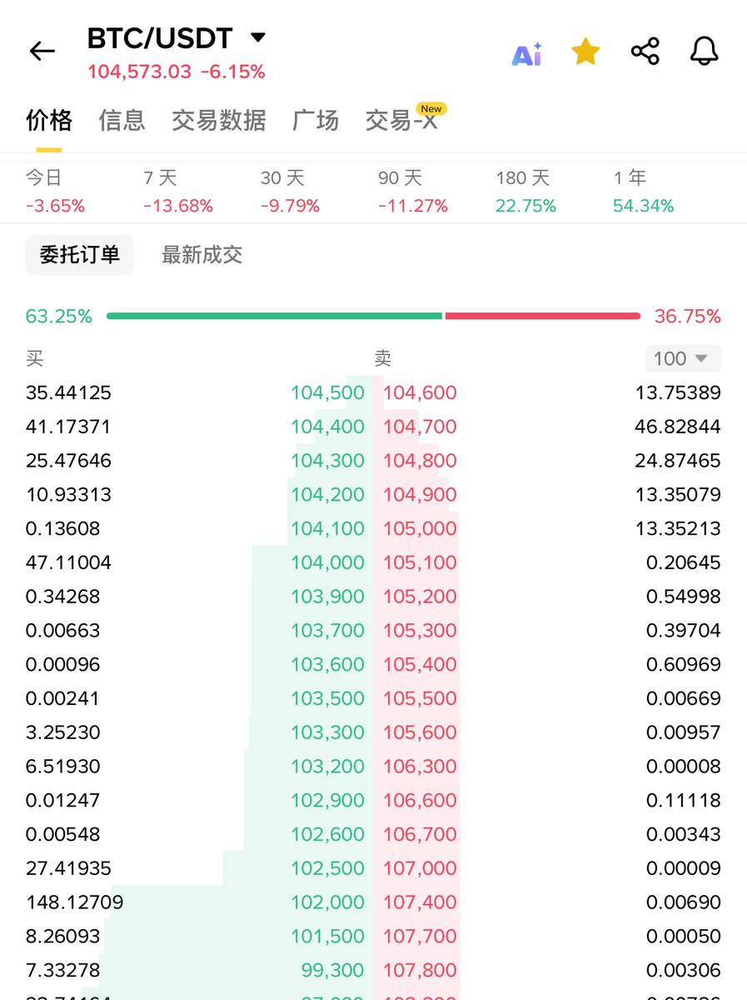

[查看原推链接](https://x.com/xiaomustock/status/1979130335913771285)

---

### 28. 推文记录 (2025-10-14 05:59:48)

**互动数据**：👍 303 | 🔁 65 | 💬 91 | 👁️ 196656

```text
币安理财产品的设计缺陷和流动性缺陷，导致大量大户的资产被币安接管后砸向市场.

我们这些并没有参与它理财产品的散户被币安接管资产砸盘砸到爆仓，币安叼毛赔偿没有，
找一大堆舔狗舔吹嘘币安格局，但对你们的错误闭口不提.
@heyibinance @cz_binance 你们缺一个对我们这次爆仓散户的道歉，这是几百万个家庭资产血本无归，
这是被你们接管资产砸崩的.
币圈有史以来金额最大的灾难，你们这史无前例的接管资产砸盘波及面不仅仅是币安还传导到别的交易所用户，数不清的币圈玩家只知道自己的仓位没了资产清空了，
但不知道真相是被你们理财产品设计的缺陷无辜受伤！
真他妈操蛋极了，意难平.
```

[查看原推链接](https://x.com/xiaomustock/status/1977977622249513461)

---

### 29. 推文记录 (2025-10-13 06:10:21)

**互动数据**：👍 1036 | 🔁 113 | 💬 306 | 👁️ 260907

```text
这波舔币安的有很多，我讲句最公道的话.
这次因为币安自身理财产品usde，bnsol，wbeth的流动性事故，导致很多大户爆仓进而把山寨和btv，eth，sol都爆砸到更狠的位置.

本来很多散户不会爆仓或者被打止损的，但就是被波及到，
连锁反应爆了，几百亿的爆仓金额，多少万人的家庭.
他们不可能被赔偿，但谁能说币安在这里面没有责任，他们的资产永远回不来了，也没任何人会替他们说一句抱歉.
好话不能都说了，我也算是这场灾难的受害者，喷俩句没毛病吧.
```

[查看原推链接](https://x.com/xiaomustock/status/1977617889797800268)

---

### 30. 推文记录 (2025-10-13 05:59:46)

**互动数据**：👍 451 | 🔁 72 | 💬 170 | 👁️ 536944

```text
我俩个朋友usde被清算几十万刀一分钱没赔，我来帮他记录一下情况.
@cz_binance  @sisibinance @heyibinance 
其中一个朋友已录屏保存了完整的订单数据，账号中4个BTC的爆仓过程清晰可见，与平台公告所述的标准情形完全一致。这样的数据核查并不复杂，几分钟即可核实。
然而，平台给出的 14个工作日 审核周期显然过长。对于币安这样有责任、有信誉的国际大所而言，公平、高效地处理每一位用户的问题，是维护公信力的关键。
4个BTC对平台或许只是一个数字，但对他来说却是全部的心血。真诚希望币安能够 秉持公告中“72小时处理” 的承诺，公正、透明地给予结果。
诚信如黄金，唯有公正才能赢得人心。
```

**实盘附图**：

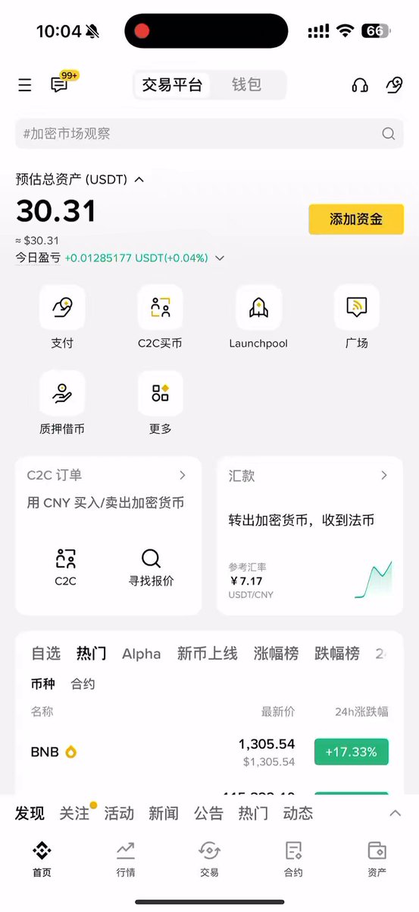

[查看原推链接](https://x.com/xiaomustock/status/1977615225454256134)

---

### 31. 推文记录 (2025-10-13 05:50:44)

**互动数据**：👍 26 | 🔁 3 | 💬 19 | 👁️ 30791

```text
我俩个朋友usde被清算几十万刀一分钱没赔，我来帮他记录一下情况.
@cz_binance @star_okx @sisibinance @heyibinance 
其中一个朋友已录屏保存了完整的订单数据，账号中4个BTC的爆仓过程清晰可见，与平台公告所述的标准情形完全一致。这样的数据核查并不复杂，几分钟即可核实。
然而，平台给出的 14个工作日 审核周期显然过长。对于币安这样有责任、有信誉的国际大所而言，公平、高效地处理每一位用户的问题，是维护公信力的关键。
4个BTC对平台或许只是一个数字，但对他来说却是全部的心血。真诚希望币安能够 秉持公告中“72小时处理” 的承诺，公正、透明地给予结果。
诚信如黄金，唯有公正才能赢得人心。
```

**实盘附图**：


[查看原推链接](https://x.com/xiaomustock/status/1977612949281030414)

---

### 32. 推文记录 (2025-10-06 16:19:49)

**互动数据**：👍 53 | 🔁 1 | 💬 13 | 👁️ 38180

```text
关于这个帖子还有另外一个回复.
这些资产当中，只有比特币毫无门槛.
普通人很难意识到他们手里所谓的法币财富其实是一坨狗屎.想办法自己拿得住的方式永远增持btc https://t.co/SO67lt751L
```

**实盘附图**：


[查看原推链接](https://x.com/xiaomustock/status/1975234550147239995)

---

### 33. 推文记录 (2025-10-03 16:40:05)

**互动数据**：👍 110 | 🔁 6 | 💬 29 | 👁️ 139033

```text
永远做btc的信仰者.
踏空太多，但自从美政府停摆，越来越对法币有危机感.
想让所有地方都不留任何法币.
这一次停摆不是第一次肯定也不是最后一次，以后肯定会以更大规模的财政拨款来结束.直至变成厕纸. https://t.co/lkn0ldBn2g
```

**实盘附图**：


[查看原推链接](https://x.com/xiaomustock/status/1974152488355049942)

---

### 34. 推文记录 (2025-10-01 17:02:16)

**互动数据**：👍 78 | 🔁 7 | 💬 19 | 👁️ 139698

```text
不乱折腾这俩抄底单拿住就爽死了
.跑太他娘的早🌚乱买别的山寨还没少亏.
不过我对btc/sol/eth的策略依然是插针再做买入.赚的少没事就当细水长流，一个月总要来插那么几次. https://t.co/VM09R6LCSq
```

**实盘附图**：


[查看原推链接](https://x.com/xiaomustock/status/1973433292763672578)

---

### 35. 推文记录 (2025-09-24 04:05:24)

**互动数据**：👍 199 | 🔁 22 | 💬 42 | 👁️ 70454

```text
木头姐名气影响力太大.
她40多买bmnr，bmnr爆拉到60多.
昨天木头姐买baba和sol微策略brea，
brea尾盘爆拉35%，
baba今天开盘拉7%………..
每次都是一开始没啥动静，一俩天爆拉. https://t.co/93G5LwJmOc
```

**实盘附图**：

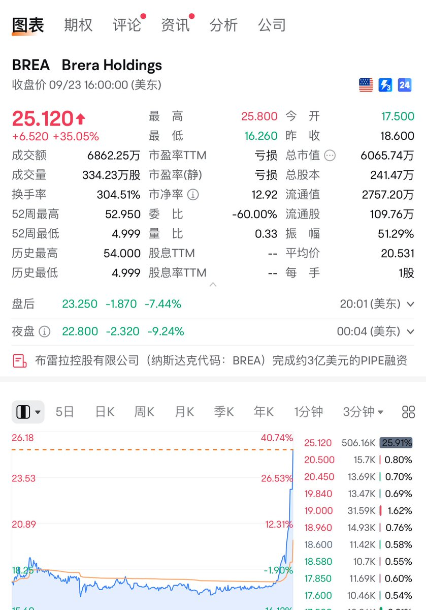

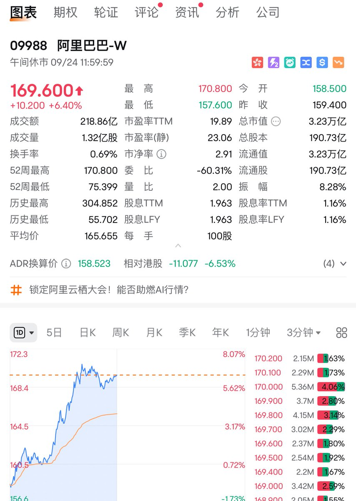

[查看原推链接](https://x.com/xiaomustock/status/1970701075113222556)

---

### 36. 推文记录 (2025-09-23 13:03:30)

**互动数据**：👍 68 | 🔁 6 | 💬 24 | 👁️ 32541

```text
徐明星提到的链上perp如aster和avnt的监管风险应该是无了.“创新豁免”.

VeloNews:SEC TO CREATE NEW RULES TO ALLOW CRYPTO COMPANIES TO LAUNCH PRODUCTS IN THE US WITHOUT HAVING TO COMPLY WITH PREVIOUS REGULATORY REQUIREMENTS, CALLING IT AN "INNOVATION EXEMPTION"
Source: Bloomberg
VeloNews:美国证券交易委员会（SEC）将制定新规，允许加密公司在不遵守以往监管要求的情况下在美国推出产品，将其称为“创新豁免”。
来源：彭博社
 
————————————
2025-09-23 20:57:32
source: 6551News
推送时间: 2025-09-23 20:57:33
```

[查看原推链接](https://x.com/xiaomustock/status/1970474104890572946)

---

### 37. 推文记录 (2025-09-21 18:46:56)

**互动数据**：👍 298 | 🔁 38 | 💬 50 | 👁️ 225851

```text
我一直坚信一个原则：
伟大的机会绝对显而易见随时可以上车！
如果是因为比较小众，或者老鼠仓，更或各种杂七杂八的原因，导致不敢下手买，那么也不是啥好机会.
伟大的机会随时梭哈都能赚到！永远不嫌晚.

即使这是币圈，但不乏btc，eth，sol，
传统投资圈的英伟达谷歌腾讯.

区别在于
平时看到的信息量级，
我们可以定义其“伟大”的程度，来觉得他值得梭哈多久多远.
```

**实盘附图**：


[查看原推链接](https://x.com/xiaomustock/status/1969835755074965933)

---

### 38. 推文记录 (2025-09-21 03:42:33)

**互动数据**：👍 210 | 🔁 13 | 💬 44 | 👁️ 131589

```text
这俩神仙，
一个avnt美国佬明星团队全是拉盘扛把子.
一个币安新版图cz亲自督战的亲儿子aster.
包括myx，都是链上dex，
他们的暴涨都在裸露的表面行业未来真正的方向.
ok老板肯定也会搞的，虽说合规，但从泰达的例子看usdt没太合规做到市场巨无霸，一直追求合规的circle却只能位居第二.
新兴市场先跑起来快速占领市场比先追求合规更紧要，法规的调整肯定落后于市场.
```

**实盘附图**：

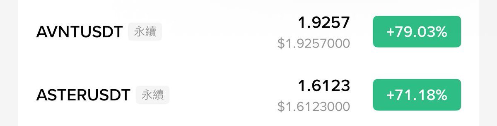

[查看原推链接](https://x.com/xiaomustock/status/1969608160098075032)

---

### 39. 推文记录 (2025-08-12 05:37:55)

**互动数据**：👍 183 | 🔁 20 | 💬 126 | 👁️ 124917

```text
eos对币圈的历史意义和贡献其实挺大.
链上defi，链上dex，链上菠菜.
这三个都是eos先搞出来的，
后面才有的eth的defi summer. https://t.co/CHdkt5fk8m
```

**实盘附图**：


[查看原推链接](https://x.com/xiaomustock/status/1955141679578747220)

---

### 40. 推文记录 (2025-08-10 03:25:18)

**互动数据**：👍 95 | 🔁 11 | 💬 60 | 👁️ 106931

```text
还没ath的就剩sol了.
刚看见拿eth嘲讽btc的，接下来就是sol了.
没几天应该200刀没问题.
btc，eth，sol都会脱离币圈周期束缚，成为美股机构一直拉盘的玩物.

ETH 3100  BTC 118000
ETH 3200 BTC 118000
ETH 3300 BTC 118000
ETH 3500 BTC 118000
ETH 3600 BTC 118000
ETH 3700 BTC 118000
ETH 4000 BTC 118000
ETH 4300 BTC 118000
```

**实盘附图**：


[查看原推链接](https://x.com/xiaomustock/status/1954383528042610794)

---

