# 卷三 · 现货期货微观结构与庄家行为学手册

> **原著经验**：[@xiaomustock](https://x.com/xiaomustock) · 川沐｜Trumoo
> **整理收录**：[@SUOHA_AI](https://x.com/SUOHA_AI) · 梭哈.AI

剖析期现基差、庄家平多建空暗流、倒金字塔崩盘机制、异常挂单深度与多空爆仓清洗逻辑。

---

## 核心精选实盘推文汇编

### 1. 推文记录 (2026-09-09 06:37:53)

**互动数据**：👍 249 | 🔁 24 | 💬 20 | 👁️ 140873

```text
从7月到现在原油快翻倍了，导致各种化工产品价格也非常高，化肥也是石油化工的一环。
叠加厄尔尼诺气候影响，多种因素把农产品价格也带起来了。
黑天鹅才是真正的暴富机会，
最爽的是黑天鹅这几年几乎每年都有。
疫情期间的负油价，gpt诞生，俄乌，关税，美伊….几乎没间断过。
所以平时没黑天鹅大机会的时候不要硬干，不要硬上杠杆。
活得久所有机会才跟你有关。
```

**实盘附图**：

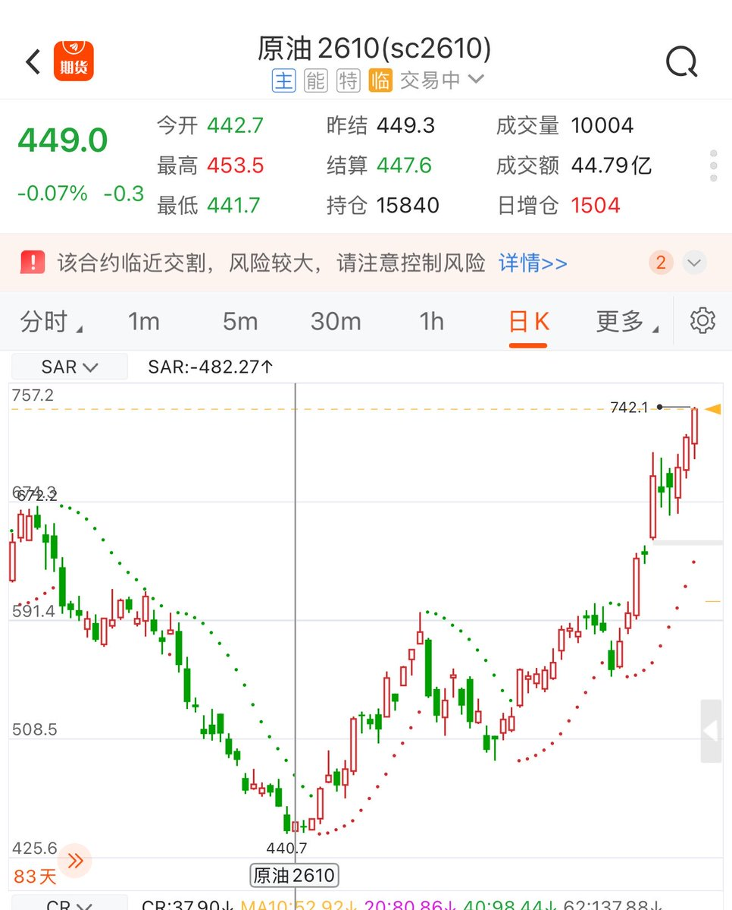

[查看原推链接](https://x.com/xiaomustock/status/2097575198375772302)

---

### 2. 推文记录 (2026-04-23 17:14:31)

**互动数据**：👍 147 | 🔁 15 | 💬 30 | 👁️ 82089

```text
很多人是不是觉得自己一开合约，价格立马反向走，尤其是高倍杠杆爆仓价很接近的btc单子，那基本上是交易所的自营做市商AI策略，监测到你高倍杠杆，不影响其他反方向人单子的情况下自动往你爆仓价走插针。
ok和币安我怀疑都有，但是没证据这种事情😂
退出币圈对绝大多数普通人来说是最正确的事情，这里的黑暗和操纵没有任何法律约束。
```

[查看原推链接](https://x.com/xiaomustock/status/2047363502566990240)

---

### 3. 推文记录 (2026-03-03 08:48:13)

**互动数据**：👍 40 | 🔁 2 | 💬 23 | 👁️ 38020

```text
美国佬打伊朗图啥？为了啥打？什么目的停止？
怎么感觉是特朗普单纯开了股指空单石油多单，想跟去年一样撸一把大的。
然后让军队瞎几把狂干，
自己家里人隔着瞎几把狂赚。 https://t.co/CQ7y437HNI
```

**实盘附图**：


[查看原推链接](https://x.com/xiaomustock/status/2028754306170777995)

---

### 4. 推文记录 (2026-02-11 01:05:37)

**互动数据**：👍 151 | 🔁 18 | 💬 104 | 👁️ 1696272

```text
当年有个群友菀凌在ok几个亿的仓位也是限制开单只减仓无法补保证金被爆了.
这个新闻里的大户杨秀春没参加合约交易的现货账户517btc理应属于她自己。
打个比方，如果交易所资产管理的权限能涉及到银行卡或者个人钱包，那这种穿仓难道也要顺道把银行卡和钱包也冻掉，所以完全没道理的事情.@star_okx
```

[查看原推链接](https://x.com/xiaomustock/status/2021390129408151557)

---

### 5. 推文记录 (2026-02-06 04:09:37)

**互动数据**：👍 415 | 🔁 11 | 💬 121 | 👁️ 354322

```text
今年莫名其妙赚66倍居然是这么来的，
今天准备把币安销户走人，
然后登上去看哪里还有渣渣都提走，
意外发现当年刷aster，机器人停了居然里面还有一个机器人开的空单没走，卧槽，机器人10万6开的. https://t.co/h8bmljN8v4
```

**实盘附图**：

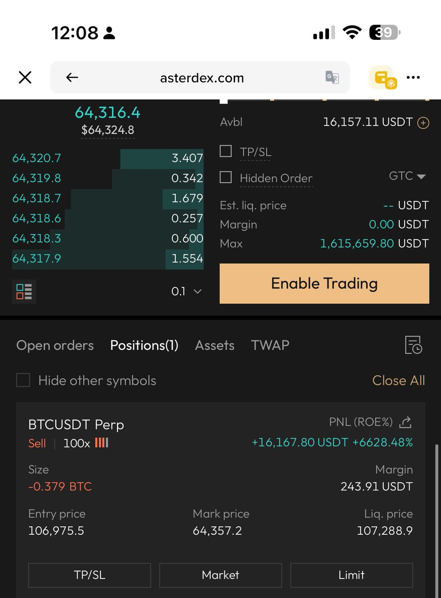

[查看原推链接](https://x.com/xiaomustock/status/2019624497457107104)

---

### 6. 推文记录 (2026-02-03 08:06:54)

**互动数据**：👍 86 | 🔁 4 | 💬 28 | 👁️ 110821

```text
沪银2604加仓到了70，成本移动到22807.
这半年搞大宗以来，利润还有个520，
但是这单搞完不敢玩了，真怕天天被按跌停本金利润一波被带走.

以后坚决不玩大宗了，不然人的贪欲会被期货的杠杆不断放大，尤其是我自己的贪欲，人性太丑恶丑陋了. https://t.co/4wRvW700Ov
```

**实盘附图**：


[查看原推链接](https://x.com/xiaomustock/status/2018597045460996105)

---

### 7. 推文记录 (2026-02-01 05:38:09)

**互动数据**：👍 145 | 🔁 13 | 💬 47 | 👁️ 84984

```text
那天沪银跌停板手贱买了一下套住了，做一个周一的规划.
计划开盘能给平开或者少亏点的机会抢跑出来.
然后如果能继续接近跌停板到个沪银2.1万多再买把大的堵超级反弹.
会有超级反弹基于俩点.
1. 超级暴跌斩价1/3，会逼使工业需求的大佬进来进货，
2. 其次是巨额浮赢的空单离场，空头平仓就是相当于买多.

剧本估计是从开盘暴跌深v往上拉一波.
```

**实盘附图**：


[查看原推链接](https://x.com/xiaomustock/status/2017834838896873852)

---

### 8. 推文记录 (2025-12-24 09:53:12)

**互动数据**：👍 542 | 🔁 37 | 💬 273 | 👁️ 162983

```text
cz之前花200万刀抄底aster的操作属于表演式抄底骗韭菜接盘看来.
本身整个aster都是cz的，免费零成本的aster筹码cz有数亿个.
本来很多人一刀以上都跑完了，
然后cz拿200万刀相当于我们散户拿2u买，把大多数散户再忽悠一把再骗进来格局.
@cz_binance https://t.co/WABT5y0Bvy
```

**实盘附图**：

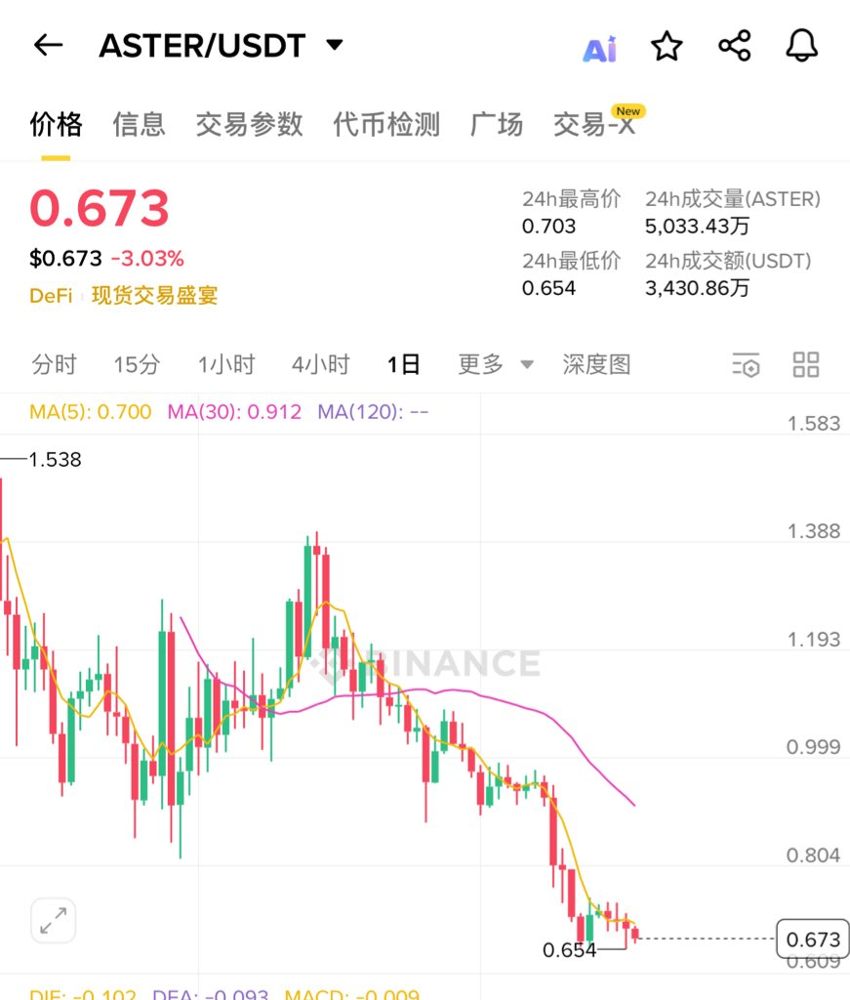

[查看原推链接](https://x.com/xiaomustock/status/2003765898180714898)

---

### 9. 推文记录 (2025-11-05 17:34:27)

**互动数据**：👍 118 | 🔁 5 | 💬 131 | 👁️ 377408

```text
这个还是要给澄清一下，我当时真是为了销号才登上去上去看了一眼，没想到给赔了11万u.
第一，我自己这个号没去维权就单纯提交工单申诉返还.
第二，一姐来说赔的时候确实也不知道是我.
所以不存在啥kol的赔，散户的不赔.
老表们那天插针爆仓有多扣u的情况，
积极去申诉提交个工单. https://t.co/wftXMOsGlj
```

**实盘附图**：


[查看原推链接](https://x.com/xiaomustock/status/1986124968980324447)

---

### 10. 推文记录 (2025-11-04 11:12:18)

**互动数据**：👍 254 | 🔁 14 | 💬 152 | 👁️ 318759

```text
刚突然收到了币安发来的11.6万美金补偿.
当时10.11号5.18分我账户提前被强平带走了，
当时提交了个币安工单，申诉返还我被多扣走的u，以为币安叼毛不赔了，他娘的居然真赔了点，也没私下找他们维权.
如果按照那天爆仓价资金被多扣了的可以找币安理论理论老表们，说不定也能给赔一波.
反正有理有据. https://t.co/0fqr3SXJVb
```

**实盘附图**：

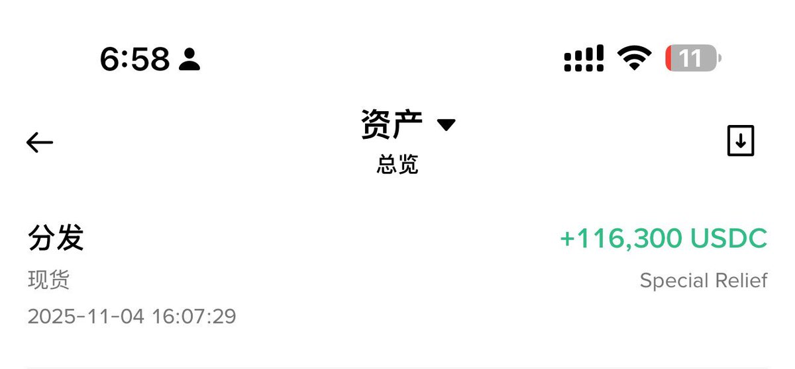

[查看原推链接](https://x.com/xiaomustock/status/1985666410962735268)

---

### 11. 推文记录 (2025-11-03 11:20:52)

**互动数据**：👍 127 | 🔁 5 | 💬 33 | 👁️ 75932

```text
一堆人在那反驳洗白cz喊完紧接着hype的5000万美金空单，
就这样说，一个应用类型的山寨庄币，
你不是项目方或者项目方关系户，
脑子没问题不可能去空5000万美金.
这玩意不用讲证据.
至于为啥不在aster，赚hpye的钱总比赚aster自己的钱好吧.
孙割有币砸盘还专门去币安砸不在火币砸.
```

[查看原推链接](https://x.com/xiaomustock/status/1985306175555125342)

---

### 12. 推文记录 (2025-10-26 05:35:08)

**互动数据**：👍 558 | 🔁 87 | 💬 147 | 👁️ 176515

```text
爆仓cz赔老外的卧槽，不敢惹洋大人. https://t.co/QEpasshTw4
```

**实盘附图**：

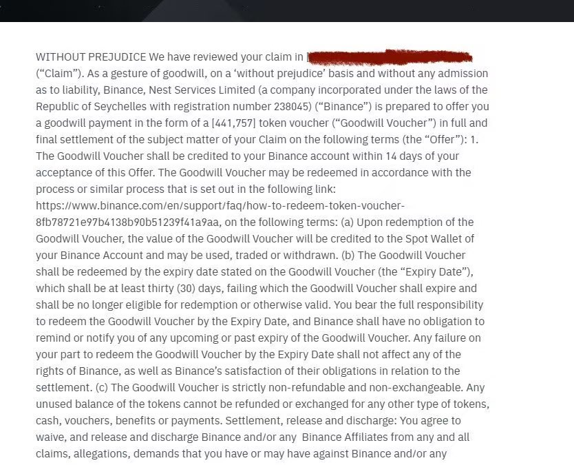

[查看原推链接](https://x.com/xiaomustock/status/1982320067883995472)

---

### 13. 推文记录 (2025-10-11 06:29:01)

**互动数据**：👍 564 | 🔁 40 | 💬 200 | 👁️ 476585

```text
上榜了他娘的，原来是爆仓的，暴里爆没了😭😭😭😭😭😭 https://t.co/4LJxfBVtFA
```

**实盘附图**：

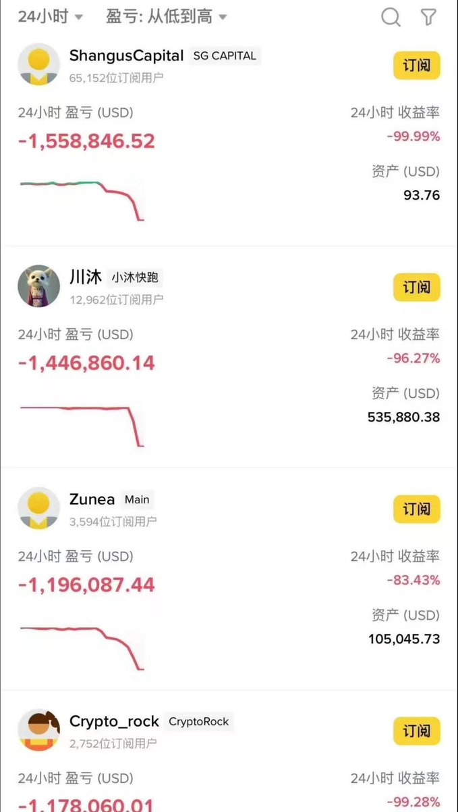

[查看原推链接](https://x.com/xiaomustock/status/1976897808382017861)

---

### 14. 推文记录 (2025-09-20 08:23:24)

**互动数据**：👍 308 | 🔁 56 | 💬 35 | 👁️ 156051

```text
费率为负的时候庄家随时能走，因为已经有了海量的对手盘.
但是费率为正不行，因为对手盘是空军，他想走就要空军买单才行，费率正说明空军的量还没有狗庄的单量多，对手盘不足不好走.
那么只有继续拉盘拉到足够多的对手盘出来了，费率负了那就可以安心走了，至于那种情况下什么时候走就完全看狗庄心情.
```

[查看原推链接](https://x.com/xiaomustock/status/1969316449958158832)

---

### 15. 推文记录 (2025-09-20 08:03:14)

**互动数据**：👍 302 | 🔁 28 | 💬 46 | 👁️ 65510

```text
最近一些爆辣的的币的一点思考记录一下.
如果一个币拉了很多倍，
正常人都想空但费率还是正的，
说明狗庄在里面还没走，
而且远大于空军持仓.
那么庄家走的时间点至少是费率率由正转负，才可能会出现下跌. https://t.co/YtrTAYjK1u
```

**实盘附图**：


[查看原推链接](https://x.com/xiaomustock/status/1969311376607793254)

---

### 16. 推文记录 (2025-09-10 11:05:28)

**互动数据**：👍 144 | 🔁 25 | 💬 43 | 👁️ 96443

```text
之前跟朋友弄了一篮子低于10m的合约，
只有一俩个亏.其他全赚.
估计现在依然能这么干，下架就是利好.

之前这条推特的含金量依然在，赌单个很难，买一篮子必中. https://t.co/hjRRYPfNR3
```

**实盘附图**：


[查看原推链接](https://x.com/xiaomustock/status/1965733357440180621)

---

### 17. 推文记录 (2025-07-19 06:59:07)

**互动数据**：👍 135 | 🔁 18 | 💬 51 | 👁️ 184694

```text
sbet和eth的买点等24号50亿增发通过，先干eth，看增发对sbet的影响，影响不大继续干.
有些人说左手倒右手，完全没必要而且非常不符合利润最大化.
首先能确定的事情，卖股票是真卖了10亿美金出来.
那么他们利润最大化的操作是杠杆开多eth，
然后拿卖股票的10亿美金真金白银市场买eth，拉升eth价格，这样才能赚最多.

这样去看左手倒右手是不是非常可笑.
左手倒右手干什么呢，拿着10亿美金存银行？完全不如市场合约杠杆套利，用来真金白银拉盘.用公司卖的钱为所有相关利益团体服务，明牌赚钱.
```

[查看原推链接](https://x.com/xiaomustock/status/1946464804144611654)

---

### 18. 推文记录 (2025-07-18 02:04:36)

**互动数据**：👍 147 | 🔁 3 | 💬 85 | 👁️ 199112

```text
这人eth空单爆仓价3686，估计一会就爆了. https://t.co/1AXTGZqCR0
```

**实盘附图**：


[查看原推链接](https://x.com/xiaomustock/status/1946028298993107044)

---

### 19. 推文记录 (2025-06-18 15:43:18)

**互动数据**：👍 201 | 🔁 17 | 💬 62 | 👁️ 85033

```text
用朋友的话说，
现在各个交易所都在引导用户玩合约，
这里面都是尸山血海，
合约用户活不过一个月，
别看我也玩，但我是亏完也啥都不影响，
你们有家有口的，能别赌合约就别去赌，
耐住诱惑，无底洞. https://t.co/JwQqIX14Kn
```

**实盘附图**：


[查看原推链接](https://x.com/xiaomustock/status/1935362693936152875)

---

### 20. 推文记录 (2025-06-17 04:56:45)

**互动数据**：👍 149 | 🔁 21 | 💬 30 | 👁️ 118737

```text
有结果的时候一定要想着先守财，把财富稳定下来，保证后半生衣食无忧，再考虑更进一步.
上一轮有非常多的人发了大财，财富的增速远远超过了认知的增速，没匹配上，
七搞八搞最后返贫甚至负债.
我身边有很多这样的朋友，
各有各的死法，
执迷nft死，
现货和meme麻的人去赌合约死，
套现搞实业投资矿场死，
玩盘子死，
链上理财死.
```

**实盘附图**：


[查看原推链接](https://x.com/xiaomustock/status/1934837598314483934)

---

### 21. 推文记录 (2025-05-31 07:27:07)

**互动数据**：👍 92 | 🔁 13 | 💬 48 | 👁️ 113954

```text
现在的链上所谓的热门币，
基本上都是阴谋局流水线生产.
尤其是bsc的meme基本上都是70%+高控，
交易所内能拉盘的山寨也是，

但有一点对我们散户是确定的：
海量的山寨代币上线合约，接盘资金稀释，狗庄圈不到钱会主动砸盘弃盘，长期归零. https://t.co/29aIdPvsgq
```

**实盘附图**：


[查看原推链接](https://x.com/xiaomustock/status/1928714843034448211)

---

### 22. 推文记录 (2025-05-12 03:48:18)

**互动数据**：👍 228 | 🔁 44 | 💬 133 | 👁️ 218948

```text
我写一下买moodeng和pnut俩个meme的思路.
河马：这波行情主要是eth爆反拉盘，
➡️eth是v神的➡️v神喜欢吹河马.
所以干河马.
pnut：松鼠是上的最全交易所的meme，
拯救美国，美资老外有格局能持续拉盘.
初期真的很像pepe和shib早期.
是币安去年到今年以来上线拉盘拉的高度最高的，从3亿美金拉到20多亿美金.
币安现货里面强庄的meme就是pnut.

然后是c佬给我pnut信仰他梭哈买入赚了小2m美金@cccioncc 

河马moodeng是盖姐@mdyy0404 给我信仰一直让我买，我也很认同她的思路.
```

**实盘附图**：

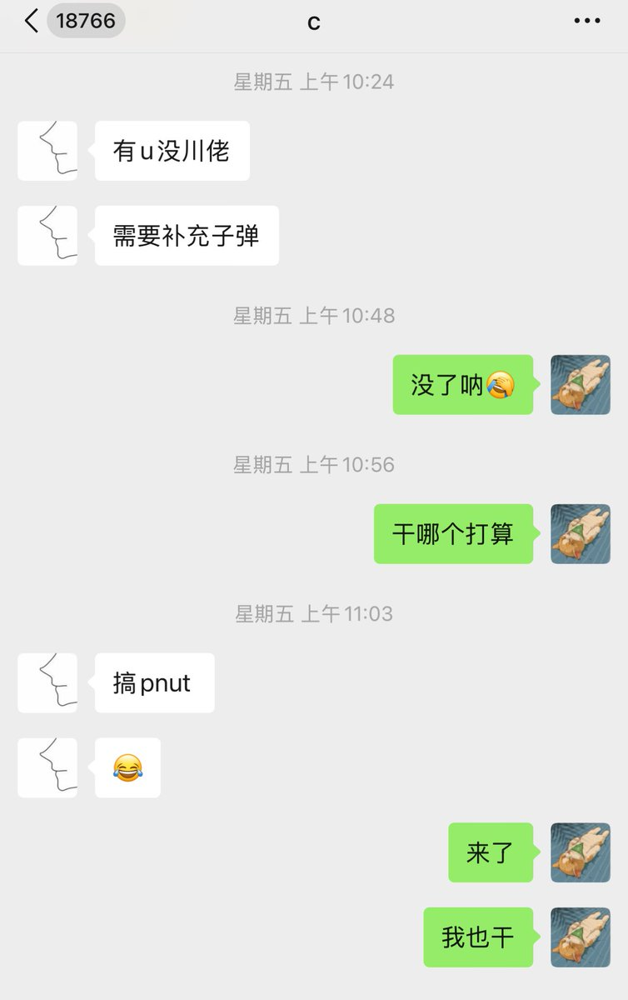

[查看原推链接](https://x.com/xiaomustock/status/1921774407418040684)

---

### 23. 推文记录 (2025-05-02 04:24:32)

**互动数据**：👍 187 | 🔁 35 | 💬 42 | 👁️ 169511

```text
为啥买这个给有缘人个原因，这也是一个好策略.
1.一个代币比如瞬间或者快速爆拉了100%甚至300%.
2.然后高位插针持续下跌，顶部会累积大量的空头获利盘.
3.当跌幅很大，一直无反弹，横盘时间很久的时候.小额涨幅就会产生连锁反应，导致大量的空军提前为了保住利润买入止盈，甚至有非常多低位空的空头为了止损买入平空，

4.空军止盈止损自己会左脚踩右脚互相伤害拉盘.所以价格会持续上升.
所以我选择0.86u买个sign.
这种涨幅不会太大，但也很爽.
```

**实盘附图**：


[查看原推链接](https://x.com/xiaomustock/status/1918159648890421380)

---

### 24. 推文记录 (2025-04-29 11:40:00)

**互动数据**：👍 58 | 🔁 10 | 💬 56 | 👁️ 283835

```text
讲一件我自救的意外之喜.
本来币安开的多在0.06就要爆仓了，那会合约价0.068，可能就一根针的事情.
我不想这么爆仓就结束，去gate买了13万刀的羊驼现货.0.072，
正巧运气使然，赶上反弹赚了一波.
看到这一刻已经0.105砸完最后0.096卖完了.

我这个人赌性太强了，太容易上头.
所以每次赚钱都套现，生怕在币圈这地方一头脑发热全部亏没了.
羊驼再次让我感觉到我这个性格从来没变过，
连续大仓位干了三四次被干没了.
太爱赌了.
```

**实盘附图**：


[查看原推链接](https://x.com/xiaomustock/status/1917182072147546514)

---

### 25. 推文记录 (2025-04-17 16:31:34)

**互动数据**：👍 1155 | 🔁 308 | 💬 150 | 👁️ 554904

```text
写持续爆拉的山寨的做空指标，
在爆拉之前，庄家的持仓方向肯定是多单，

1.跟随价格的上涨，合约持仓的名义价值跟持仓量保持一致持续贴合增长.

抛开最早写过的费率指标，
当庄家准备结束操盘的时候.
它会先走掉自己建立的多头仓位转换成空头仓位.
在这个过程中合约持仓的图上会出现一个非常显眼的特征.
2.跟随价格的上涨，合约持仓的名义价值突然与持仓量分离！出现开口空洞.
这时候就是庄家通过拉盘或者托盘平多卖出多头仓位，然后建立空单.
因为这个节点庄家的操作会明显的大额影响到持仓量的多少.但价格的上升或者托盘会显示为名义价值可能一直在增长或者脱离贴合的曲线.
```

**实盘附图**：

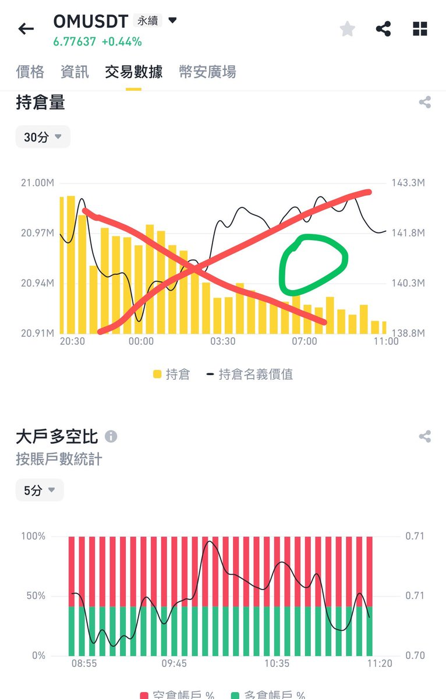

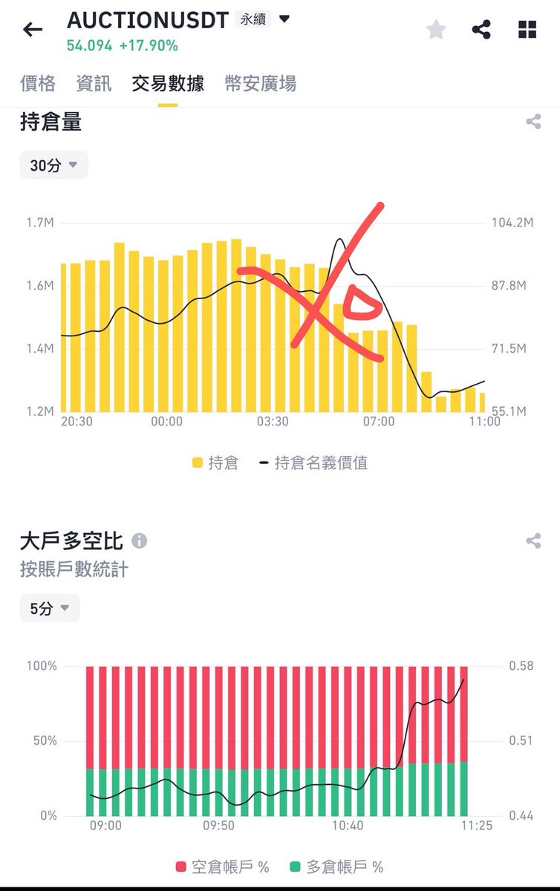

[查看原推链接](https://x.com/xiaomustock/status/1912906793719832746)

---

### 26. 推文记录 (2025-04-13 05:35:39)

**互动数据**：👍 500 | 🔁 78 | 💬 67 | 👁️ 196866

```text
这个号用更稳健的操作方式来搞.
1.每笔操作的30%利润买btc现货.
每笔操作亏损超过30%，用btc现货补齐操作资金，否则继续操作.
一直增加现货btc的持仓量，让这个新号也能顺利100万u.

2.每一笔交易严格设置止盈止损，防插针和自己上头追保证金.尤其是高倍杠杆，保证止损后还有钱继续玩能活下去，永远不归零不下拍桌.

3.最稳健的以一篮子做空山寨和找机会做多btc为主.感觉市场没机会优先做空山寨，觉得有机会优先做多btc.

4.拉升过程中的山寨不空不参与，只痛打落水狗暴跌了再空吃后半段，不用忍受费率.

5.对极其大格局撒钱盘面还很稳的山寨做多，对抠逼全网一起骂的项目方但盘面也很稳的山寨也做多.其他的类型都空，如果拉盘都主动止损不硬扛.
```

**实盘附图**：

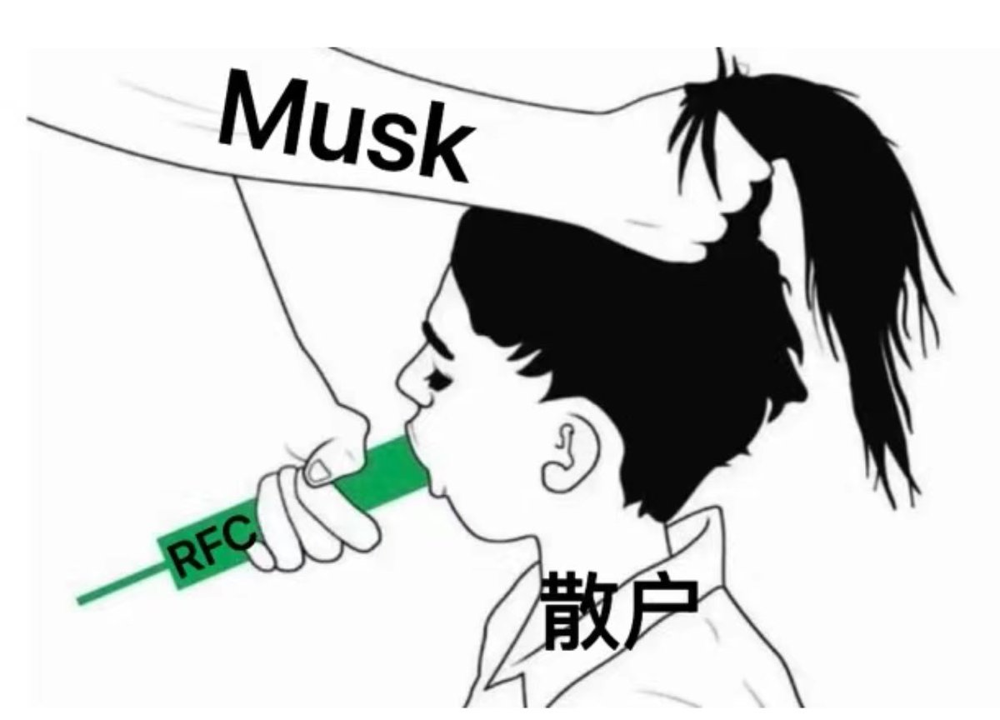

[查看原推链接](https://x.com/xiaomustock/status/1911292173980733874)

---

### 27. 推文记录 (2025-04-02 00:56:29)

**互动数据**：👍 369 | 🔁 51 | 💬 120 | 👁️ 256372

```text
昨天act暴跌的真相百分之百是act的做市商被币安做局吃掉了.
1.先连续两次都针对act这类合约持仓量很高的代币.（如果不是币安下场，不可能发生短时间调整俩次，而且是特意针对持仓量跟市值相比非常高的act这些）

2.调低杠杆倍数和减小对应的开仓金额后，压缩做市商的仓位，
如果在不想平仓的情况下持有的多单仓位，
迫使做市商不得不增加保证金规模变相提高了做市商需要提供的保证金总金额.

3.然后币安再用低流动性特征，拿极小金额可能几十万刀现货瞬间砸爆做市商多头仓位.

4.合约持仓金额瞬间从1.1个亿美金跌到1800万美金.做市商成了币安韭菜.
当韭菜都亏完的时候，币安就得从做市商手里赚钱了.因为只有做市商还有点钱.
可见市场多差.
```

**实盘附图**：

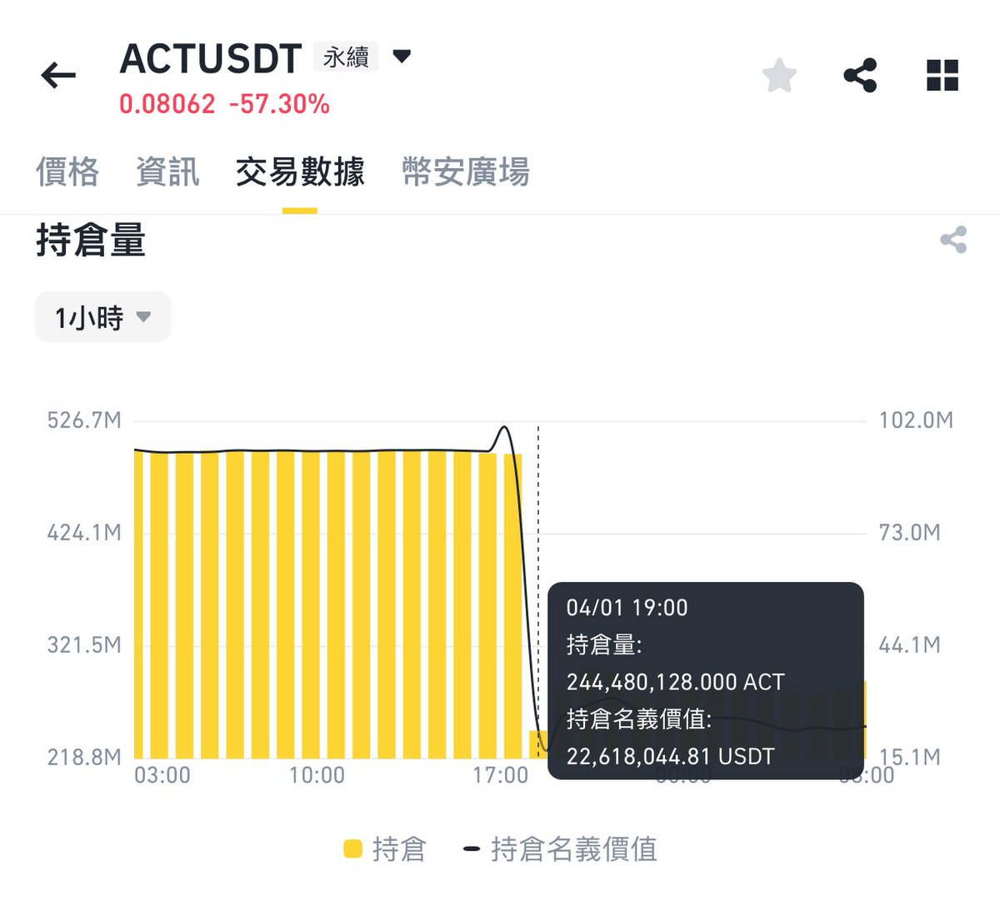

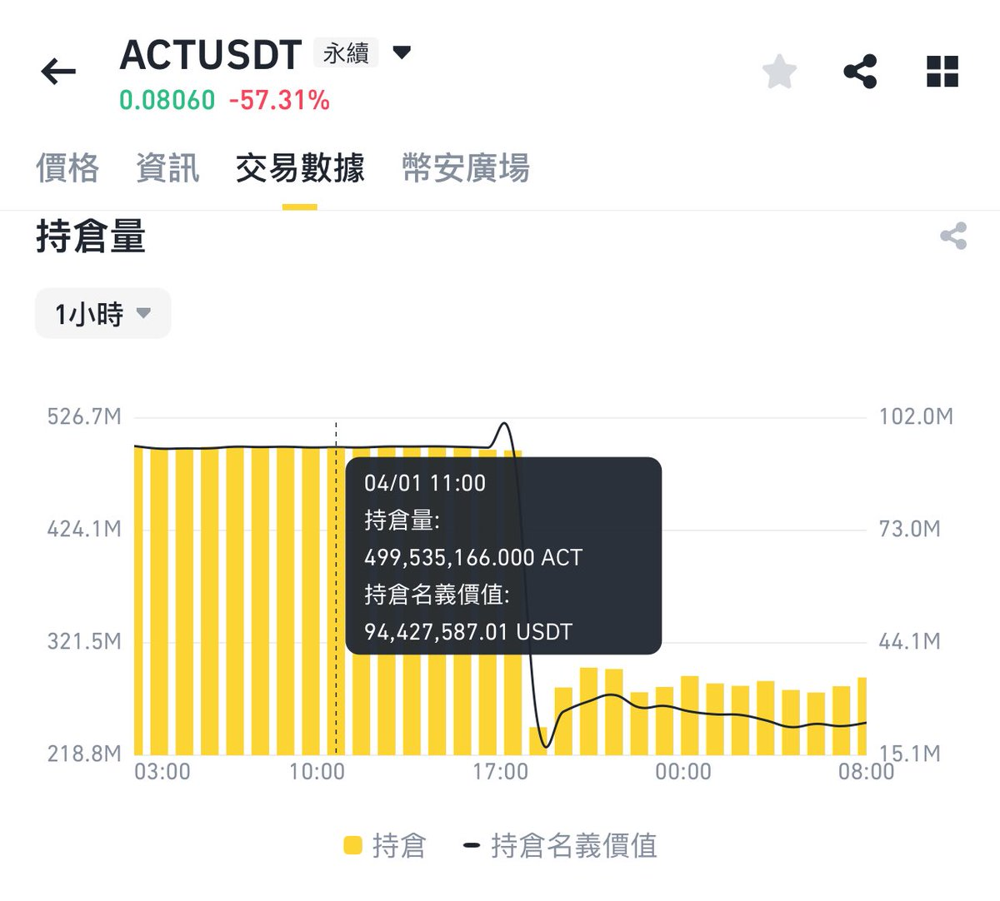

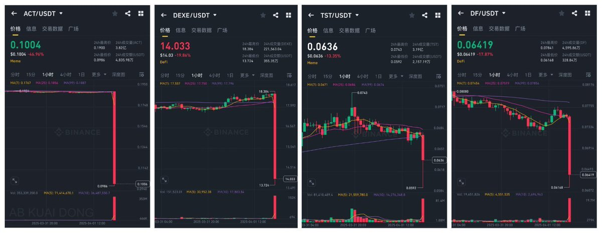

[查看原推链接](https://x.com/xiaomustock/status/1907235656373584135)

---

### 28. 推文记录 (2025-03-21 05:39:53)

**互动数据**：👍 60 | 🔁 9 | 💬 56 | 👁️ 114688

```text
lina价格一路在，但是合约持仓量一直在涨，目标来个250-300，50%-100涨幅.
市值和合约持仓量1/1了.
大户合约持仓方向79%都是多单.
lina这逼感觉要干把大的，故意砸盘把多单开着吃进去. https://t.co/tHMwXH4xTX
```

**实盘附图**：


[查看原推链接](https://x.com/xiaomustock/status/1902958321939951794)

---

### 29. 推文记录 (2025-03-16 06:18:41)

**互动数据**：👍 819 | 🔁 229 | 💬 118 | 👁️ 806216

```text
讲一下我这个为啥专门买合约持仓量和市值比高的币，不管这些币干啥的光看合约持仓量.
1.首先合约持仓量占市值比例高的话说明多空的对手盘充足。
2.他的合约持仓量越高甚至超过市值说明庄家越强，说明庄家筹码越足，它有极强的拉盘动力。
3.因为对收盘充足一旦开始拉盘（或者砸盘），高杠杆的对手盘肯定会心慌跑路做燃料拉盘平空。

打个比方，如果你昨天25开空了auction，现在拉到28不慌不慌，你割不割肉？
你如果割肉买入那这样高比例的合约持仓里面有无数个跟你一样这样想的人。
他们会因为一点点价格拉升而心发慌，担心利润回撤，担心亏损，担心爆仓，
然后反向走人买入作燃料。
```

**实盘附图**：

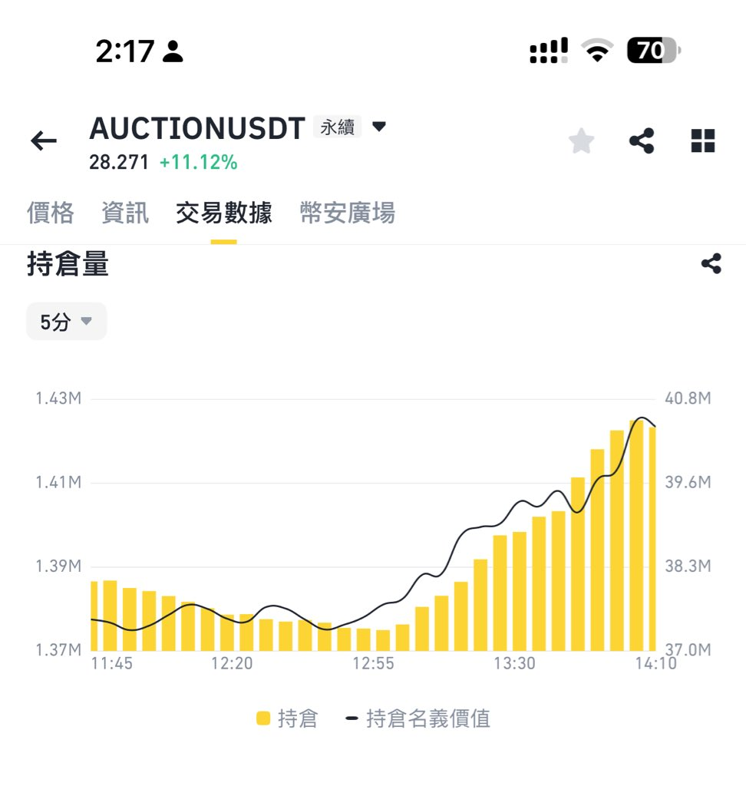

[查看原推链接](https://x.com/xiaomustock/status/1901156147119427821)

---

### 30. 推文记录 (2025-03-08 09:34:31)

**互动数据**：👍 207 | 🔁 36 | 💬 72 | 👁️ 316251

```text
这个vine价格在下跌，合约持仓量一直在涨。都快接近市值1/1了。价格0.0327.
目前是全网市值最小的合约持仓量接近市值的币。估计能去个0.04-0.06.
标的的合约持仓量接近市值或者超过市值，有俩个好处.
1.有庄家大户在里面。
2.有充足的对手盘和流动性。 https://t.co/kqCrAAbVV0
```

**实盘附图**：

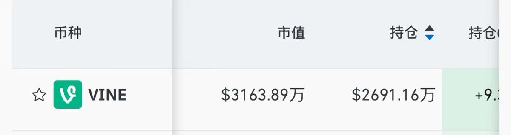

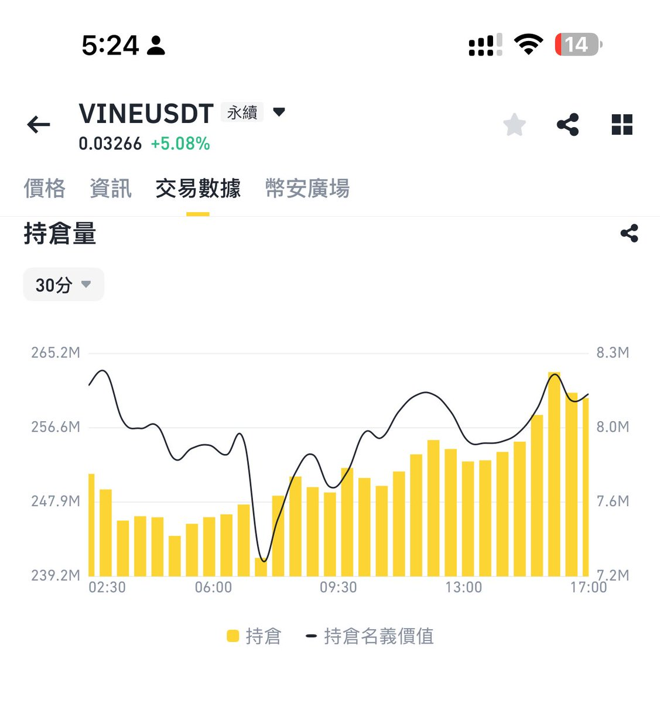

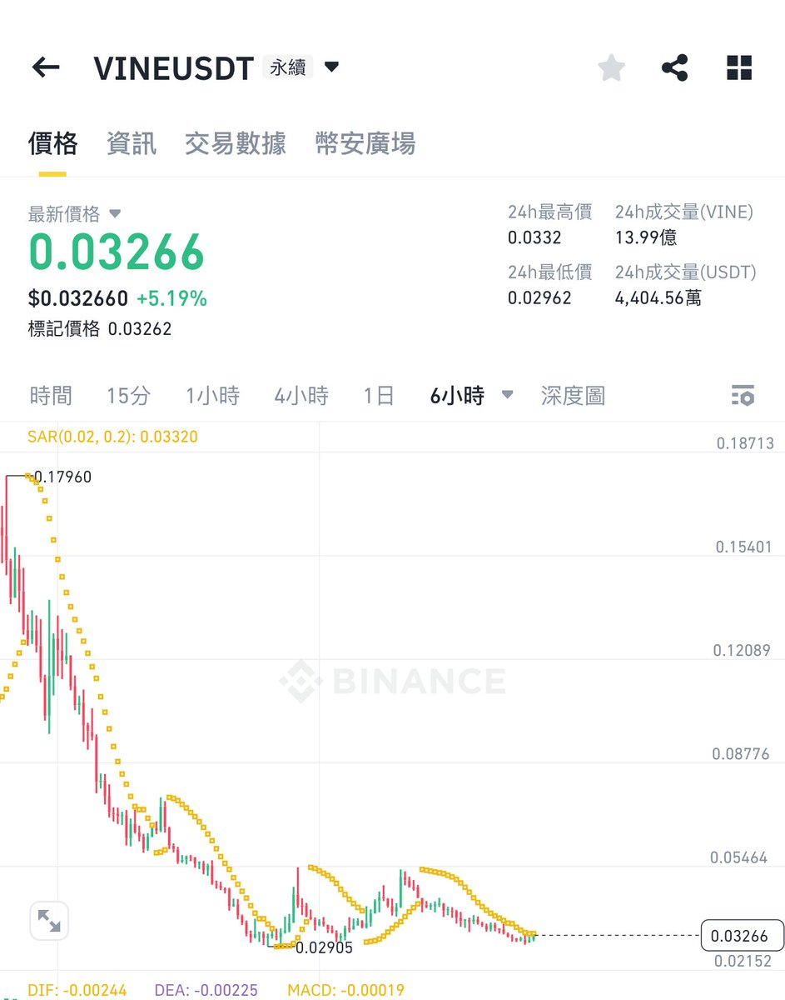

[查看原推链接](https://x.com/xiaomustock/status/1898306325890912640)

---

### 31. 推文记录 (2025-03-01 09:12:42)

**互动数据**：👍 100 | 🔁 13 | 💬 73 | 👁️ 154302

```text
shell从筹码结构看，
1.流通1.5亿以下
2.币安仅有5千万左右筹码.
3.是币安现货里最小的ai.
4.开盘到现在跌到上币安前的价格了，有性价比. https://t.co/qPopB1Ndbp
```

**实盘附图**：


[查看原推链接](https://x.com/xiaomustock/status/1895764118189346937)

---

### 32. 推文记录 (2024-12-21 05:38:30)

**互动数据**：👍 103 | 🔁 6 | 💬 43 | 👁️ 89061

```text
昨天前100所有币里面，洗盘最彻底的就是doge，这么大的市值直接腰斩.洗得干净的不能再干净，狗庄太狠了，不愧是狗庄.
前十拉盘最猛的也当然是狗庄. https://t.co/uyr6eztHLG
```

**实盘附图**：


[查看原推链接](https://x.com/xiaomustock/status/1870343065959109049)

---

### 33. 推文记录 (2024-12-21 05:31:43)

**互动数据**：👍 68 | 🔁 7 | 💬 39 | 👁️ 106137

```text
doge经历了极致的洗盘，之前车上人太多太多了，这一下杠杆几乎全部被干没了.
@DOGE 部门还剩十几天要开始干活了.
按照杀破狼的山寨季倒计时俩天，那也是必须先是meme季，然后必须doge带头.
doge-1u https://t.co/wVwAOVN4lX
```

**实盘附图**：


[查看原推链接](https://x.com/xiaomustock/status/1870341357082222899)

---

### 34. 推文记录 (2024-12-21 03:22:34)

**互动数据**：👍 56 | 🔁 7 | 💬 43 | 👁️ 61797

```text
盲猜usual庄家很快开始拉盘了.

飞轮靠的是tvl增长换来的，增长率只要上不去就完了，前天一天增加了2个亿，今天一天1个亿都不到，每天增发流通数量维持在400万个左右，如果价格不动 流通很快就会上去。
如果价格在这个位置上不去，稳定币质押收益会不断下降，tvl增长就很慢很差劲.
庄家会拉盘提升收益率继续提高tvl.它吸收的usdc可以白用4年再给归还，诱惑极其大，跟别的稳定币不一样.
所以usual如果我是狗庄的话肯定拉盘，继续维持高收益吸引资金进来质押提升tvl.
```

**实盘附图**：


[查看原推链接](https://x.com/xiaomustock/status/1870308855567265914)

---

### 35. 推文记录 (2024-12-19 10:06:15)

**互动数据**：👍 85 | 🔁 6 | 💬 44 | 👁️ 289366

```text
这次的核心是始终把盈利换成btc，没有机会也全换btc.有机会就卖btc撸，现货比例从一开始的60%慢慢提升，现在现货比例80%左右吧.每次所有利润都是为了买更多的btc，同时降低杠杆占总资金的比例，一直努力降低风险，一直努力赚btc.
如果一个btc直接100万美金，那不用折腾了现在开始.当然现在的持仓不是btc，移动速度太快了25.
```

**实盘附图**：


[查看原推链接](https://x.com/xiaomustock/status/1869685668110299380)

---

### 36. 推文记录 (2024-10-28 05:55:19)

**互动数据**：👍 196 | 🔁 32 | 💬 55 | 👁️ 151013

```text
买meme之前，先不要下手，用一分钟把合约地址复制到推特搜索框里，点最新，然后往上翻，找到第一个条信息源看看具体是啥谁弄的，然后再决定买与否。我觉得相对还靠谱些，不能全看群里丢个合约地址就去pvp。 https://t.co/q0RHaGlrZR
```

**实盘附图**：


[查看原推链接](https://x.com/xiaomustock/status/1850778350538961232)

---

### 37. 推文记录 (2024-10-08 04:40:17)

**互动数据**：👍 142 | 🔁 27 | 💬 31 | 👁️ 179857

```text
期货合约和杠杆真的能害死人，这玩意研究不得，要人命，远离这种极致的贪欲。 https://t.co/X50haIGZds
```

**实盘附图**：


[查看原推链接](https://x.com/xiaomustock/status/1843511709576970569)

---

### 38. 推文记录 (2024-10-06 09:57:16)

**互动数据**：👍 183 | 🔁 25 | 💬 112 | 👁️ 281111

```text
血淋淋教训，别碰合约，别借钱投资。
炒股炒币都一样。
虽然股市很火热，但依然还是要闲钱投资，别上杠杆别借钱。有杠杆有借款的赚钱了的时候记得第一时间还清。 https://t.co/rkRxA4OSy6
```

**实盘附图**：


[查看原推链接](https://x.com/xiaomustock/status/1842866709146841124)

---

### 39. 推文记录 (2024-09-24 06:17:25)

**互动数据**：👍 277 | 🔁 50 | 💬 80 | 👁️ 117985

```text
归零几次就活明白了，第一次炒币赚到钱可能觉得房子增值慢，车子贬值，人民币垃圾资产。然后钱都放了币里面炒。

我第一次赚到的时候就这样想，毕业那会，然后很快因为18年熊市来了玩合约杠杆全亏完了。
现在嘛，赚钱要知道套现，亏钱也要套现。 https://t.co/LrfBiWsfla
```

**实盘附图**：

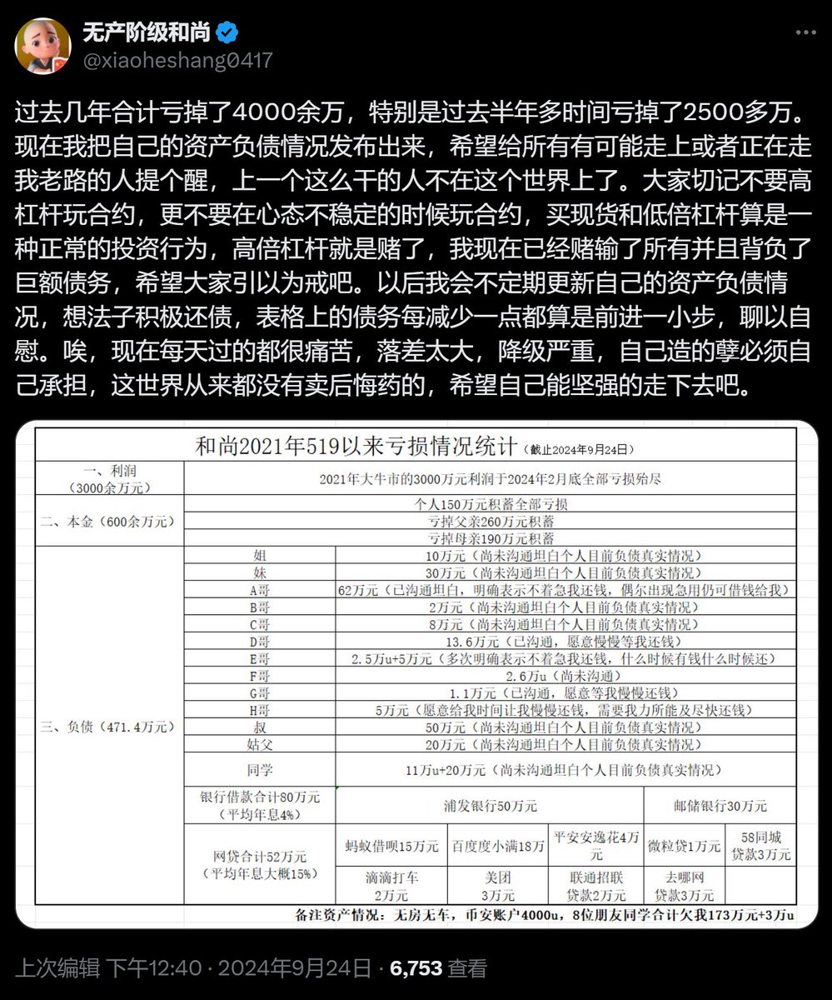

[查看原推链接](https://x.com/xiaomustock/status/1838462727217709366)

---

### 40. 推文记录 (2024-09-16 07:37:31)

**互动数据**：👍 125 | 🔁 11 | 💬 110 | 👁️ 77196

```text
真把韭菜玩死了，本来很多人最开始支持小写neiro，然后币安上一个大写合约，然后韭菜含泪扔了小写跑去支持大写。
现在币安又来支持小写现货，同一个名字俩个币同一个交易所😂一个名字的币韭菜被割俩次
这种骚操作币圈哪一个交易所都没这么干过。
现在现货名字是大写，实际上是小写。 https://t.co/BQOQNpYpDo
```

**实盘附图**：


[查看原推链接](https://x.com/xiaomustock/status/1835583780746363064)

---

