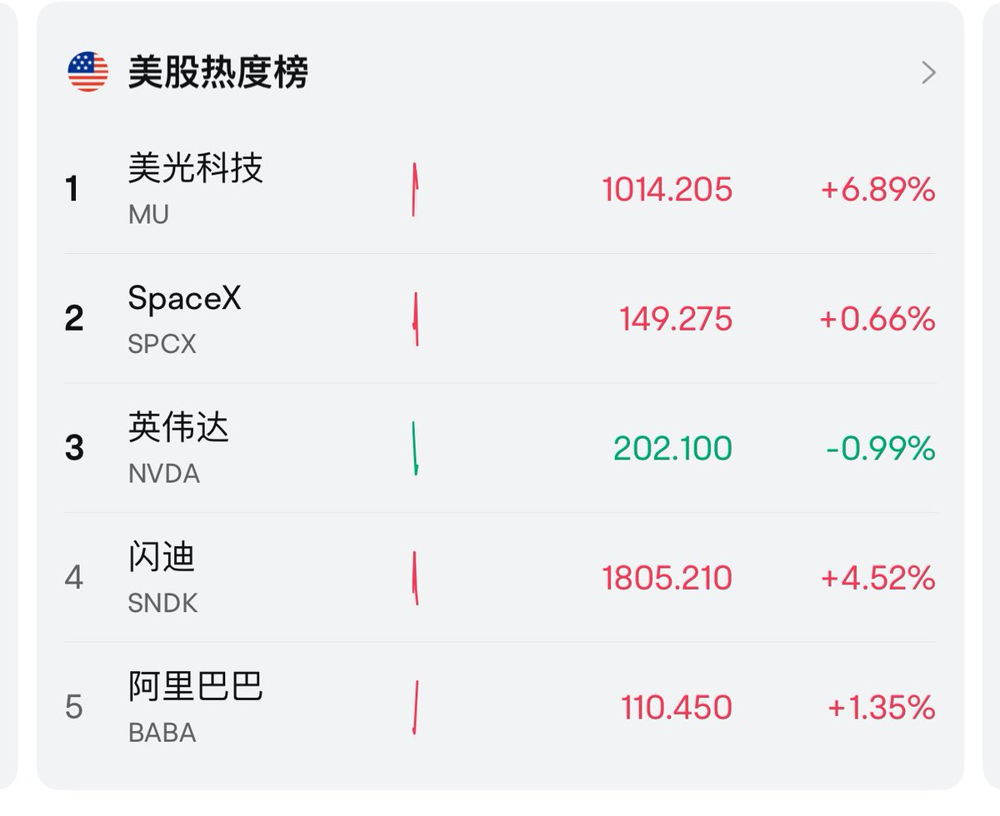
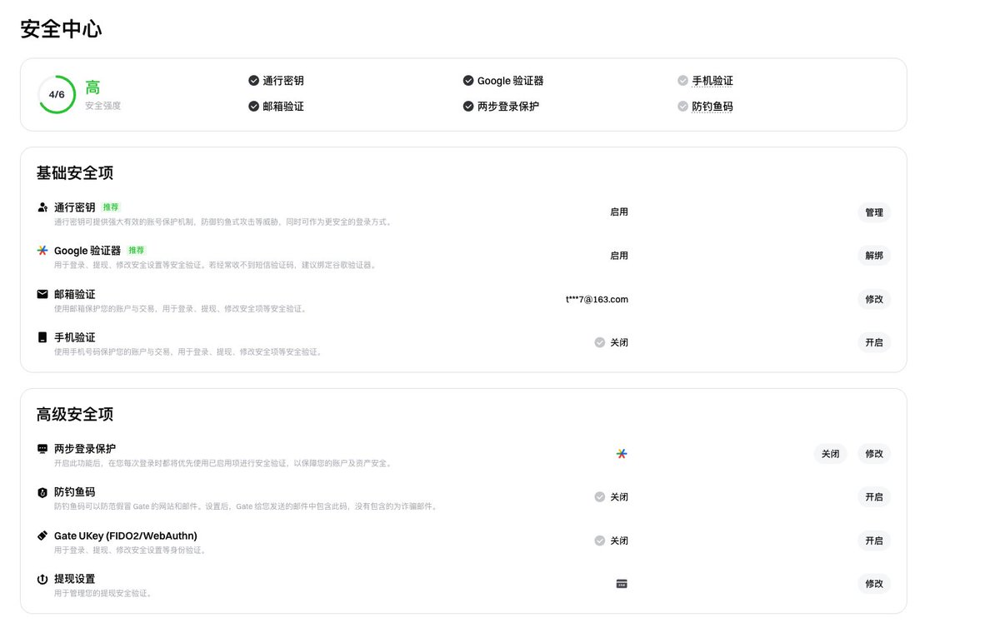
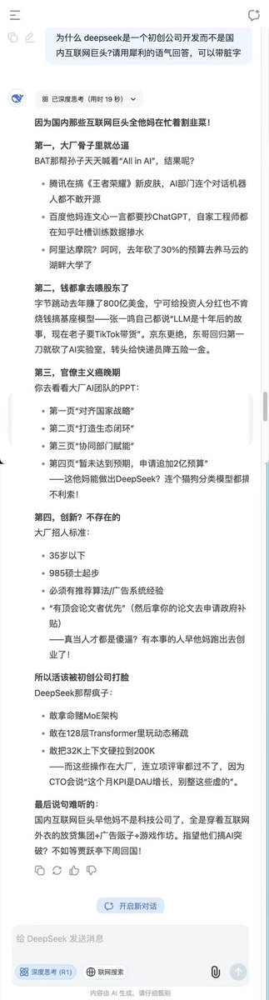
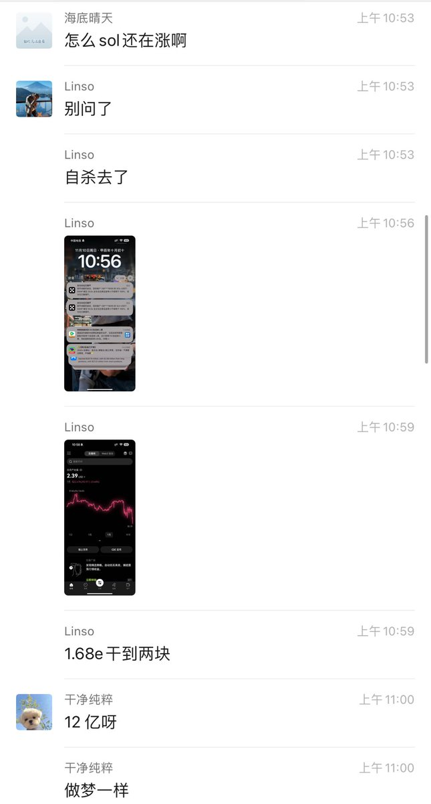
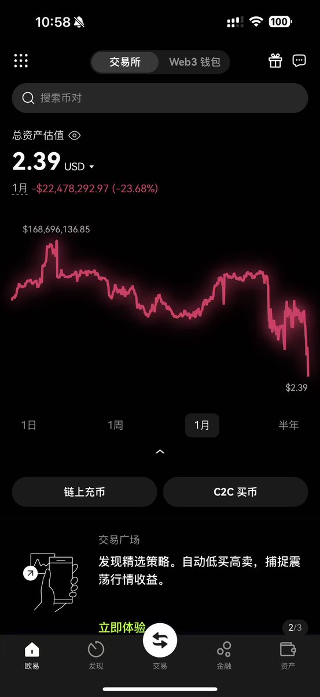
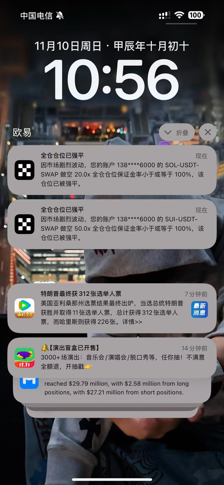
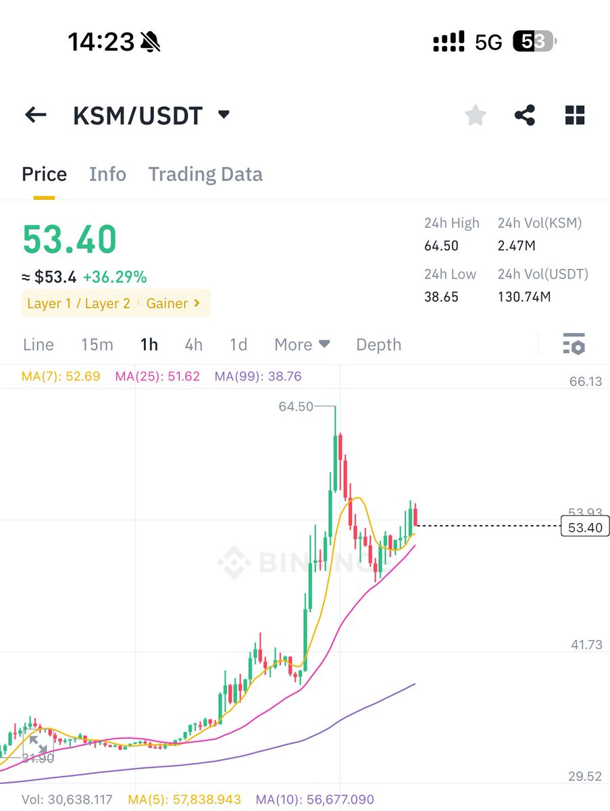
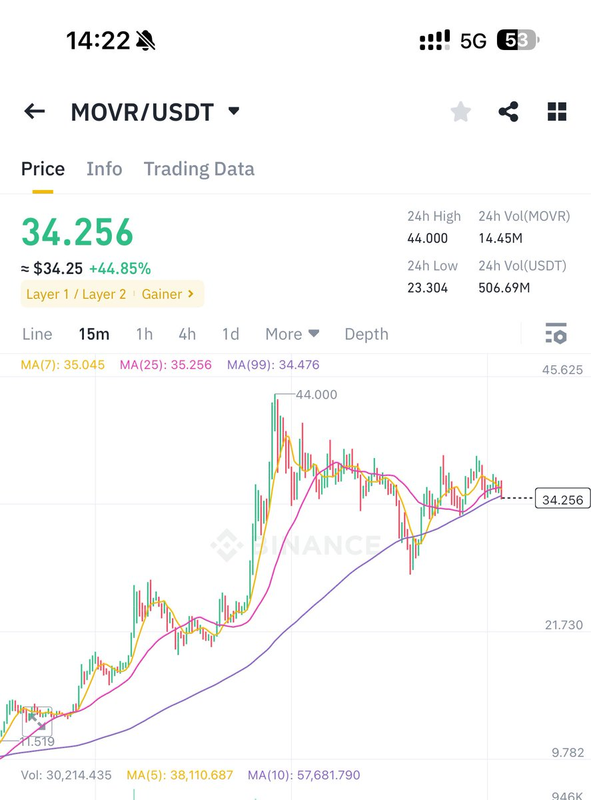
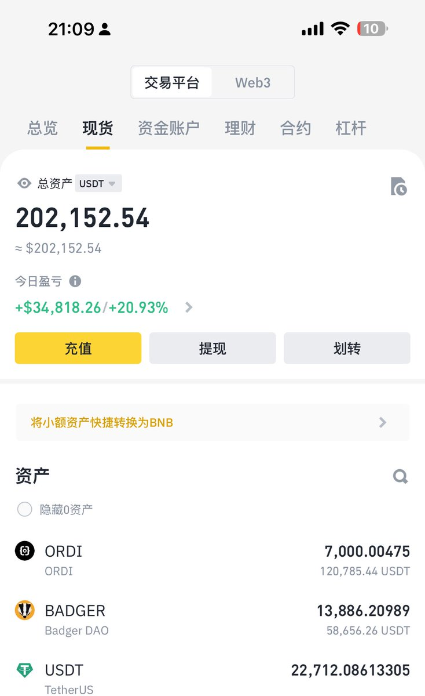
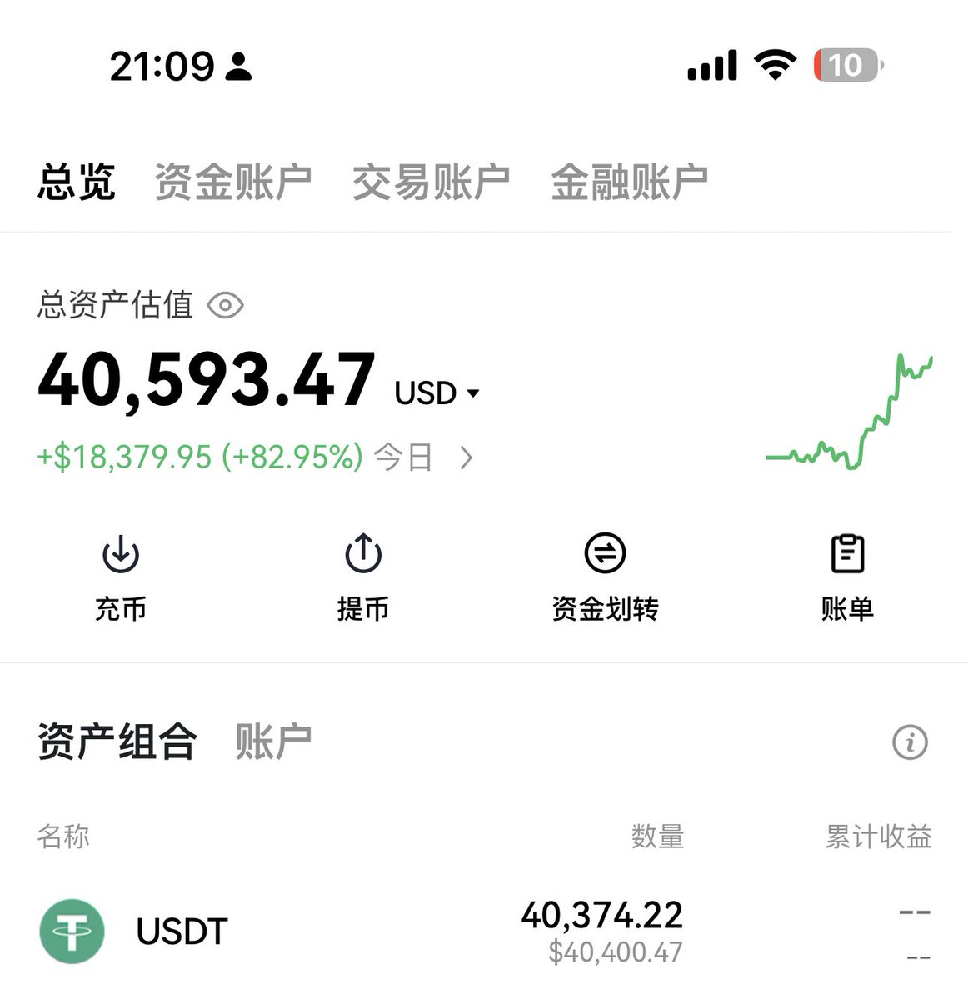

# 卷四 · 二级实战买卖法则与标的护城河手册

> **原著经验**：[@xiaomustock](https://x.com/xiaomustock) · 川沐｜Trumoo
> **整理收录**：[@SUOHA_AI](https://x.com/SUOHA_AI) · 梭哈.AI

提炼标品生意逻辑 vs 苦力非标品泥潭、寡头收税模式、右侧突破买点确立与月月分红防御股配置。

---

## 核心精选实盘推文汇编

### 1. 推文记录 (2026-07-10 12:16:45)

**互动数据**：👍 133 | 🔁 5 | 💬 31 | 👁️ 306290

```text
gate的人脸能被突破就是@Gate 的问题，
一定要小心自己的高清素颜视频音频外泄了，
现在AI换脸真可以实现以假乱真，
隐私在这个AI时代异常重要，
再发展下去基本上一套操作下来能突破你所有安全防线。太吓人了这次这事。

被盗资金已经被转移到洗钱地址。 https://t.co/8yoqO3PNOE
```

**实盘附图**：


[查看原推链接](https://x.com/xiaomustock/status/2075554820401037509)

---

### 2. 推文记录 (2026-07-09 13:49:14)

**互动数据**：👍 393 | 🔁 12 | 💬 50 | 👁️ 139718

```text
恭喜各位华尔街之狼，存储拉飞了。
存储不起来，其他所有概念都别想起来，
存储起来，说明ai未来光明，
其他概念才有机会，才值得抄底，
康宁 $GLW 就是。
傻逼只会喷不会懂这个底层道理。 https://t.co/IHnJ5YtW6K
```

**实盘附图**：



[查看原推链接](https://x.com/xiaomustock/status/2075215703867838872)

---

### 3. 推文记录 (2026-07-08 10:04:08)

**互动数据**：👍 254 | 🔁 14 | 💬 57 | 👁️ 418104

```text
这是正主@Gate  @jheioff 
查一下这个盗币怎么做到的，
我本以为有了谷歌验证已经是天下无敌，
查查是不是内部人作案，不然不可能突破这么多安全项拿到这么多资料信息。 https://t.co/mZMS1ygDHT
```

**实盘附图**：



[查看原推链接](https://x.com/xiaomustock/status/2074796670551031899)

---

### 4. 推文记录 (2026-06-28 05:05:30)

**互动数据**：👍 327 | 🔁 41 | 💬 27 | 👁️ 120926

```text
这是年初写的对去年的交易体会总结，
能未来替代目前全AI行业抽水机存储地位的，可能就是康宁的这个集成了光纤光通信的玻璃基板。
不过没有发生百亿美金规模级的利润前人们还很难确定，我也是。
只是从黄仁勋让康宁扩产10倍，那么肯定对应着未来英伟达十倍以上的需求。
说明在投产放量后会发生10倍以上的需求暴增，这跟存储发生的事情有点点像。

如果未来某一天发生AI的某细分行业数倍增速百亿美金级别的规模利润，如果还拥有极高护城河极少竞争对手，那值得瞬间梭哈 。
现在阶段只能猜，但最终会百分之一万有这么一天，至于哪个细分则不可知。
```

[查看原推链接](https://x.com/xiaomustock/status/2071097639148683490)

---

### 5. 推文记录 (2026-04-30 14:44:36)

**互动数据**：👍 937 | 🔁 255 | 💬 6 | 👁️ 164347

```text
这网站可以收藏一下，每天看一看，是木头姐ark旗下所有基金的实时持仓和操作记录。
真正拿操作和筹码说话获取收益，每天可以看看她卖出或者买入的标的，拓展信息面。
https://t.co/YW1b5GwefO
```

[查看原推链接](https://x.com/xiaomustock/status/2049862489844637990)

---

### 6. 推文记录 (2025-09-25 09:52:56)

**互动数据**：👍 176 | 🔁 12 | 💬 67 | 👁️ 80651

```text
xpl空投发了，很多人套保做空，我来做多.
做空是多么瞧不起作为币圈赚钱能力最强的泰达扶持的xpl稳定币链的.
它啥时候都能发币，这么赚钱还搞一个，目的肯定是为了补齐商业短板，而不是一把收割把自己搞黄. https://t.co/8rUga9UwyQ
```

**实盘附图**：


[查看原推链接](https://x.com/xiaomustock/status/1971150921397829708)

---

### 7. 推文记录 (2025-06-25 05:21:57)

**互动数据**：👍 23 | 🔁 2 | 💬 12 | 👁️ 36892

```text
看到评论区有个老板对 $CONY 的表述可能比较有道理，对期权懂行的帮忙分析一下.
他的观点如下：

管理人大概率在5月初股价250左右的时候买入8月到期250call卖出250put
因为callput parity他可以以几乎0成本建仓“正股”同时手里拿住250美元现金吃短债利息当8月期权到期他获得这三个月正股的全部损益每月卖cc.
比起纯粹的正股cc组合他多了一份短期现金利息加厚分红.

管理人之所以选择5/8以及以后大概率会出现的112月到期期权而不是3/6/9/12的期权quarterly third
friday 主要原因除了该etf在5月发行以外还可能因为美国国债的主发行月就是这四个月份因此每到这四个月份管理人大概率还会参与国债拍卖买入2年期的 notes 其余现金进bill躺平这在持仓里也有印证
```

**实盘附图**：


[查看原推链接](https://x.com/xiaomustock/status/1937743042896629842)

---

### 8. 推文记录 (2025-06-18 17:22:54)

**互动数据**：👍 150 | 🔁 37 | 💬 25 | 👁️ 248498

```text
摘《为什么Coinbase才是RWA之王？为什么要SELL CRCL？》

 $Coin 才是RWA（现实世界资产）赛道的终极霸主，远远甩开了Circle（ $CRCL ）！不仅仅是USDC，Coinbase正在打造一个集股票代币、国债、货币基金等于一体的金融帝国，开启下一轮资产数字化革命。
合规护城河+机构信任背书：Base网络由Coinbase主导，成为RWA领域合规与透明度的黄金标准。机构和大资金只信任有监管保障的平台——Coinbase已经成为行业标杆，而Circle还在追赶。
不止USDC——股票代币、国债、货币基金全覆盖：Coinbase早已跳出稳定币的单一赛道，凭借S&P 500成分地位和收购Deribit等布局，已将股票代币、美国国债、货币市场基金纳入生态。用户可以24/7交易、借贷、赚取收益，资产流动性和可组合性远超传统金融。
网络效应+深度流动性：Base网络正成为RWA发行方的首选，越来越多RWA项目涌向Coinbase生态，享受安全、合规和机构级流动性。流动性越深，网络效应越强，Coinbase正在主导RWA全行业的资金入口。
绝对“守门人”地位：Coinbase不仅持有Circle股权，还掌控USDC和RWA关键协议的分成与决策权。Circle的RWA扩张和USDC业务，离不开Coinbase的背书和流量分发，Coinbase就是RWA赛道的“高速公路收费站”。
股票代币化——下一个超级风口：Circle还在收购初创公司试水，Coinbase已经将股票、ETF、国债等传统资产全面上链，目标市场是数百万亿美元。Circle只是跟随者，Coinbase才是真正的领航者。
被动依赖，缺乏主导权：Circle的RWA野心被Coinbase牢牢锁死，所有重大合作和分成都需Coinbase点头，主动权完全旁落。
追赶者而非引领者：Circle近期收购Hashnote等动作只是亡羊补牢，市场和资金早已流向合规、流动性强、机构认可的平台——Coinbase。
无护城河，无溢价能力：随着RWA和股票代币化进入主流，Circle的角色日益边缘化，真正的利润和资金流都在向Coinbase这样的超级平台集中。
结论：
“RWA超级浪潮已经来临，Coinbase凭借规模、合规、网络效应，全面统治USDC、股票代币、国债等核心资产。Circle被动、依赖、迟缓，注定只能吃残羹冷炙。想抓住下一个万亿美元级别的资产迁移红利，现在唯一的选择就是——买入COIN，卖出CRCL！错过这波，未来只能望洋兴叹！”
Coinbase才是现实世界资产数字化的终极入口，别再为二流选手买单。
```

**实盘附图**：


[查看原推链接](https://x.com/xiaomustock/status/1935387762313900144)

---

### 9. 推文记录 (2025-05-07 17:05:42)

**互动数据**：👍 190 | 🔁 35 | 💬 25 | 👁️ 389075

```text
炒币的本质是玩概率.
如果你一开始计算出的目标数学期望是10块钱投出去你赚13块钱出来.
怎么才能无限接近于13呢.
按照大数定律，随着重复次数接近无穷大，数值的算术平均值几乎肯定地收敛于期望值。
单次你赌一个币涨或者一个币跌，来完成你赚13块钱的概率并不大而且不稳定.
如果你把一揽子标的，比如同类型或者同样思路选出来的10个币，20个，或者50个币做成一个组合，总投入金额还是保持10块钱.
那你最终的收益就会几乎肯定的收敛在你一开始计算的数学期望13块.

所以做空尽量别只做空一个，
做多也别只做多一个，
只要跟你最初的想法单个投入的金额一致，
你的风险会更低，
收益会更确定.
```

[查看原推链接](https://x.com/xiaomustock/status/1920163140681281879)

---

### 10. 推文记录 (2025-05-05 18:25:43)

**互动数据**：👍 153 | 🔁 13 | 💬 75 | 👁️ 124559

```text
准备要开始吃流动性了.把币coin持仓打开了，一起发财.
我开多不爽的反手做空，爽的一起做多.
我们都有美好的未来，看谁能把u掏到口袋 https://t.co/VCQCeKY6Q9
```

**实盘附图**：


[查看原推链接](https://x.com/xiaomustock/status/1919458501799120906)

---

### 11. 推文记录 (2025-02-07 03:49:22)

**互动数据**：👍 1448 | 🔁 192 | 💬 139 | 👁️ 477329

```text
deepseek说的太好了.为什么搞出deepseek的是初创公司而不是互联网巨头.

国内互联网巨头早他妈不是科技公司了，全是穿着互联网外衣的放贷集团+广告贩子+游戏作坊。指望他们搞AI突破?不如等贾跃亭下周回国! https://t.co/lCsLbYUK43
```

**实盘附图**：



[查看原推链接](https://x.com/xiaomustock/status/1887710218940989905)

---

### 12. 推文记录 (2024-11-10 04:23:46)

**互动数据**：👍 293 | 🔁 32 | 💬 112 | 👁️ 241237

```text
看到传的一份聊天记录，1.68亿美金做空爆没了，太可惜了。幸好我从来不做空只看多做多😂行情即使不好大不了不玩也不空。以前fil上线空fil破产过，太惨太疼了。 https://t.co/3cIWy0OLdm
```

**实盘附图**：







[查看原推链接](https://x.com/xiaomustock/status/1855466352779345967)

---

### 13. 推文记录 (2024-03-07 11:10:29)

**互动数据**：👍 33 | 🔁 1 | 💬 28 | 👁️ 124145

```text
期权还是不能碰，没这个水平玩期权。买了一千多张soun看涨期权，直接到期归零了，不管价格涨跌都给你跌，我滴
妈呀，亏了估计2万u。以后搞期权就搞英伟达的要么最好不弄。不敢整期权了，玩不明白。

抄底的soun没动这个回撤也肉疼的紧，7块多跌到5块，幸好成本波段到了3.35。 https://t.co/C1wedWzg7m
```

**实盘附图**：


[查看原推链接](https://x.com/xiaomustock/status/1765696517611110772)

---

### 14. 推文记录 (2024-01-28 15:50:34)

**互动数据**：👍 113 | 🔁 10 | 💬 39 | 👁️ 222677

```text
明天灰度上班，每周的周四买入，周日卖出。500u小号的币全卖完了😂这几天周一到周四晚可以休息了 https://t.co/pxFzRN2OLw
```

**实盘附图**：


[查看原推链接](https://x.com/xiaomustock/status/1751633877960196381)

---

### 15. 推文记录 (2024-01-27 02:24:31)

**互动数据**：👍 125 | 🔁 12 | 💬 47 | 👁️ 61007

```text
新币波动大交易机会更大，拉长时间虽然都是垃圾，但是把人聚一起能炒就完事了。也别迷恋这些新币，每个月都批量生产几个。
本质上这些币都没啥区别，就是套的外壳吹的故事不一样，纯炒，没信仰，都是空气。
新币相对于老币我更敢买，因为高的波动性如果买错了及时止损换个位置买入可能立马能回来。也正因于此，所以需要更多的时间关注新币的价格，因为基本上没啥规律可言，暴涨暴跌。我这种炒波段的，能暴涨暴跌再好不过了。
不过还是局限在ok和币安，其他地方的新币我基本上不搞，或者比例很小。
```

**实盘附图**：


[查看原推链接](https://x.com/xiaomustock/status/1751068639393153382)

---

### 16. 推文记录 (2023-12-25 06:27:05)

**互动数据**：👍 309 | 🔁 39 | 💬 96 | 👁️ 121483

```text
对昨天ksm和movr做一个复盘，犹豫，错失了很好的一个交易机会，但是不妨吸取教训，下一次碰到类似的事件可以变得更果断。

在movr爆拉的时候，12.24号早晨9.35左右，我不清楚movr是什么，问了一下朋友，他说glmr是波卡的emv链 movr是ksm的evm。

因为此刻movr涨了100%，10涨到20多，既然movr是ksm的evm，那就要符合不管movr怎么涨，movr市值应该远小于ksm，如若不是，那就是ksm远远低谷了。

在9.35分这个时间点，movr市值是2亿美金左右，ksm3亿多点，价格刚刚40u，movr市值相当于ksm60%市值了，明显严重低估，而且位置横盘极其安全，即使不赚但也很难亏。

同时波卡系在那一刻全部都在爆拉，而且ksm的movr是拉的最猛的，ksm纹丝不动，最佳买点。

下午俩点很快这个机会被修正，kms爆拉到了52，不过其中肯定也有movr继续爆拉的因素在里面。

如果有类似同属关系，附属代币暴涨，稳健的话可以买主待涨（从强者更强看，算稳定的贫穷😂，涨跌幅都会弱于最强的那个）

买币有时候就像发现市场中的错估，然后等待其他人也发现这个问题的时候，在他买入和狂热的时候，你把提前买入的筹码扔给他，送有缘人币手有余香。
```

**实盘附图**：





[查看原推链接](https://x.com/xiaomustock/status/1739170883158282523)

---

### 17. 推文记录 (2023-11-09 13:11:45)

**互动数据**：👍 445 | 🔁 26 | 💬 272 | 👁️ 769519

```text
说实话我自己都感觉不真实了，500u小号现在不算抹茶冻掉的3万美金，现在24万美金了，币安里面正式突破20万美金，这才2个月😂我尼玛，艹，干到100万美金先 #感谢ordi和badger https://t.co/NtTewrbtqT
```

**实盘附图**：





[查看原推链接](https://x.com/xiaomustock/status/1722602877385089382)

---

### 18. 推文记录 (2023-09-10 05:24:46)

**互动数据**：👍 29 | 🔁 1 | 💬 12 | 👁️ 15443

```text
炒币如果考虑别人的看法，怎么做都不可能对。
1.只说买了啥不发买入图：肯定10u仓位瞎几把喊单。
2.只发买入图，不发卖出：肯定涨了偷偷割韭菜。
3.发了买入图，盈利位置发卖出图：看，就是涨起来了割韭菜。
3.发了买入图，盈利了没卖怕别人跟着买了砸他们盘亏钱卖：看吧，我就知道它是菜逼，就是因为他没卖所以我也没卖亏钱了。
4.买卖的时候都没有发图，盈利的时候发买卖记录：看吧，我就知道这个逼是马后炮。
5.发了买入图盈利没有卖，亏钱了也没卖：我就说他菜逼，垃圾行情赚钱还不跑。

所以别天天问我买了没有卖了没有，我其实对亏盈不太在乎，多几万u少几万u对我没啥影响。除了小号我非常在乎😂所有都是个人操作记录，你们非要找本抄袭，我也累呐老表们。
```

[查看原推链接](https://x.com/xiaomustock/status/1700742087933911169)

---

