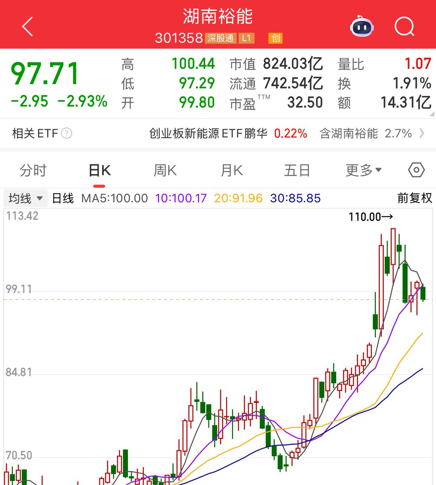
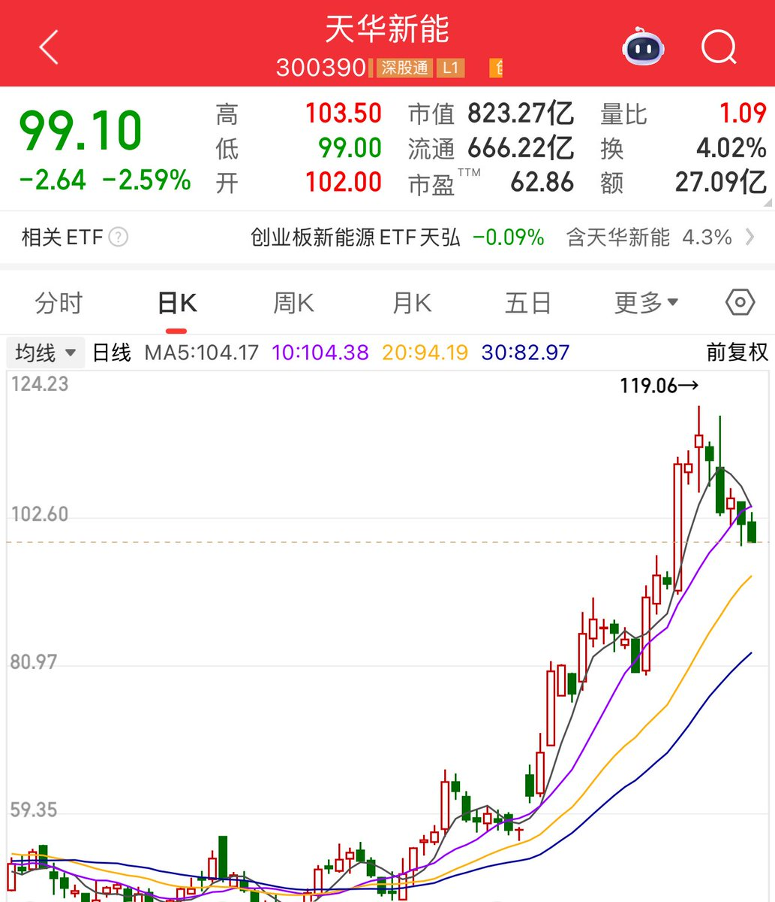
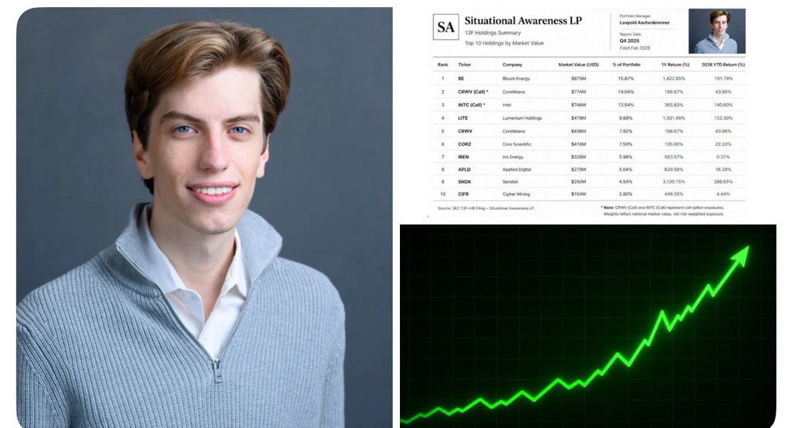
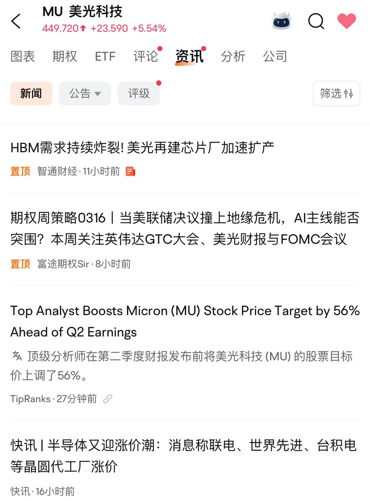
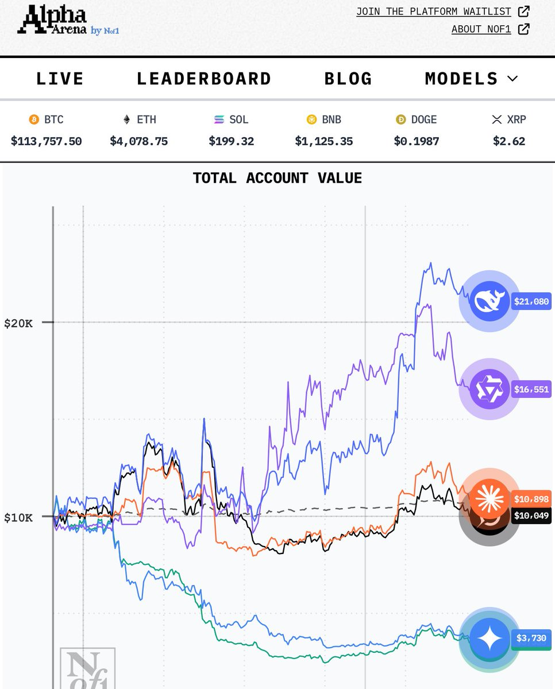
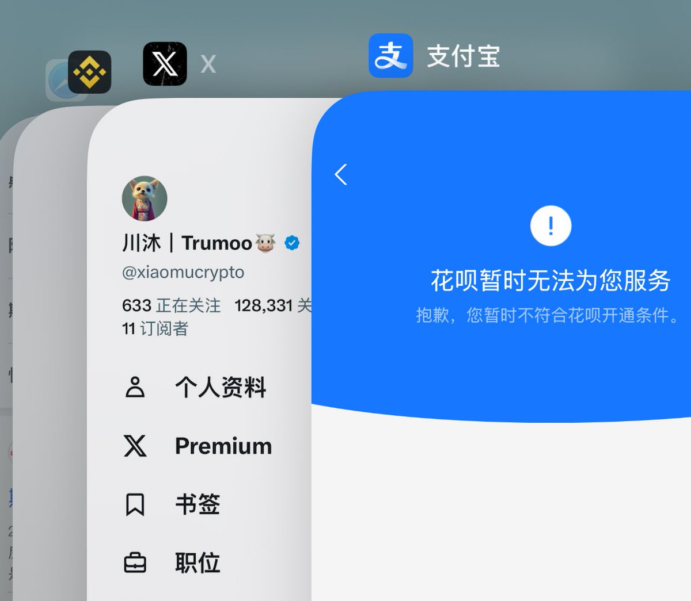
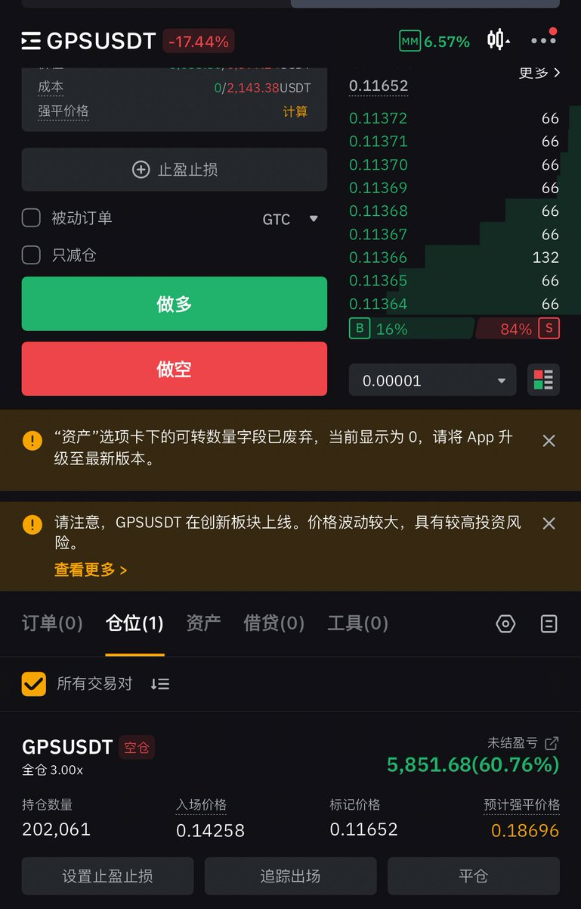
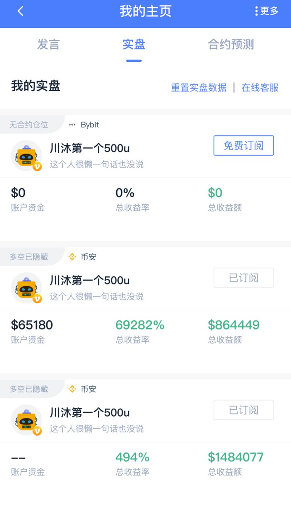
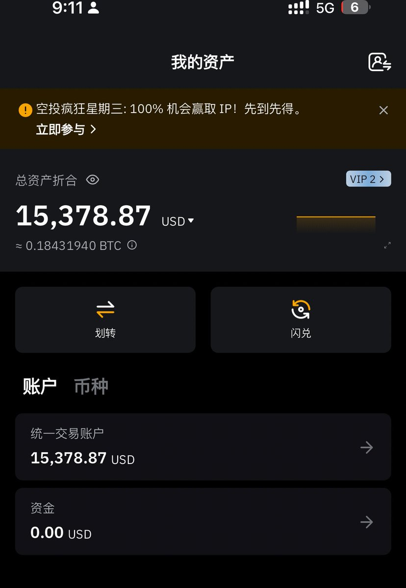
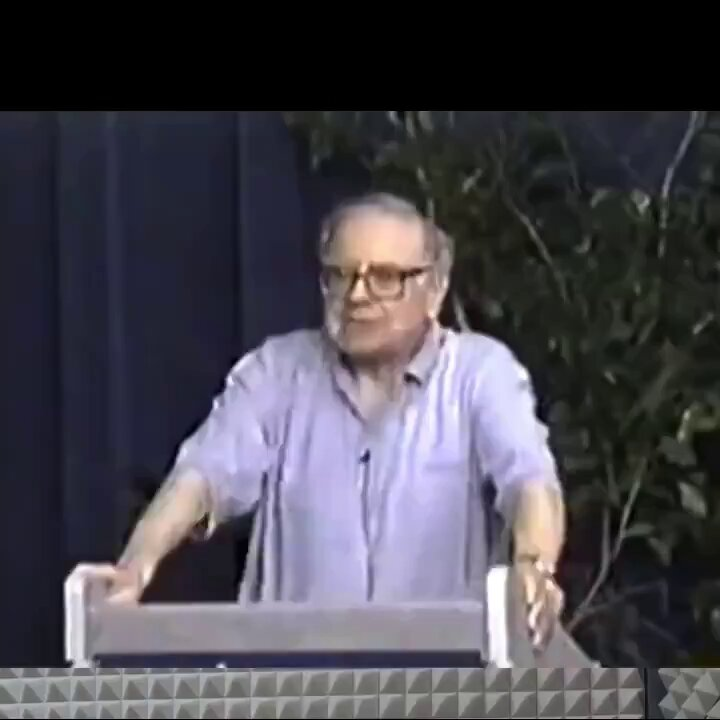

# 卷五 · 仓位风控与跨市场大资产配置手册

> **原著经验**：[@xiaomustock](https://x.com/xiaomustock) · 川沐｜Trumoo
> **整理收录**：[@SUOHA_AI](https://x.com/SUOHA_AI) · 梭哈.AI

铭记巴菲特 1998 年 LTCM 长期资本崩塌警示，落实富有后保证不穷回去铁律、多账户对冲及 Kraken 出入金闭环。

---

## 核心精选实盘推文汇编

### 1. 推文记录 (2026-07-28 13:17:08)

**互动数据**：👍 0 | 🔁 0 | 💬 0 | 👁️ 0

```text
看到一句话，
人类往往高估了一年内的变化，
同时也低估了10年后的变化。
最近亏到迷茫和自我怀疑，
存储真是盈亏同源的一波，
今年赚钱是因为存储，
亏钱还是因为存储。
巴菲特真是太牛逼，
他能在资本市场活这么久，肉体也能活这么久，跟他没杠杆，一直没满仓的操作风格肯定多少有关系，像我们普通人可能为了暴富上杠杆焦虑得睡不着觉，或者富了以后一直带杠杆亏盈都焦虑。
看他公司股价历史也无数次腰斩过，
但过几年还是能不断新高。
亏成这样，事已至此，
我在想以后我应该以什么样心态炒股票，
我应该以什么样眼光再看待未来，
去年的时候跟朋友一起抄底过300左右联合健康，拿了小半年毫无反应跑了，最近每次想到巴菲特的时候都想起来他在任时候最后也抄了联合健康，再去看的时候已经400多。什么样的心态才能做到他这种耐心愿意等待非常久获得收益。
对我们散户青春宝贵，
每次大幅回撤我都有一种时间的蹉跎感，
即使以后涨回来，除了劫后余生的轻松，
我总感觉有一部分的我在承受亏损的过程中死了，少了少年气。
但巴菲特面对回撤暴跌可能是真的兴奋，他的闲置仓位太多了全是货币资金，可能闲钱足够多就是他耐心和长寿的主因。
```

**实盘附图**：


[查看原推链接](https://x.com/xiaomustock/status/2082092997622280410)

---

### 2. 推文记录 (2026-05-13 02:46:18)

**互动数据**：👍 1134 | 🔁 145 | 💬 41 | 👁️ 677198

```text
加仓了 #湖南裕能 ，#天华新能 
俩个储能股，第二大仓位。
赌跟去年的新易盛一样。
一年时间70拉到700。 https://t.co/QfM4qVf9cz
```

**实盘附图**：





[查看原推链接](https://x.com/xiaomustock/status/2054392763567706509)

---

### 3. 推文记录 (2026-05-11 07:16:59)

**互动数据**：👍 546 | 🔁 46 | 💬 24 | 👁️ 124930

```text
openai辞退的00后过几天会公示他基金的持仓操作，这个在全球都很热，他的新建仓位可能会被市场快速拉起来。算是一个值得等着看的机会。 https://t.co/TSOssbEPTH
```

**实盘附图**：



[查看原推链接](https://x.com/xiaomustock/status/2053736108450566475)

---

### 4. 推文记录 (2026-03-16 17:35:17)

**互动数据**：👍 257 | 🔁 33 | 💬 28 | 👁️ 404289

```text
我们如果未来十年百年，只投资赚走最多钱的科技细分行业，那我们的投资收益肯定能远远跑赢巴菲特，就是跌的时候过程中会有太多质疑，但是我坚信的时候我觉得他们都是傻逼。

操作只需要从开始变成赚走最多钱的科技公司开始，到被下一个细分行业替代截止自动换过去继续再继续重复，只赚大道的钱。

没发生变化前，hbm存储三巨头依然是符合我自身的投资理念，所以继续坚守。
爱怎么fud跟我无关。
```

**实盘附图**：



[查看原推链接](https://x.com/xiaomustock/status/2033597989365944732)

---

### 5. 推文记录 (2025-10-28 06:11:10)

**互动数据**：👍 261 | 🔁 25 | 💬 85 | 👁️ 207132

```text
屌爆了deepseek，其他一有波动巨幅回撤或者快归零了，deepseek稳稳的翻倍还保持着1.1万刀的利润.
交易这块deepseek真是吊打全球ai模型. https://t.co/nAiO47edfb
```

**实盘附图**：



[查看原推链接](https://x.com/xiaomustock/status/1983053910085656839)

---

### 6. 推文记录 (2025-10-26 16:33:57)

**互动数据**：👍 118 | 🔁 8 | 💬 44 | 👁️ 308051

```text
从炒币实力证明，只有国产大模型遥遥领先
https://t.co/7VHjk1uii0
阿里通义千问，deepseek收益几乎翻倍，
海外被吹到爆炸的gpt和gemni快归零了，
老外号称数学最好的俩个模型claude和马斯克的grok4仅仅没亏保本. https://t.co/lWsTrw5tn2
```

**实盘附图**：


[查看原推链接](https://x.com/xiaomustock/status/1982485862735823352)

---

### 7. 推文记录 (2025-03-30 07:02:27)

**互动数据**：👍 47 | 🔁 2 | 💬 23 | 👁️ 151760

```text
这个止损的想法记录一下，因为单个做空性价比不高，最大只能赚到做空金额的钱.
所以止损肯定不能让涨幅超过做空价的100%，不然盈亏比就对不上了.
单个出现亏个50%割肉，应该没毛病.
不过我还没设置止损，太多了不好搞😂

止盈估计跌个50%也比较好，我是看心情止盈🤡没固定计划.
```

[查看原推链接](https://x.com/xiaomustock/status/1906240590993346697)

---

### 8. 推文记录 (2025-03-07 18:27:40)

**互动数据**：👍 554 | 🔁 34 | 💬 183 | 👁️ 379273

```text
到现在为止我的花呗也用不了。不过再也不需要用了。
我那时候亏完也很沮丧，
回家路上，
我坐在我姐的电瓶车后座问她：
姐你相信我还你再赚回来吗？
我姐回我说：我信！
回家就把所有攒的工资给我还网贷。
她也刚毕业工作俩年，当月工资3000多块钱，只给自己留了个饭钱，别的都给我了。
后面真赚回来了！
托我姐吉言，
感激我姐一辈子。

一次次亏完最大的教训就是赚钱一定要套现；
资金一定要分散，
不要给自己一股脑冲动全部梭哈掉的机会和可能性；
该买的东西房子车子别在乎贬值，买。亏完了能换钱，冲动的时候卖不掉。
另外，亏完了你最宝贵的东西是生命，别放弃，想一切办法上岸回归正常生活。
ai很发达，说不定能教你很多实用赚钱的方法。
```

**实盘附图**：



[查看原推链接](https://x.com/xiaomustock/status/1898078110161207807)

---

### 9. 推文记录 (2025-03-04 13:12:46)

**互动数据**：👍 456 | 🔁 53 | 💬 130 | 👁️ 1036262

```text
挑战搞起了，空所有新币.
一万u开始到100万刀结束.
第一个gps他娘的上来就给了50%收益.
账户已经接入币coin.
这是玩推特的第三年，也是我开的第三个挑战号。😀
我回头详细写一下我空所有交易所新币的策略规划。包括止盈止损等等。
第一个实盘号，500u到了180万刀.
第二个实盘号1000u到了100万刀
这是第三个实盘号，1万刀目标100万刀.
```

**实盘附图**：







[查看原推链接](https://x.com/xiaomustock/status/1896911698365399535)

---

### 10. 推文记录 (2024-08-06 07:12:56)

**互动数据**：👍 2417 | 🔁 892 | 💬 42 | 👁️ 438410

```text
继续温习一遍提醒自己，巴菲特1998年讲的高智商人才管理的长期资本崩溃。 https://t.co/5wYIElHVJB
```

**实盘附图**：



[查看原推链接](https://x.com/xiaomustock/status/1820719692308492404)

---

### 11. 推文记录 (2024-06-26 04:10:44)

**互动数据**：👍 1560 | 🔁 541 | 💬 57 | 👁️ 706786

```text
这是巴菲特1998年的一次演讲。案例举了高智商汇聚的长期资本在十几天内崩溃。
当你富有以后你关心的不应该是下一次再暴富，而是保证自己不穷回去的前提下用部分自己盈利。我这俩年相较以前最大的变化应该是把资金分散了克制自己的冲动，以前干啥觉得好都喜欢一把梭，大赚过最后都梭没了。很值得耐心看一遍。
```

**实盘附图**：


[查看原推链接](https://x.com/xiaomustock/status/1805815938274763181)

---

### 12. 推文记录 (2024-03-24 16:21:31)

**互动数据**：👍 378 | 🔁 106 | 💬 40 | 👁️ 95056

```text
如何从概率学上管理仓位配比，确保收益率。

首先要确保的是自己的交易策略是否胜率在50%以上。
如果回顾自己历史的交易过程，不管金额多少基本上10次比如6次以上都是赚的。
第一点，那么接下来就需要每次把自己的投注金额确定好，比如对同一策略发现的交易机会每次祖传5万u或者每次祖传50万u。这样策略的胜率会直接决定你盈利，而不是随机投注，这样就不会发生9次投1万美金的时候赚20%，一次投10万美金的时候亏20%，最后整体核算居然亏的。

第二，对同一策略产的交易机会，在交易中执行的止损比例也要严格统一，比如统一在15%亏损的情况下割肉止损。不同策略可以制定不同的割肉止损位置和不通的获利止盈位置。

第三，很关键的一点是，策略的止盈点比例要比止损点比例要高，比如赚20%止盈，亏5%止损。这样才会在概率的赚大钱亏小钱。

第四最后一点，对已产生盈利未达到止盈点目标价的情况，至少或尽量要保证自己在成本线上方止盈出局，进一步压缩减小亏损的概率。

码字不容易，点个赞如果对您有帮助可以加个书签。
```

**实盘附图**：


[查看原推链接](https://x.com/xiaomustock/status/1771935385096269824)

---

### 13. 推文记录 (2024-03-21 05:54:24)

**互动数据**：👍 499 | 🔁 56 | 💬 69 | 👁️ 622417

```text
今年的推特都是蹭热点的哈，那就来写点有价值的，俩天后出，写三篇最近几个月的思考，码字不容易，想看的加个书签。
1.《如何通过多指标：跌幅，市值，期现交易量，来选币提高命中率》
2.《如何从概率学上管理仓位配比，确保收益率。》
3.《大资金在币圈如何多途径零风险套利稳定获取年化30%收益》
```

[查看原推链接](https://x.com/xiaomustock/status/1770690403458797801)

---

### 14. 推文记录 (2023-12-26 05:48:37)

**互动数据**：👍 328 | 🔁 51 | 💬 96 | 👁️ 155555

```text
每次买卖我都如履薄冰，因为买错了我也会亏很多，努力提高胜率。
对每种交易机会，如果能说服自己买入，那自己心中要有一个打分。如果10分是梭哈的话
什么机会打8分？
什么机会打5分？
什么机会打1分？
根据自己心中的评判标准，进行仓位配比，和持有时间的规划，买入前制定好自己该买多少，拿多久，什么情况减仓，什么情况加仓，什么情况清仓。
虽可能不是非常明确，但得心里有个大致的谱。
需要搭配什么手法，利益最大化？

做不到所有交易机会都参与，但是最热的必须参与一下，感受市场。同时得多关注对未发生临近发生的机会关注，提前做好准备参与，比如bake的ido新币？币安的新币nfp？未上交易所的闪电nostr？未开市场的cook？dego的比特币游戏？每次大饼砸盘链上铭文龙头和基建抄底？

对已然发生的规律归纳，对未发生的用规律预判，并用资金付出实际行动，再根据自己获得的结果优化，根据市场节奏调整，提升遇到类似未发生机会交易的胜率。
```

**实盘附图**：


[查看原推链接](https://x.com/xiaomustock/status/1739523589873770971)

---

### 15. 推文记录 (2023-11-17 07:33:42)

**互动数据**：👍 162 | 🔁 31 | 💬 21 | 👁️ 56661

```text
跟币圈也一样，没亏完之前，币圈老鸟怎么给他说别把钱全拿来玩合约全拿来炒币，都不会听。甚至亏完一次俩次都不会醒悟，可能第三次才能痛彻心扉，戒掉合约。小资金翻身一个靠链上，一个需要在杠杆上严格的仓位配比和严格的止盈止损纪律，才有一丝丝机会，能一直活下去并把资金做大。 https://t.co/xOOii4DFUh
```

**实盘附图**：


[查看原推链接](https://x.com/xiaomustock/status/1725416911050281263)

---

