# 卷六 · 交易心法复盘与个人进化论手册

> **原著经验**：[@xiaomustock](https://x.com/xiaomustock) · 川沐｜Trumoo
> **整理收录**：[@SUOHA_AI](https://x.com/SUOHA_AI) · 梭哈.AI

坚守自由交易员纯二级定位，战胜浮躁与贪婪恐惧，用真实公开笔记复盘错题本，实现跨周期稳定盈利。

---

## 核心精选实盘推文汇编

### 1. 推文记录 (2026-09-22 03:08:45)

**互动数据**：👍 158 | 🔁 14 | 💬 15 | 👁️ 136135

```text
$META 和腾讯暴涨本质都是因为agent，
但是真要找一家纯粹的agent公司非常难，市场里基本上没有，之前meta公司收购的manus如果香港上市可能是唯一纯度100%的agent智能体公司。
不过神奇的点是腾讯居然又是manus最大股东….. https://t.co/KiQNELotGe
```

**实盘附图**：


[查看原推链接](https://x.com/xiaomustock/status/2102233613287014700)

---

### 2. 推文记录 (2026-09-19 15:37:47)

**互动数据**：👍 903 | 🔁 47 | 💬 7 | 👁️ 267228

```text
下周美和华领导人会面，必然互相有承诺，
所以我以布局美诺华😂 https://t.co/Zvz8WoHHWj
```

**实盘附图**：

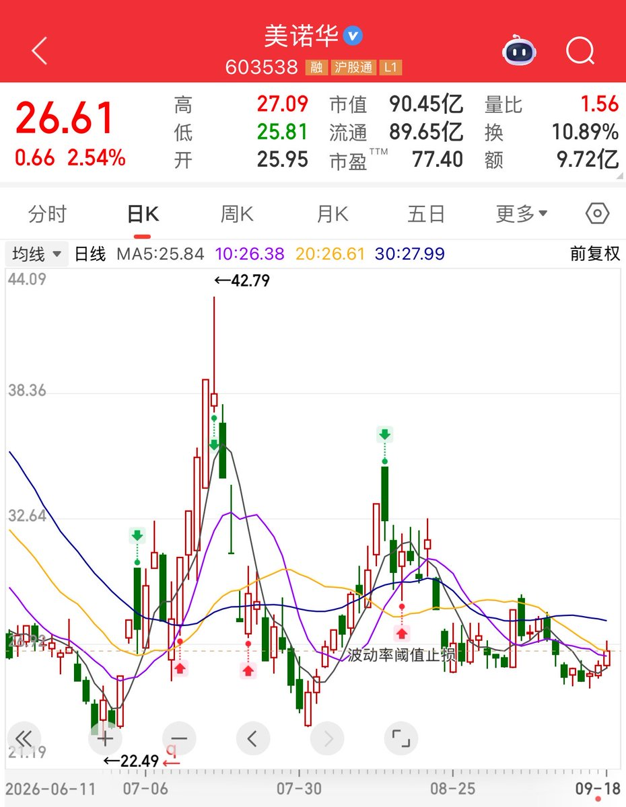

[查看原推链接](https://x.com/xiaomustock/status/2101334948032712755)

---

### 3. 推文记录 (2026-09-07 06:01:11)

**互动数据**：👍 169 | 🔁 7 | 💬 73 | 👁️ 67731

```text
最近关注到国内正在发生的一个AI对家境不是很富裕的学生非常不友好的地方。
很多学计算机专业搞编程的学生他们最大的困难不是学不会，而是老师已经开始需要学生带token资本上课，一个AI相关的教学课程下来，可能token费用要赶上他们学费了。

这估计只是高校课程紧跟AI适应社会真实需求的开始，各种学科专业慢慢都会涌现这样的课程，全程可能老师都教学生用AI代理完成他们的课程任务，可能是生物学，可能是工程学，设计，数学，信息等等。

以往这些学生只需要负担一个学费，
现在他们需要额外负担老师教学的token成本这可能远远大于他们的学费和生活费成本。
如果你家境贫寒或者仅仅是普通，那么最终的学习成绩都会被班里token开支富裕的学生碾压。

以后普通人报学校可能首选的是能给更高token免费额度的学校就学。
这可能是是未来全球所有普通学生需要面临的问题，普娃危机。
```

**实盘附图**：


[查看原推链接](https://x.com/xiaomustock/status/2096841189639200968)

---

### 4. 推文记录 (2026-08-21 05:29:11)

**互动数据**：👍 192 | 🔁 10 | 💬 31 | 👁️ 116874

```text
真正能解决美债的死结，还是美政府必须孤注一掷搞AI把社会生产效率用AI爆拉上来，所有问题都会消失。
AI想搞起来，就离不开存储，
潘健成和黄仁勋一堆大佬说真正制约AI进化的瓶颈就是存储。
闭环了，
美政府想解决美债就得把存储拉起来。😂 https://t.co/vozKy0R9n4
```

**实盘附图**：


[查看原推链接](https://x.com/xiaomustock/status/2090672543820869918)

---

### 5. 推文记录 (2026-08-14 13:11:09)

**互动数据**：👍 380 | 🔁 58 | 💬 19 | 👁️ 164588

```text
cpu必然会发生和2026年跟存储发生的结构性需求缺口。
现在cpu和gpu的配置需求是1/8，
随着各AI大模型公司下场AI代理，代理需求催生的高端cpu需求会在2-3个季度内快递被爆拉到1/1。八倍的需求提升，而高端cpu的产能完全不可能在最近的2个季度内实现产能8倍提升。
cpu需求的爆发点很接近了，
从这个季度英特尔的高端cpu挤压低端cpu产能可以看出这种变化正在加速。
最快今年年底最慢27年q1就能看见cpu大幅提价，复刻存储26年行情。
也就是只剩下3-5个月时间窗口了。
```

**实盘附图**：

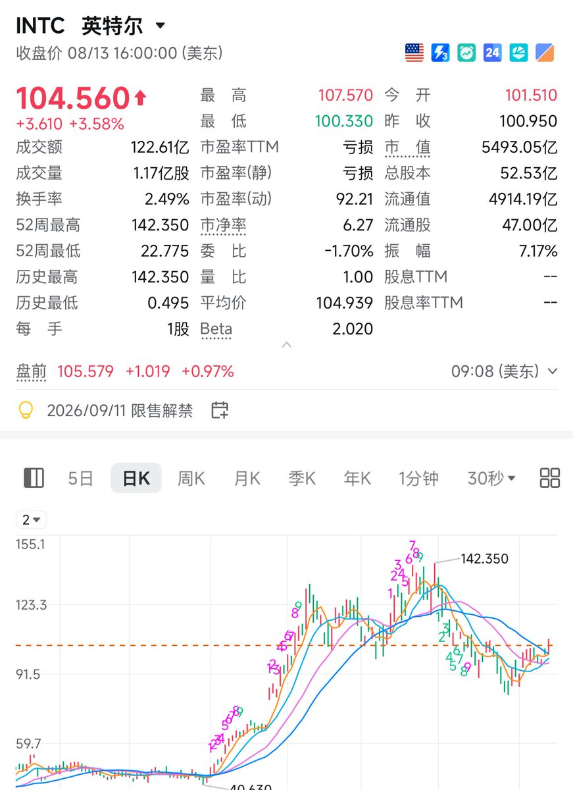

[查看原推链接](https://x.com/xiaomustock/status/2088252084437323966)

---

### 6. 推文记录 (2026-08-07 20:06:35)

**互动数据**：👍 326 | 🔁 20 | 💬 28 | 👁️ 125592

```text
gate真是说一套做一套，拖了这么多天gate都不给jc提供之前声称保存的手持视频和后台操作日志。
之前立案前口口声声催用户赶紧立案然后全力配合……恶心呐 https://t.co/FB0psAh3NK
```

**实盘附图**：

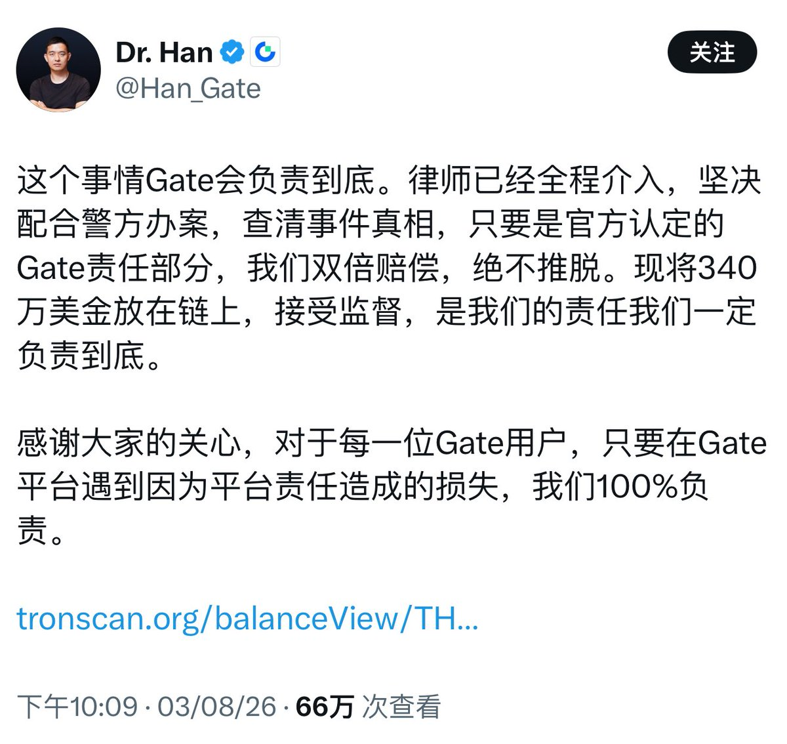

[查看原推链接](https://x.com/xiaomustock/status/2085819915202949219)

---

### 7. 推文记录 (2026-08-05 05:32:45)

**互动数据**：👍 193 | 🔁 9 | 💬 38 | 👁️ 144480

```text
梁圣太权威了，它还没像kimi一样堆参数，
只是几个月突然公布出来一个接近全球顶级模型能力的版本，再把价格达到白菜价。
除此之外从不在公众视野中出现。
这么搞同样token预算，存储消耗量得倍增。 https://t.co/vC4P5t9Kp3
```

**实盘附图**：


[查看原推链接](https://x.com/xiaomustock/status/2084875235833348532)

---

### 8. 推文记录 (2026-08-02 19:25:11)

**互动数据**：👍 591 | 🔁 59 | 💬 46 | 👁️ 382519

```text
这个gate被盗170万美金现在比较明晰，
gate这波公关太抽象。
就是黑客没有掌握用户最新的谷歌验证也没掌握邮箱密码，也不知道手机验证码，
只是一直提交重置申请，
然后gate系统人脸不通过，
gate开始给人工手持审核，把假得不能再假的手持给通过了，
黑客借此重置了谷歌验证，重置了邮箱，
添加了白名单地址，
然后最后提笔到从未用过的地址又一次被gate系统拦截，
然后人工审核给依据一份黑客声称的支付宝录屏给通过了，
也就是说gate系统审核中的人脸识别，谷歌验证，邮箱验证全都没通过，gate人工全给黑客的假的不能再假的资料过了。

没立案之前gate嘲讽用户说是用户自己的人脸比对，已经保留了视频和照片。
立案后gate说是他们系统没有保存人脸识别的视频和照片，只给识别结果😂

也就是说全程从头到尾都人脸识别异常，不管是系统还是人工，但最终gate依据支付宝就觉得是本人给过了。
自己的安全项认证全都不信，gate信没有人脸信息的支付宝录屏？

gate是不是提前声明了支付宝能作为你gate账户资产安全项的审核依据？
那别人币安或者okx或者信用卡被盗是不是录个屏就能顺手盗你gate用户资产？因为看起来币安@binance 和 @okx 确实比gate安全点。就像支付宝在gate认知里比gate安全一样。
```

**实盘附图**：

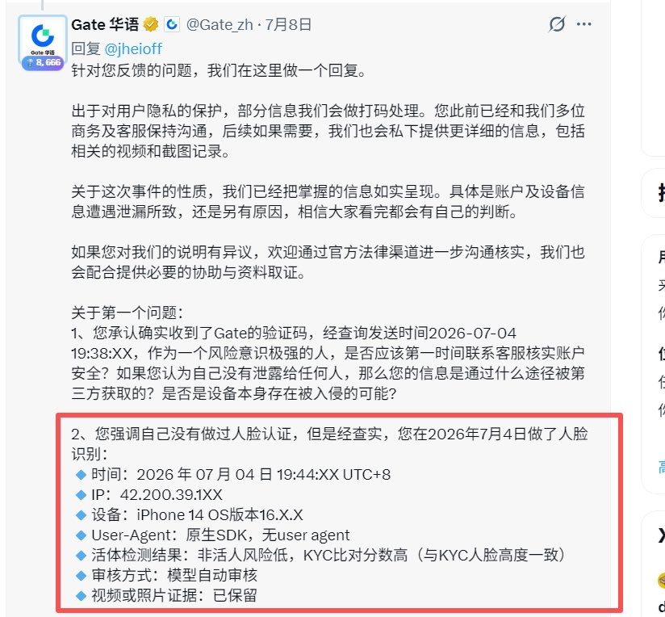

[查看原推链接](https://x.com/xiaomustock/status/2083997560654663931)

---

### 9. 推文记录 (2026-08-01 09:13:24)

**互动数据**：👍 135 | 🔁 14 | 💬 20 | 👁️ 87095

```text
刚进入8月还有一件大事，AI界的卷王DeepSeek正式更新V4 Flash ，ds flash已经逼近GLM-5.2，价格只有十五分之一。
ds 的Coding Agent和软件工程能力大幅提升，在终端操作、代码仓库修改和复杂开发任务上的表现明显增强；
ds的AI Agent和工具调用能力明显增强，更适合连续执行多步骤任务；
针对Codex也做了适配，更方便接入各类AI编程和Agent工具。
这次升级是冲着Coding和AI Agent来的，
而且pro版本也很快要发布，那到时候真是要准备对着Cladue的核心coding业务干。

最值得关注的点是ds只用了2840亿参数就实现了接近对手万亿参数规模的智能水平，
全世界可训练参数规模再往上堆可能也就kimi这种2万多亿，他们参数堆到极限再往上空间不大了。但ds还有10倍的堆参数空间，正儿八经的性能优化调参的工程级卷王。

这一波不仅冲击了国内模型定价连带也必然冲击了国外ai的定价，如果ds 的pro版本coding能力逼近claude和openai，那么他俩的高价也必然无法维持都得降价。

降价就会被动带来海量的用量提升，数据存储压力倍增，对存储又反而是利好。市场对存储最大的担忧就是长鑫这条鲶鱼，而不是对存储需求的担忧。但实际这种担忧对业绩的影响是远期的，这种利好和利空的左右脑互搏，市场肯定会上下来回震荡，直到存储紧缺到市场所有人都难受的时候，可能路径才会再次明确。
```

**实盘附图**：


[查看原推链接](https://x.com/xiaomustock/status/2083481209561141749)

---

### 10. 推文记录 (2026-07-22 04:27:09)

**互动数据**：👍 0 | 🔁 0 | 💬 0 | 👁️ 0

```text
量子闪存（Quantum Flash）
是复旦大学周鹏、刘春森团队研发的一种室温单电子非易失性存储技术。该技术于2026年7月17日在国际学术期刊《科学》（Science）主刊上发表，通过独创的“归壹”结构（共面漏极-沟道-源极结构）和“态密度剪刀”理论，成功在室温（27℃）环境下实现了单个电子对单个比特信息的稳定存储，传统技术需要数万电子存单个比特。

性能指标
量子闪存实现了“一电子一比特”的理论极限存储密度，相比传统技术所需电子数减少了数万倍。该技术首次在室温（27℃）环境下实现了清晰的单电子非易失性存储观测，打破了需极低温环境的限制。单个电子注入产生的存储窗口（阈值电压偏移）达到0.5伏特，远超此前报道的55毫伏，且数据保持时间长达10年以上。此外，该技术可与现有的CMOS硅工艺兼容，为产业化应用奠定了基础。

去年4月，周鹏-刘春森团队于《自然》（Nature）期刊提出“破晓（PoX）”器件，实现了世界最快400皮秒超高速非易失存储，解决了自1967年浮栅晶体管发明后，高速与非易失无法兼得的基础性难题。
```

**实盘附图**：


[查看原推链接](https://x.com/xiaomustock/status/2079785296787554614)

---

### 11. 推文记录 (2026-07-19 15:32:41)

**互动数据**：👍 292 | 🔁 23 | 💬 16 | 👁️ 145303

```text
再牛逼的模型，想把模型实力转化成收入，
那你就必须要有海量的内存卡和推理卡，
不然破天的富贵你把握不住，
所以你说内存和推理卡缺不缺？
kimi再牛逼能怎么样，富贵来了新增订阅都接不住。 https://t.co/PXKbuIwOOQ
```

**实盘附图**：

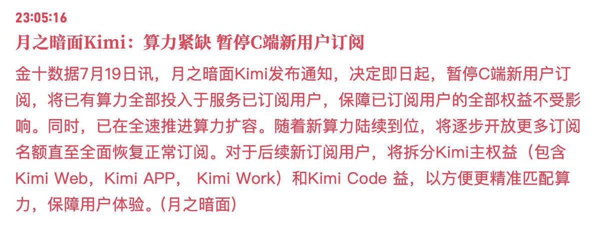

[查看原推链接](https://x.com/xiaomustock/status/2078865618779205687)

---

### 12. 推文记录 (2026-07-17 21:11:31)

**互动数据**：👍 119 | 🔁 8 | 💬 23 | 👁️ 96556

```text
kimi公司内部的五条准则
非常务实，不凭空想象推项目，靠实验数据说话。
记得gpt诞生之初，我用的就是kimi，
kimi翻译小众文字文档的效果出奇的好。
期待它上市的時候。 https://t.co/8vWEhkhuSM
```

**实盘附图**：


[查看原推链接](https://x.com/xiaomustock/status/2078226111373467737)

---

### 13. 推文记录 (2026-07-13 08:32:13)

**互动数据**：👍 688 | 🔁 18 | 💬 82 | 👁️ 313391

```text
过去一个月利润最高50%全还回去，
还倒贴13%，棒子是真该死呐，一群精神病。 https://t.co/IOyoplHXcN
```

**实盘附图**：

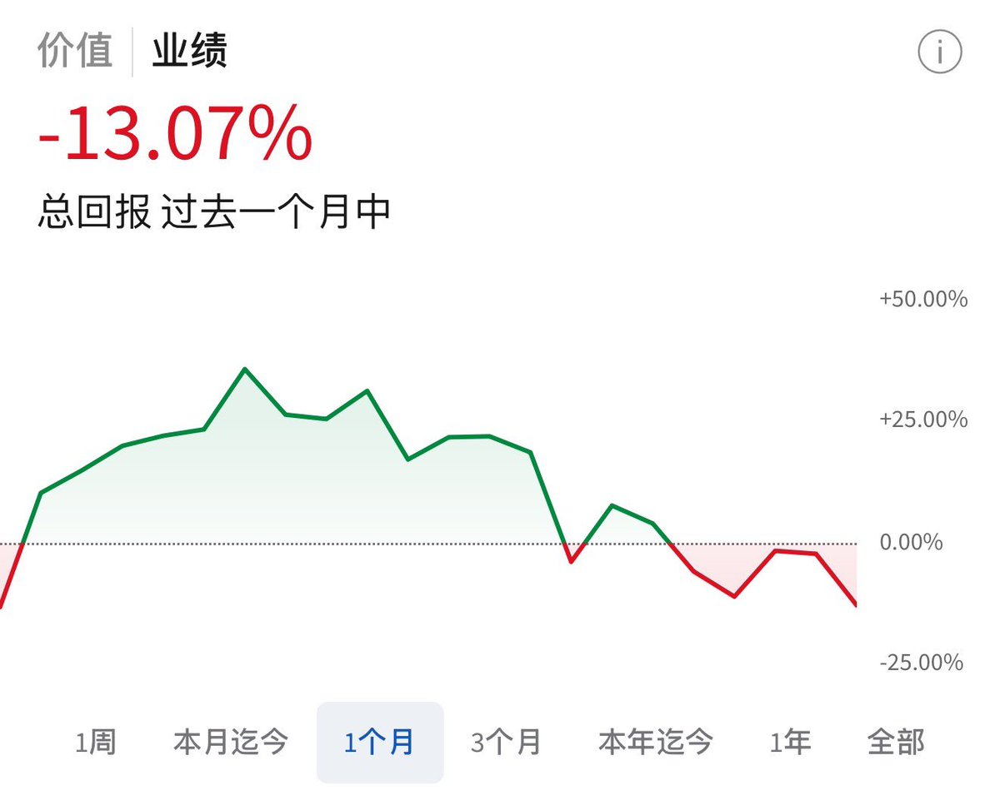

[查看原推链接](https://x.com/xiaomustock/status/2076585478808281292)

---

### 14. 推文记录 (2026-07-11 09:24:36)

**互动数据**：👍 369 | 🔁 21 | 💬 62 | 👁️ 205666

```text
我觉得只要客户能证明不是自己操作的，平台就该赔，不然我为什么放你这。
如果是支付宝ai换脸，手持验证钱被盗了支付宝赔不赔？
@Gate  你是真牛逼你不赔？没操作所有安全项都开了钱都能丢我钱为什么放你这，有啥安全保障？ https://t.co/XB5fp4Y12h
```

**实盘附图**：

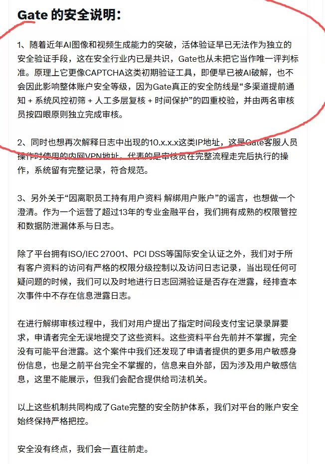

[查看原推链接](https://x.com/xiaomustock/status/2075873886185697351)

---

### 15. 推文记录 (2026-07-07 14:40:20)

**互动数据**：👍 656 | 🔁 16 | 💬 73 | 👁️ 200530

```text
心脏疼，感觉像得了恶疾 https://t.co/B3BsfjWb7h
```

**实盘附图**：

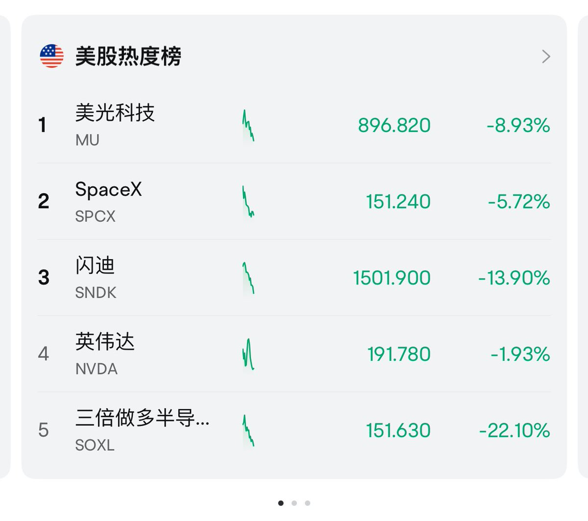

[查看原推链接](https://x.com/xiaomustock/status/2074503788296368216)

---

### 16. 推文记录 (2026-07-02 09:16:36)

**互动数据**：👍 319 | 🔁 15 | 💬 52 | 👁️ 121748

```text
有花堪折直须折，莫待无花空折枝。
挥霍和珍惜都是同一件事情，
不舍得也是一种浪费，
在心动热爱的当下，大胆的去享用，
真正的珍惜不是供奉，
而是让美好的事物参与我们生命的流动。

你们要学这个秃头，能干妹子的年纪抓紧干妹子。 https://t.co/hYaORRM03v
```

**实盘附图**：


[查看原推链接](https://x.com/xiaomustock/status/2072610378241159562)

---

### 17. 推文记录 (2026-06-30 13:55:09)

**互动数据**：👍 394 | 🔁 20 | 💬 28 | 👁️ 186504

```text
$康宁 $GLW 泛林 $LRCX 科磊 $KLAC 应用材料 $AMAT 
全部爆拉，做人做事首先要相信自己，
自己给自己洗脑，
自己都不信怎么可能拿得住呢。
大不了错了再改。 https://t.co/T4Kbt4ToRZ
```

**实盘附图**：

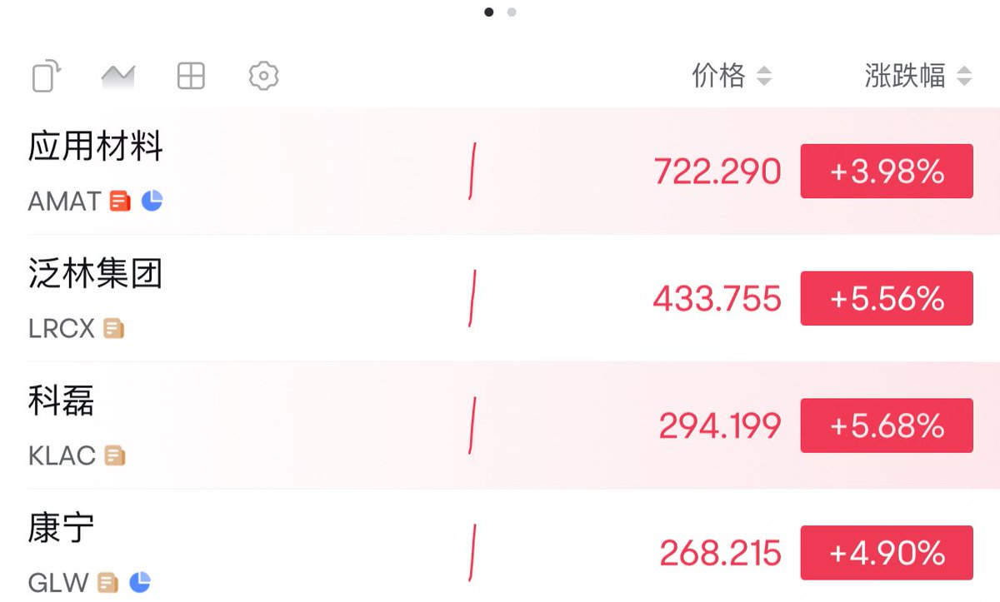

[查看原推链接](https://x.com/xiaomustock/status/2071955704215458276)

---

### 18. 推文记录 (2026-06-26 11:28:02)

**互动数据**：👍 228 | 🔁 26 | 💬 19 | 👁️ 73524

```text
AI有泡沫，但AI没有丝滑的取代所有白领的工作前就不可能破。路途遥远。
所有的脏活累活AI机器人干，
所有复杂耗时的脑力活动AI干，
现在的agent还很弱智。
现在的AI也没有普及进入每个人的生活，
你们现在所从事的工作没有被AI取代，
说明AI的泡沫破灭还路途遥远，
AI都还没理解物理世界，
只在文字层面和虚拟空间挣扎，
跌一跌的很正常，
真到哪头满大街的机器人外卖员，
机器人服务员，机器人厨师，
所有的科技创新，创意，AI最终都会比人类干的更好，但现在远远没有，
等吧，泡沫最起码也是agi来临后。
```

**实盘附图**：

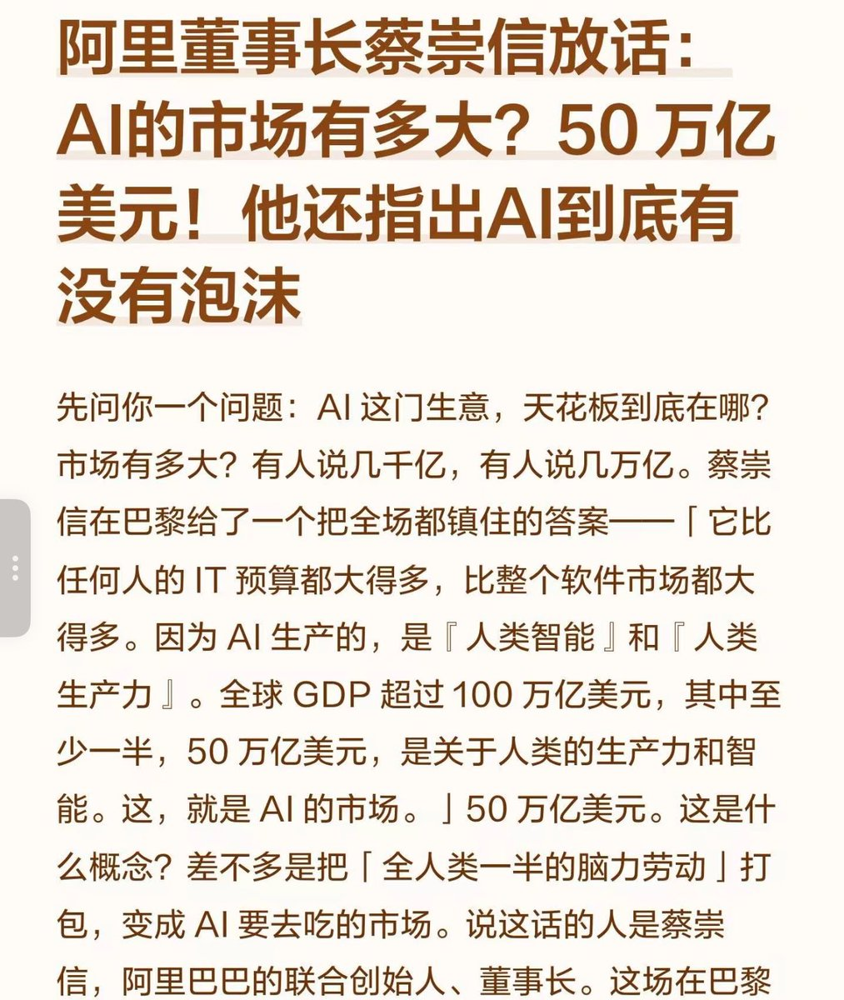

[查看原推链接](https://x.com/xiaomustock/status/2070469129996324930)

---

### 19. 推文记录 (2026-06-23 01:58:48)

**互动数据**：👍 674 | 🔁 53 | 💬 58 | 👁️ 240460

```text
这个信号挺危险，说明美版云厂和AI公司巨额的投入没有带来AI消费端产品明显的代际差异。等韩国熔断我再回来，很多天没熔断了。 https://t.co/cfBzZMGV3e
```

**实盘附图**：

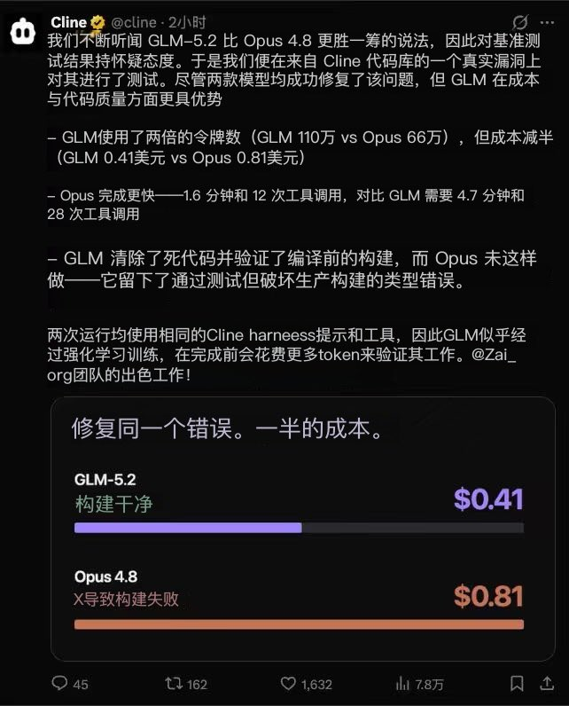

[查看原推链接](https://x.com/xiaomustock/status/2069238712811282693)

---

### 20. 推文记录 (2026-06-09 05:00:27)

**互动数据**：👍 456 | 🔁 52 | 💬 40 | 👁️ 222523

```text
高频短线交易则是停留在打工人思维，想着靠短线每天挣点，除非你是天选打工人，否则很难发财甚至大部分人都肯定最终亏钱。

而长期持有只在特定情况调仓是老板思维，
如果你的眼光和认知配得上你的财富，拥有足够远见，则早晚必定发财。 https://t.co/HZ1YwXelUJ
```

**实盘附图**：

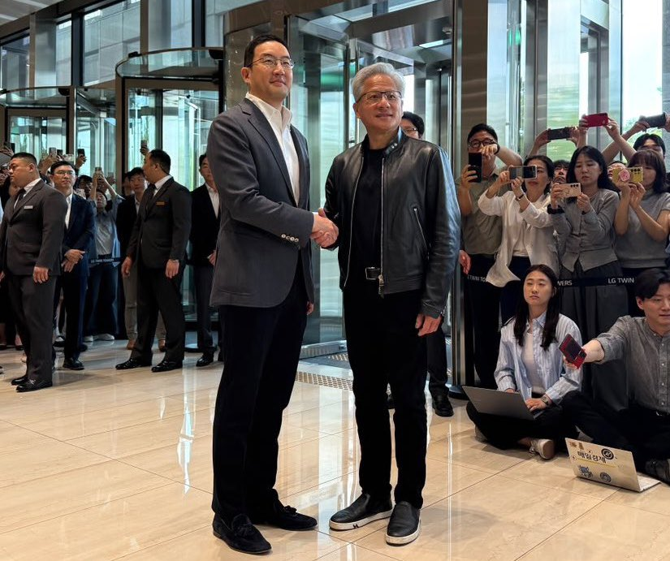

[查看原推链接](https://x.com/xiaomustock/status/2064210997590524098)

---

### 21. 推文记录 (2026-06-08 03:16:52)

**互动数据**：👍 402 | 🔁 24 | 💬 79 | 👁️ 385624

```text
#优必选  开售了仿生机器人U1，定位情感陪伴与人体交互，仅限18岁以上成人购买。
搭配了养成情感大模型，本地存储记忆，
外观与规格：分男款和女款。
男款：身高 183 厘米，重量 42 千克。
女款：身高 168 厘米，重量 35.2 千克。
均配备 88 个自由度，旨在实现更自然的肢体动作。 https://t.co/CMT7Ml48m8
```

**实盘附图**：


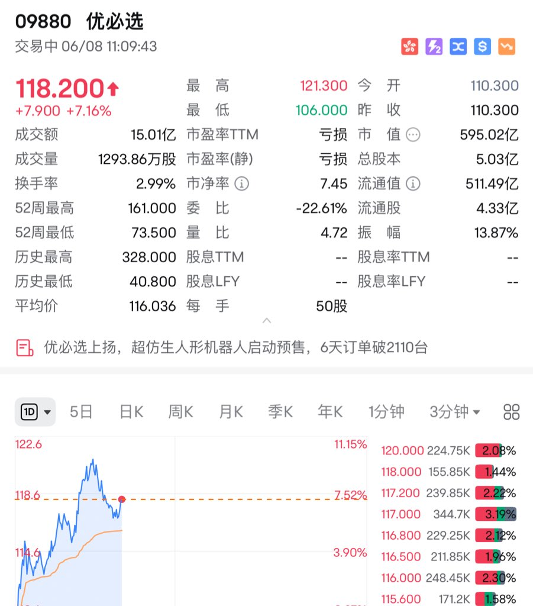

[查看原推链接](https://x.com/xiaomustock/status/2063822541286785098)

---

### 22. 推文记录 (2026-06-04 17:35:49)

**互动数据**：👍 641 | 🔁 2 | 💬 45 | 👁️ 70263

```text
感谢老板们订阅，订阅里没啥太多不一样的内容，受之有愧，另外也不想跟老板们有啥资金纠葛。
打算月底了绑个卡把这个钱捐给韩红基金会，
就当给你们积福缘了。 https://t.co/azTBxRV0WH
```

**实盘附图**：

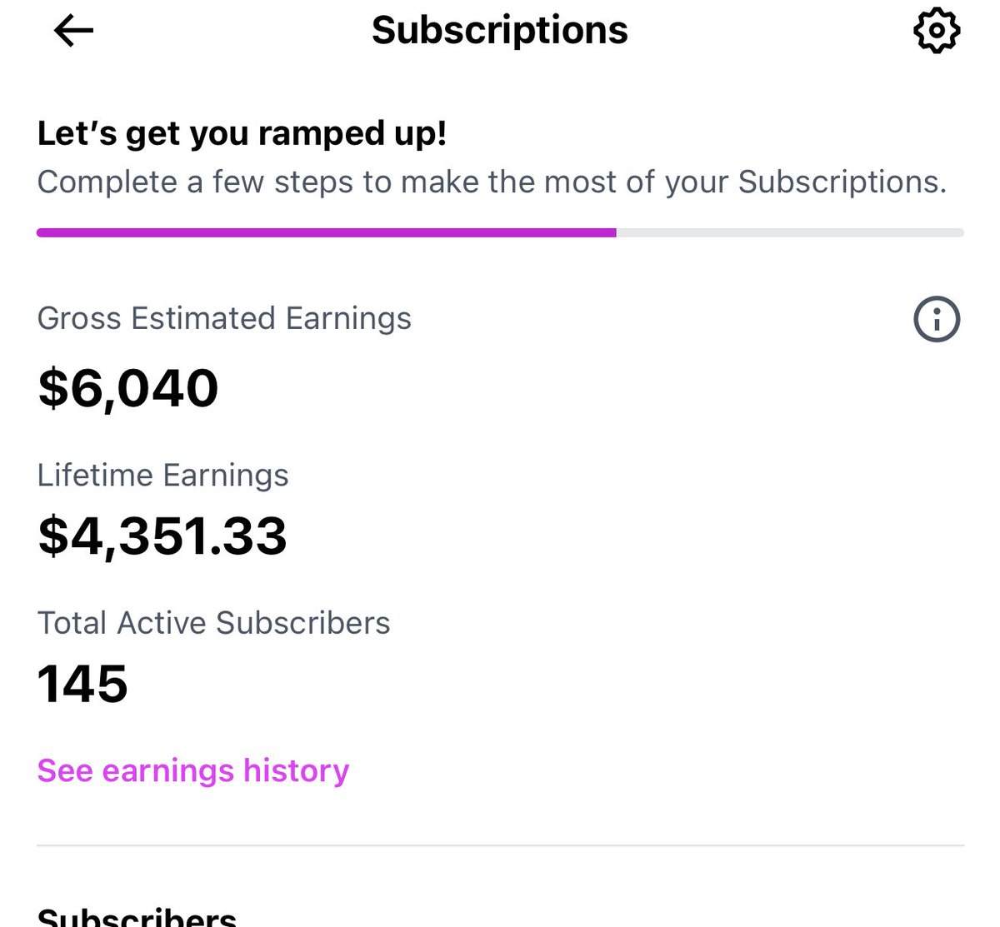

[查看原推链接](https://x.com/xiaomustock/status/2062589153376600466)

---

### 23. 推文记录 (2026-06-03 07:19:42)

**互动数据**：👍 244 | 🔁 6 | 💬 263 | 👁️ 153031

```text
这 #港美互联网lof 的基金经理在搞啥，还不如我来管，这么好行情按比例把一季度持仓配进去完事，非要瞎折腾，不然不可能昨天才一个点收益，希望这个经理脑子里出花活别乱操作，真是醉了。
我放着装死了。 https://t.co/2n7Mw9qbFa
```

**实盘附图**：

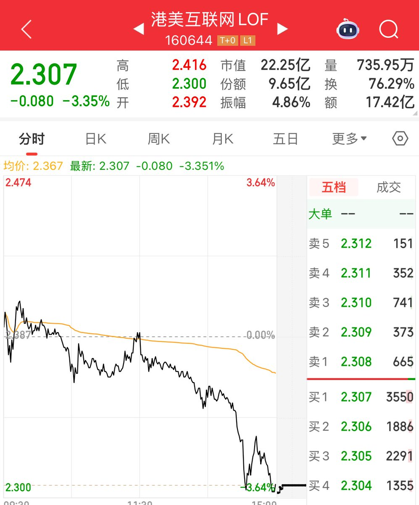

[查看原推链接](https://x.com/xiaomustock/status/2062071713429381534)

---

### 24. 推文记录 (2026-05-30 06:44:23)

**互动数据**：👍 336 | 🔁 38 | 💬 47 | 👁️ 228432

```text
面向AI的AI PC电脑最主要的需求是什么，肯定还是海量的存储，远超常规电脑PC数倍百倍的需求。
个人用电脑一天打不了几个字，上班摸鱼8小时，
AI用电脑，多线程打满，疯狂输入输出，
持续不断无眠无休24小时。
存储给多少都远远不足。
AI PC 跟人用PC之间存储需求的差距可能是百倍千倍万倍，倍数差距只取决于你给他提供了多少存储，多少都不够。
只要存储够大，他就有空间能给你干更多更多的活。
```

**实盘附图**：

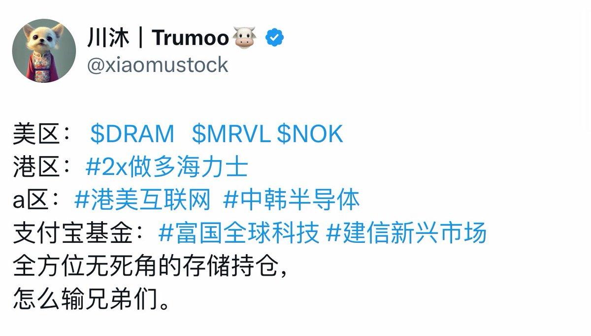

[查看原推链接](https://x.com/xiaomustock/status/2060613274958246220)

---

### 25. 推文记录 (2026-05-27 17:04:15)

**互动数据**：👍 241 | 🔁 11 | 💬 53 | 👁️ 194178

```text
段永平这是被小姑娘洗脑了，
什么泡泡马特王宁比乔布斯还厉害？？？？
这是一个可以量化的对公司对老板的评价？
这不是马屁么？
你要看好，觉得看懂了就写个12345，
而不是打嘴炮。
举牌显然是市场不买单附加小女友可能跟他梭哈套住了，段永平打肿脸充胖子硬加仓拖住股价拖到举牌了。
现在每天泡泡马特交易量都只有20多亿，
段永平买走117亿，说明这段时间买盘很可能就他一个，相当于连续5天就他一个人买才能买这么多。
段永平之前的思想看看挺不错，这搞泡泡马特没几个人觉得是他真懂了。
```

**实盘附图**：

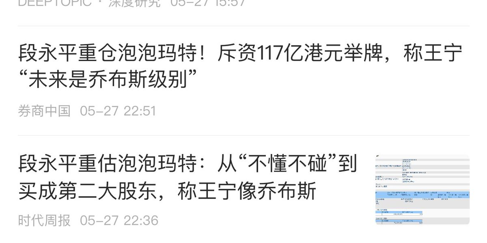

[查看原推链接](https://x.com/xiaomustock/status/2059682105831936464)

---

### 26. 推文记录 (2026-05-17 16:56:08)

**互动数据**：👍 312 | 🔁 32 | 💬 25 | 👁️ 100019

```text
比起账户亏损，错失时代才是普通人最大的风险。
你爸妈错失2000年的房地产和互联网导致你家族如今的贫困，
你的持续观望导致错失如今的AI革命，
会导致你下一代下下代永远生活在社会底层，
这个时段不能梭哈赚取财富，那么等AI站起来的时候所有普通人只能沦为毫无用处的人体电池，你连劳动的资格都没了，更别提赚取财富。
也很可能是人类文明里最后一次属于碳基生物机会。
```

**实盘附图**：

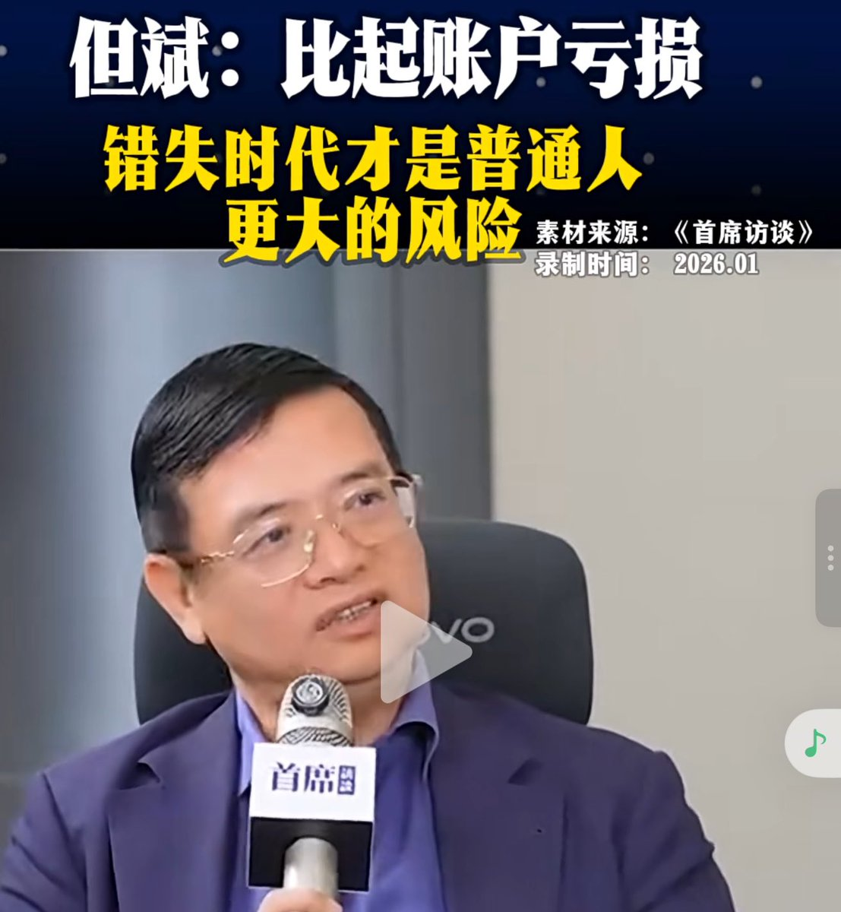

[查看原推链接](https://x.com/xiaomustock/status/2056056181894905899)

---

### 27. 推文记录 (2026-05-16 09:49:11)

**互动数据**：👍 146 | 🔁 8 | 💬 16 | 👁️ 61568

```text
美国的融资环境有多好可以用一个人形容：
贾跃亭。
连续“失败”连续能一直融到钱。

放别的国家可能已经抓起来了，他在美国不仅没事还能源源不断融资到投资人的钱。

如果是真心搞AI科技又有真技术那能融到的钱会更加海量，manus就是列子。 https://t.co/py6fxB0swj
```

**实盘附图**：


[查看原推链接](https://x.com/xiaomustock/status/2055586348354908416)

---

### 28. 推文记录 (2026-05-16 08:09:48)

**互动数据**：👍 311 | 🔁 13 | 💬 30 | 👁️ 328456

```text
很多朋友问存储是不到头了，我觉得没到，
但可以用另外一句话说：
存储容易的钱已经赚完了，
后面的钱赚起来比较困难，

会有fud会有估值模型变化等等，
赚起来比较曲折。 https://t.co/GCgZs2vTKz
```

**实盘附图**：

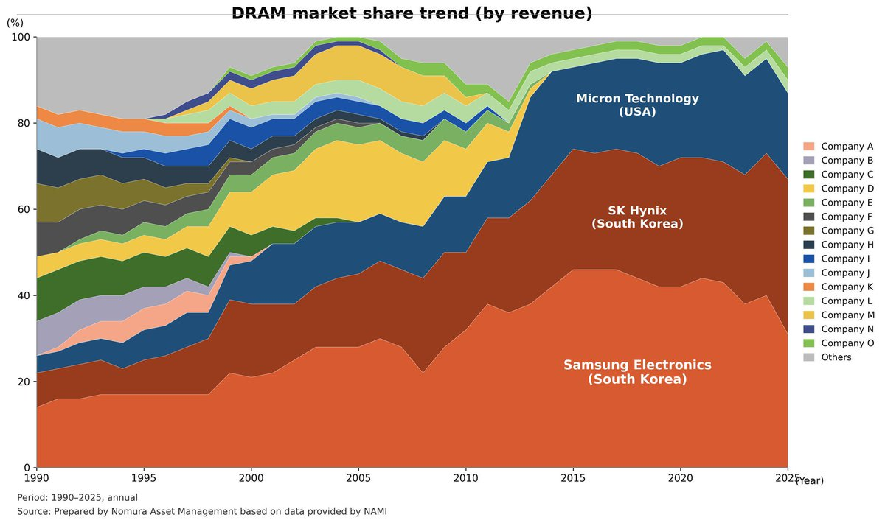

[查看原推链接](https://x.com/xiaomustock/status/2055561340505174187)

---

### 29. 推文记录 (2026-05-13 05:28:09)

**互动数据**：👍 219 | 🔁 17 | 💬 31 | 👁️ 135436

```text
ssd的需求强度才刚刚开始，消费端和AI端需求会同时暴增。

消费端去年到今年上半年很多消费电子把存储空间都阉割后提价了，消费者用段时间肯定会面临存储空间不够的问题，就需要额外配置ssd。
AI端的企业级ssd也一样，去年到今年各家大模型累计了海量的用户，长期数据积累肯定再推生出需求海量ssd压缩过去不常调用的老数据。
Agent还没彻底普及，因为现在普通人能接触到的agent还是比较傻瓜。一旦普及hbm和ssd的需求还要指数级爆炸，远超gpu和cpu需求，他们是无眠无休制造数据的机器。
```

**实盘附图**：

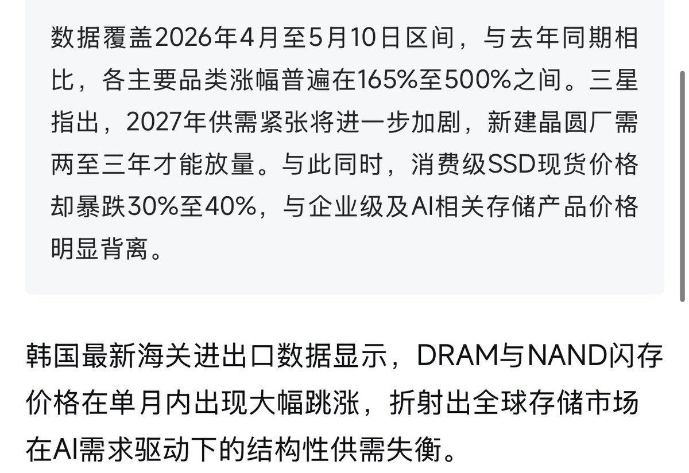

[查看原推链接](https://x.com/xiaomustock/status/2054433495271760119)

---

### 30. 推文记录 (2026-05-11 17:20:59)

**互动数据**：👍 350 | 🔁 39 | 💬 21 | 👁️ 70185

```text
每个人一生有且仅有一次的AI浪潮革命，
对整个人类也是有且仅有一次解放智力的AI革命，
换句话说相当于瓦特发明蒸汽机，别人看见机会搞工厂纺织，你还在家手搓织布。

如果放眼整个人类历史，这一年的机会成本高的可怕，资本每浪费的每一天，都是很难再从以后的历史机遇里找回来。

但从另外一个角度，如果这个过程是AI取代人类，那么我们投在AI的每一分钱都在加速毁灭，“历史的罪人？”😂
```

**实盘附图**：

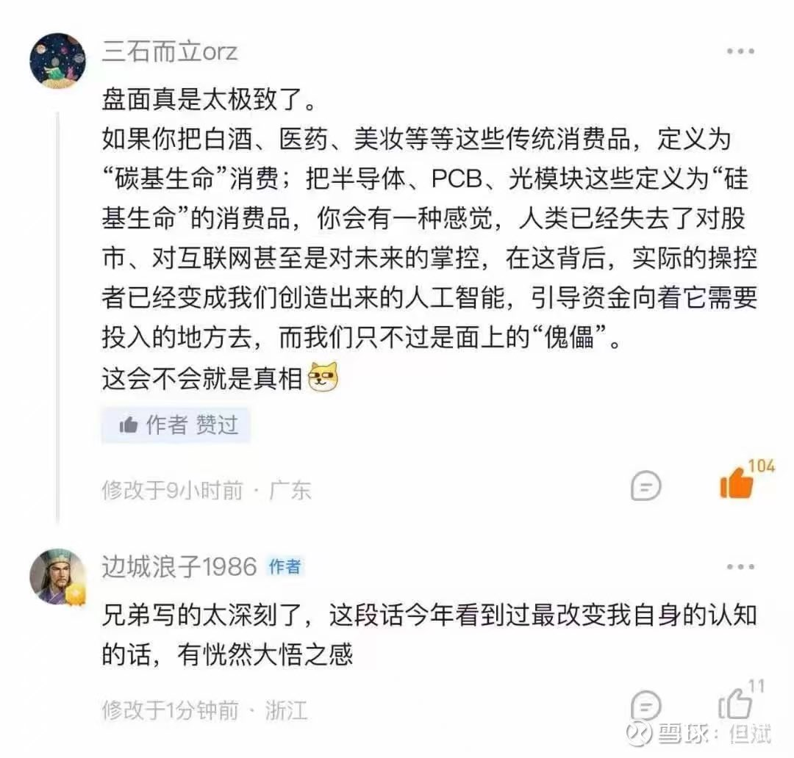

[查看原推链接](https://x.com/xiaomustock/status/2053888108672786444)

---

### 31. 推文记录 (2026-05-06 15:02:00)

**互动数据**：👍 585 | 🔁 127 | 💬 22 | 👁️ 347502

```text
看到一对比图，把2000年的互联网浪潮和22年gpt开启的AI浪潮作涨幅对比。
现在是第858天，崩盘时间是1330天。
据此到崩盘点还有数倍涨幅，时间472天也就是对应到27年年底最顶峰还有一年半。
看完这个图心安了不少。 https://t.co/CoZJvJSzfb
```

**实盘附图**：

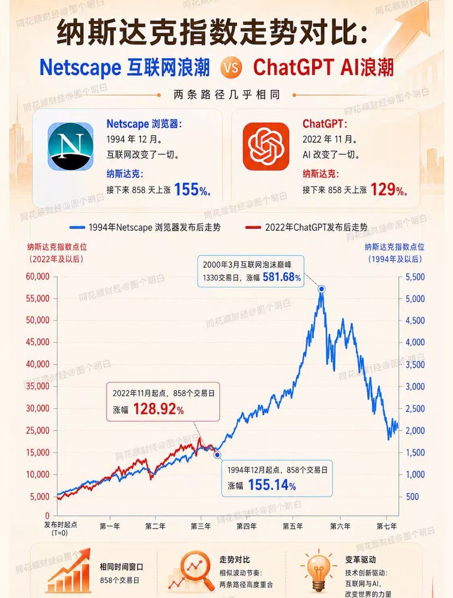

[查看原推链接](https://x.com/xiaomustock/status/2052041193941291318)

---

### 32. 推文记录 (2026-05-06 06:54:22)

**互动数据**：👍 352 | 🔁 31 | 💬 12 | 👁️ 177164

```text
按照 #湖南裕能 连续5个单季度50%-100%的业绩增速，2026全年的利润能接近100亿，
市盈率不到9，如果给它亲爹宁德时代一样的pe27，那可以涨到300块钱拉三倍。 https://t.co/O9srSJzmdu
```

**实盘附图**：

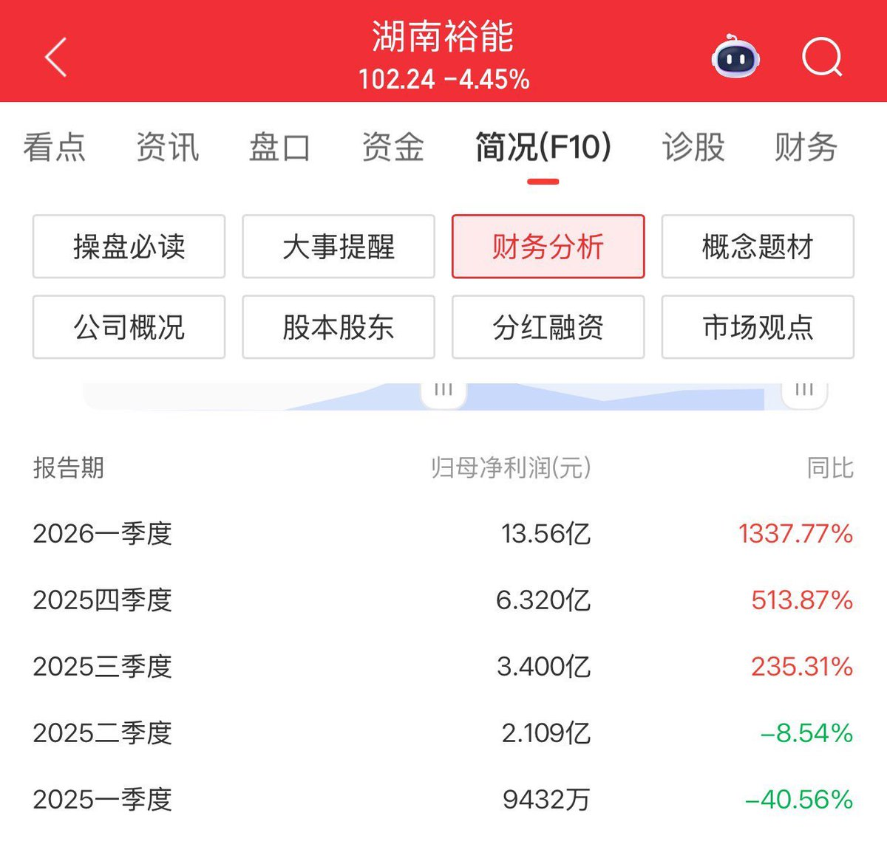

[查看原推链接](https://x.com/xiaomustock/status/2051918476072132889)

---

### 33. 推文记录 (2026-04-29 20:08:42)

**互动数据**：👍 537 | 🔁 32 | 💬 29 | 👁️ 283680

```text
谷歌一季度利润达到了恐怖的625亿美金，
比预测值高了一倍！AI浪潮来了。
谷歌能吃掉一切。 https://t.co/i4QNBrwYey
```

**实盘附图**：

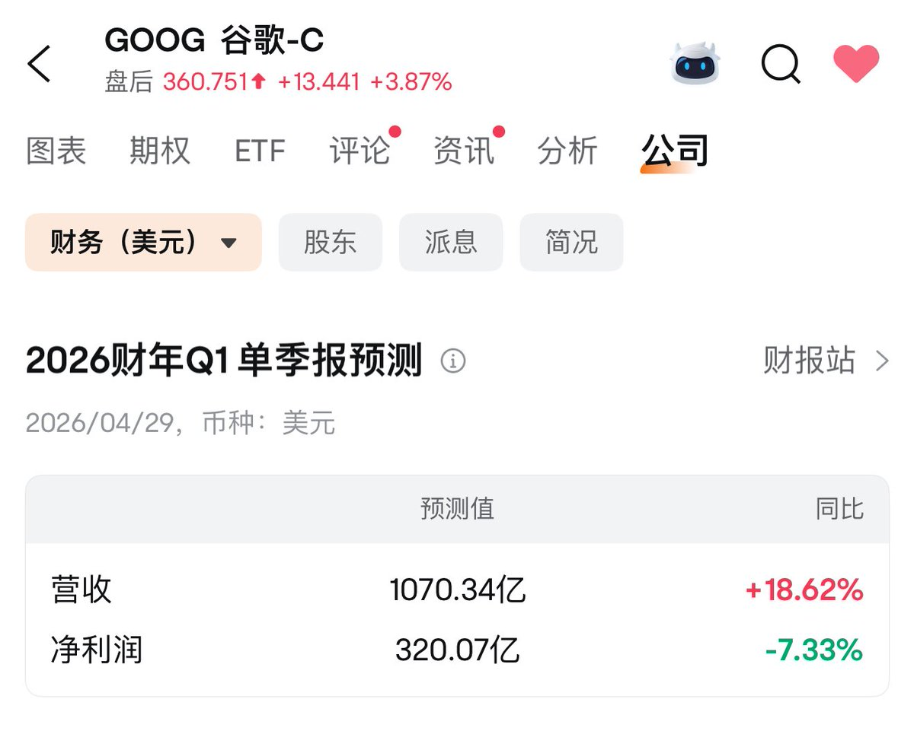

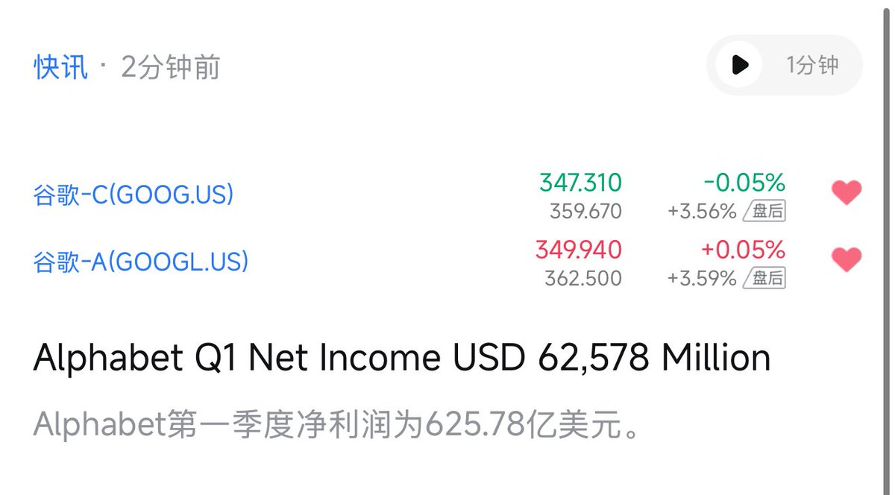

[查看原推链接](https://x.com/xiaomustock/status/2049581664649789688)

---

### 34. 推文记录 (2026-04-29 05:42:35)

**互动数据**：👍 260 | 🔁 37 | 💬 8 | 👁️ 151990

```text
天赐材料，湖南裕能，天华新能三个都是一季度报业绩利润断层爆增，
同处于储能行业，
说明储能在一季度发生了巨变，
尤其是石油断供引爆了的全球性的各国储能需求。 https://t.co/1kc3Jl2umJ
```

**实盘附图**：

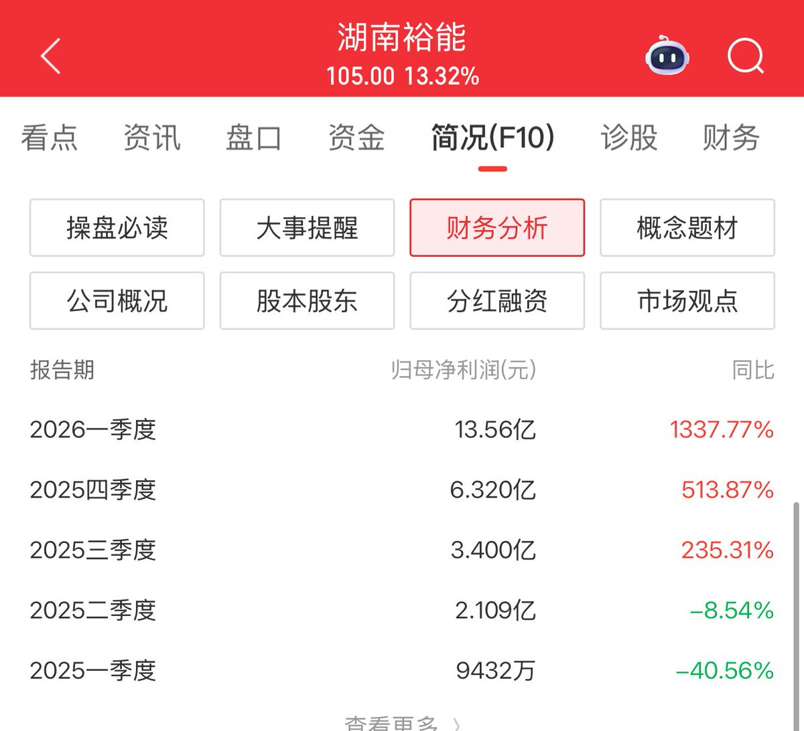

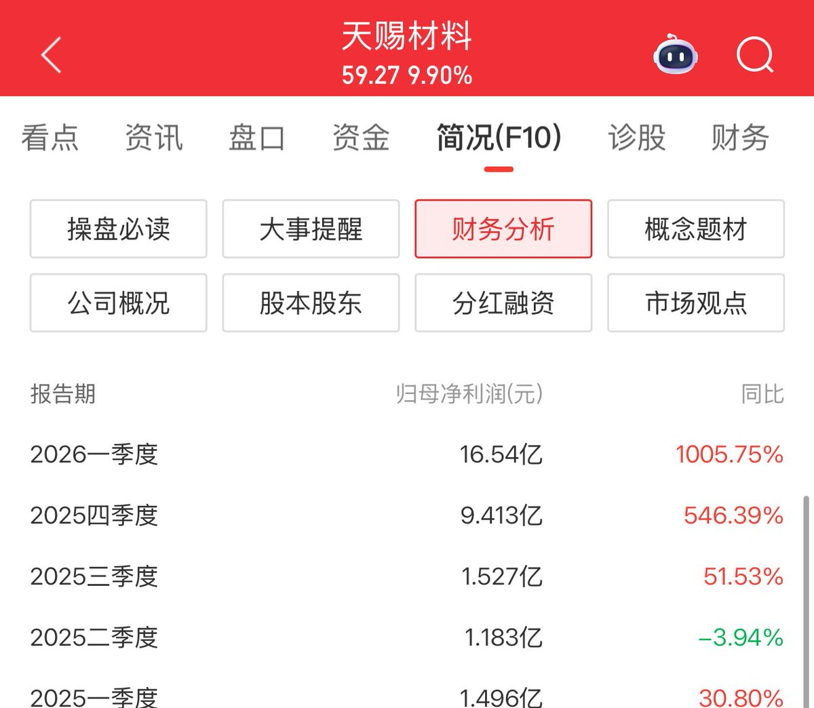

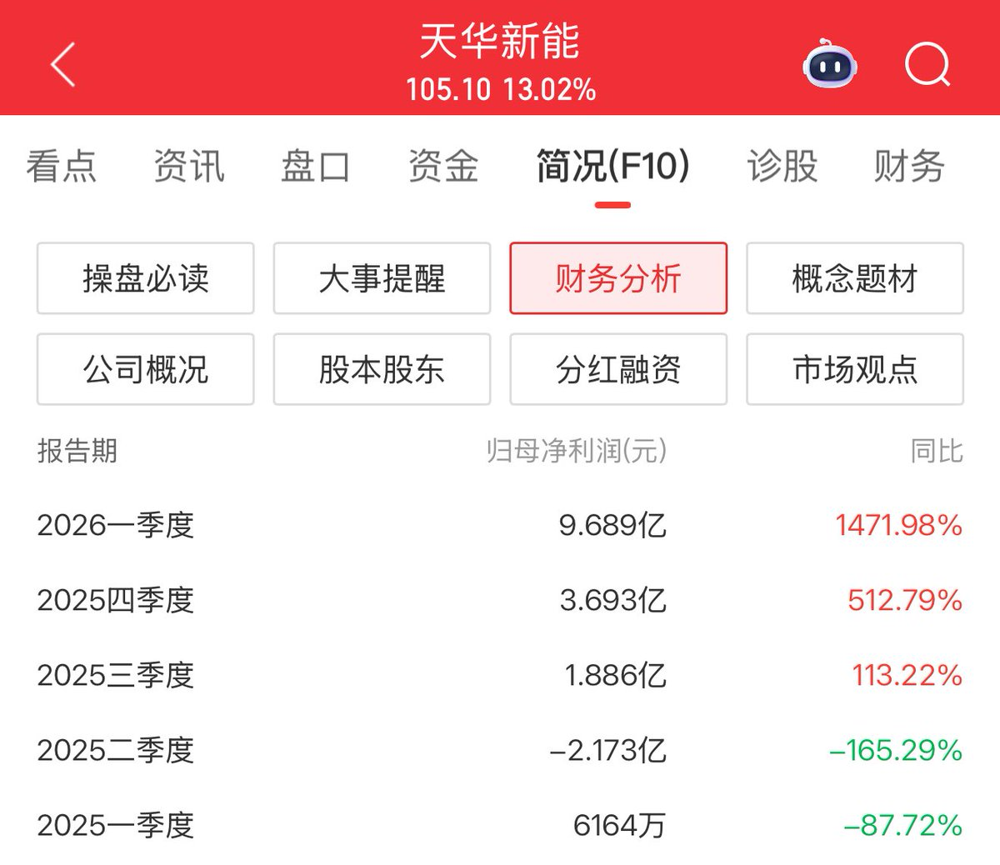

[查看原推链接](https://x.com/xiaomustock/status/2049363697219637595)

---

### 35. 推文记录 (2026-04-24 17:32:40)

**互动数据**：👍 297 | 🔁 61 | 💬 142 | 👁️ 277705

```text
$XE 今天刚上市的核能公司，热度较低。
2024年由云服务商亚马逊牵头支持了5亿美金。
该公司以小型模块化反应堆（SMR）为主，体积更小，设计上也比传统的大型反应堆更具成本效益，而大型反应堆的建造可能需要数年时间。X-Energy正在开发其Xe-100反应堆，该反应堆使用氦气而非水作为冷却剂。 https://t.co/xID016fTFx
```

**实盘附图**：

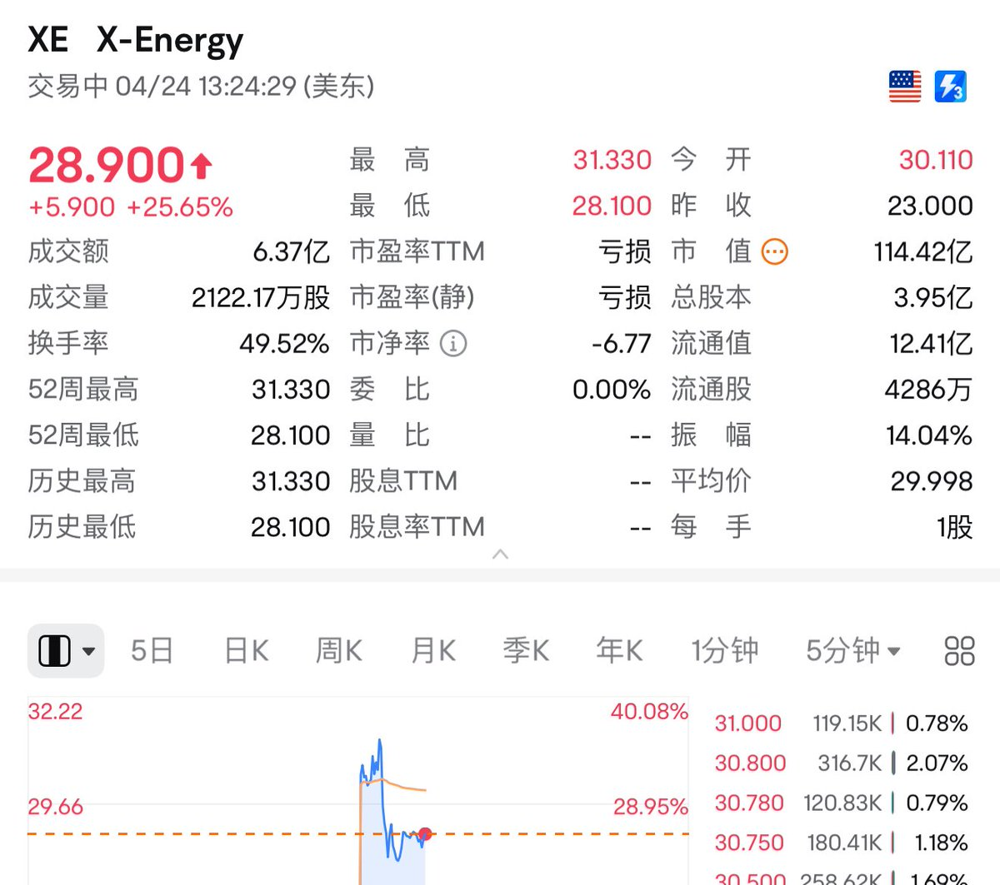

[查看原推链接](https://x.com/xiaomustock/status/2047730454783316077)

---

### 36. 推文记录 (2026-04-22 14:45:39)

**互动数据**：👍 107 | 🔁 6 | 💬 19 | 👁️ 53663

```text
存储在美伊战争中暴跌的时候阴阳怪气或者割肉看空的人，这类人本质上什么都不懂。
即没有耐心更没有认知。
最好去翻记录全部拉黑和屏蔽。
美国佬历史上战争太多了，
但科技永远在进步，
股市永远中新高。 https://t.co/oETUsAoOMp
```

**实盘附图**：


[查看原推链接](https://x.com/xiaomustock/status/2046963649676538151)

---

### 37. 推文记录 (2026-04-22 07:59:30)

**互动数据**：👍 398 | 🔁 48 | 💬 59 | 👁️ 116893

```text
一定要少去饭店吃饭或者点外卖，几乎所有饭店或者辣条零食用的都是用浸出法提炼的食用油。
方法就是用碳链长度为6的正己烷C6H14环己烷（c6h12）的6号号轻汽油浸泡大豆，用俩个沸点不一样，分离。
但是这种工艺里面化工杂志特别多，油会有一股臭味，就会经过很多次的高温化学提纯，不仅微毒长期致癌还没油香。
这油在商店超市是买不到的，专门给餐馆和食品厂供。
```

**实盘附图**：

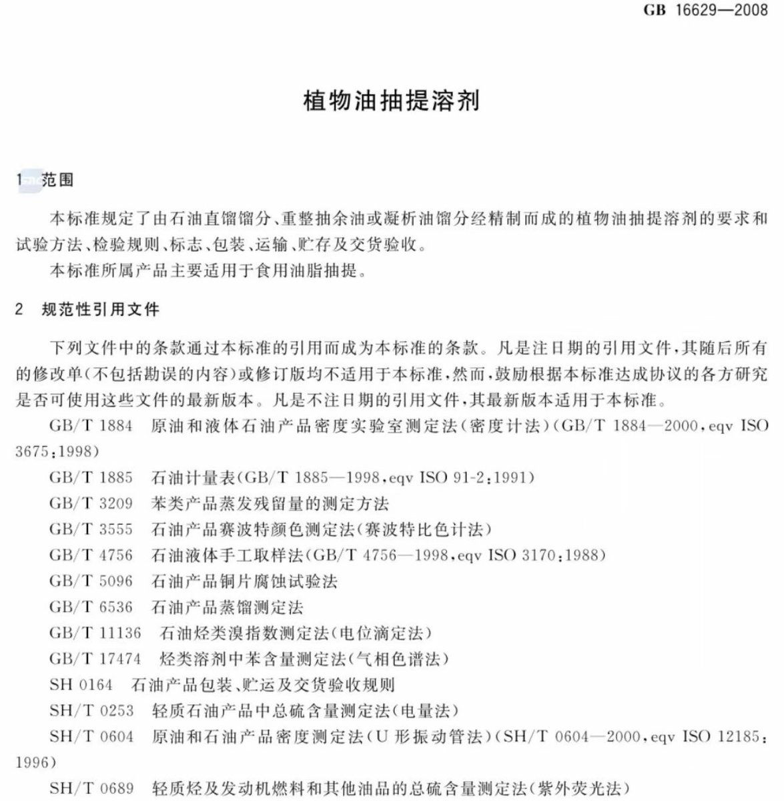

[查看原推链接](https://x.com/xiaomustock/status/2046861439676321942)

---

### 38. 推文记录 (2026-04-22 02:20:04)

**互动数据**：👍 683 | 🔁 59 | 💬 270 | 👁️ 211692

```text
以后全世界ai的胜地就是苏州，
除了飞机不能从苏州起飞，啥都会飞。 https://t.co/9N2DXxzLdg
```

**实盘附图**：

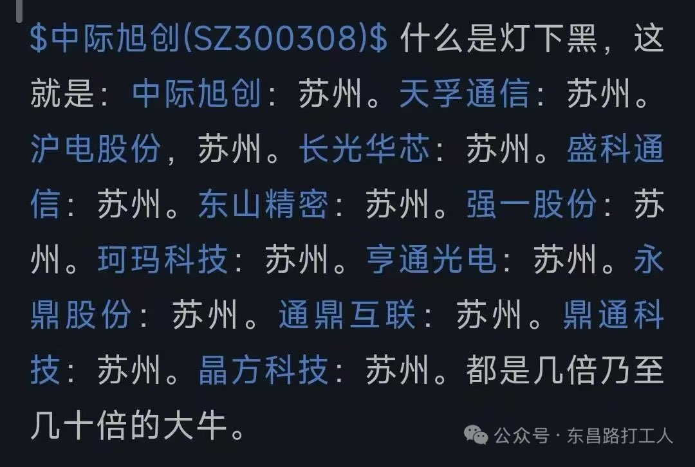

[查看原推链接](https://x.com/xiaomustock/status/2046776019542229206)

---

### 39. 推文记录 (2026-04-20 08:05:20)

**互动数据**：👍 183 | 🔁 27 | 💬 44 | 👁️ 108743

```text
swarms创始人逆向开源了claude的自己称最危险的模型mythos，起名openmythos。
swarms居然就是当年那个特朗普发币前的swarms AI代币创始人。国内最顶的科技公众号刚发的文章。 https://t.co/dMjsqXfIjw
```

**实盘附图**：


[查看原推链接](https://x.com/xiaomustock/status/2046138129036570760)

---

### 40. 推文记录 (2026-04-01 03:16:50)

**互动数据**：👍 109 | 🔁 7 | 💬 20 | 👁️ 214155

```text
一涨一跌很多人观点都不一样了，
这波跌的利润全无，很多人出于好心发私信给我说存储三巨头到头了，
但我还是坚信无眠无休Agent会带来天量的数据存储需求，我不是特朗普没法掌控市场波动，只能长期斗争最终看输赢了，所以我的置顶也不想变。
我默默装死看日后AI怎么变化，
AI真正站起来说话的时候应该是席卷全球的裁员浪潮，公司里上班的不再是程序员而是一个个用着各行各业标准化skill的agent。
```

**实盘附图**：


[查看原推链接](https://x.com/xiaomustock/status/2039180157941170262)

---

